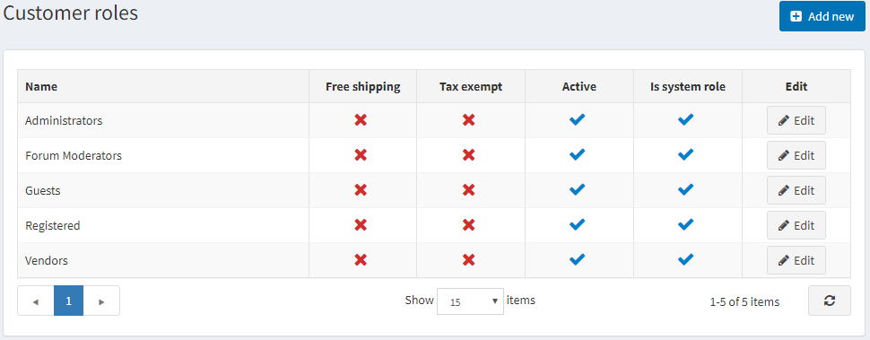
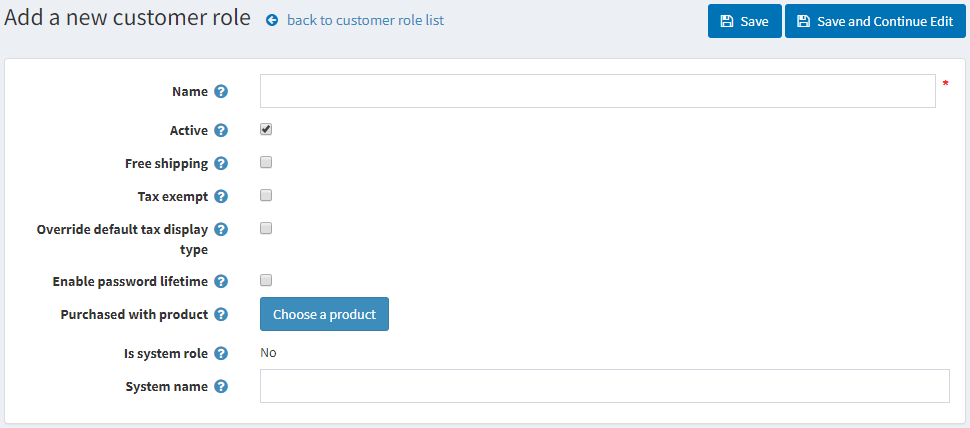

# 顧客角色

nopCommerce 中的顧客角色讓您可以將商店的使用者分組。您可以建立各種群組，例如商店管理員、購物者、[供應商](xref:zh-Hant/running-your-store/vendor-management) 等。您也可以透過 [存取控制清單](xref:zh-Hant/running-your-store/customer-management/access-control-list)，授權這些群組特定的權限，例如折扣定價以及其他特殊狀態（如免稅、免運費等）。

若要管理顧客角色，請前往 **顧客 → 顧客角色**。此時將顯示「顧客角色」視窗，如下所示：

點擊 **新增** 以加入新的顧客角色。系統將顯示「新增顧客角色」視窗：

請定義以下資訊：

* **名稱**：顧客角色的名稱。
* **啟用**：勾選此項以啟用該角色。
* **免運費**：勾選此核取方塊，讓擁有此角色的顧客在訂單中享有免運費優惠。
* **免稅**：勾選此核取方塊，讓擁有此角色的顧客進行免稅購物。
* **覆寫預設稅額顯示類型**：勾選此項，並從 **預設稅額顯示類型** 下拉式選單中選擇一種稅額類型：
  * *含稅*
  * *未稅*
* **啟用密碼有效期限**：勾選此項以強制顧客在指定時間後更改密碼。
* **購買特定商品**：點擊 **選擇商品** 按鈕以選擇特定商品。一旦顧客購買（付款）該商品，系統便會將該顧客加入此顧客角色。
  > [!NOTE]
  >
  > 若發生退款或訂單取消的情況，您必須手動將顧客從此角色中移除。

* **為系統角色**：此設定顯示該角色是否用於程式碼中。它是預先定義好的，無法修改。
* **系統名稱**：顧客角色的系統名稱。

點擊 **儲存**。

## 教學課程

* [顧客角色概觀](https://www.youtube.com/watch?v=3vdIDNIYFIQ)
* [復原已刪除的管理員使用者](https://www.youtube.com/watch?v=D45WkrbaA38)