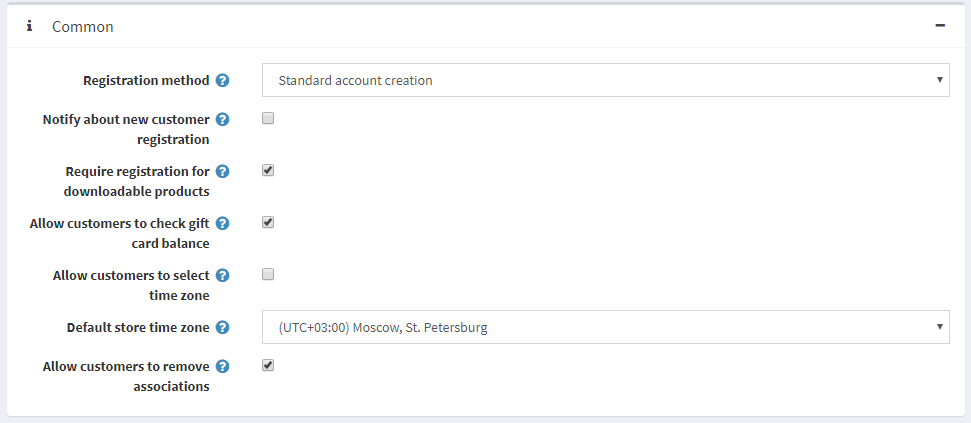
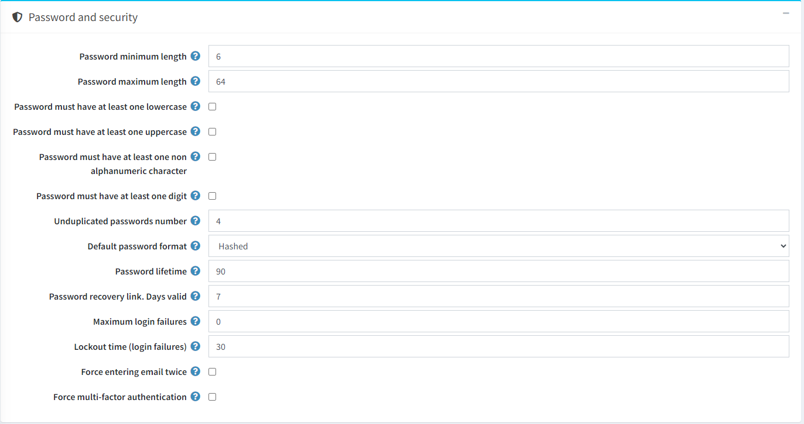
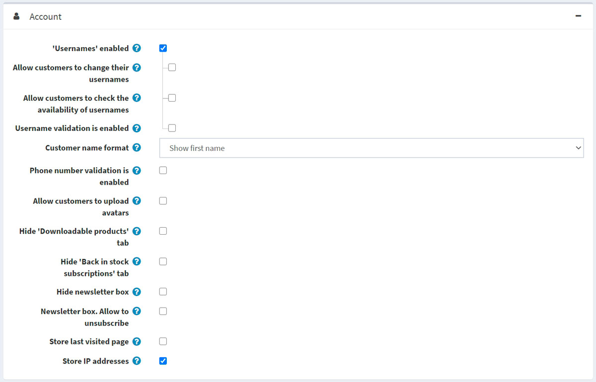
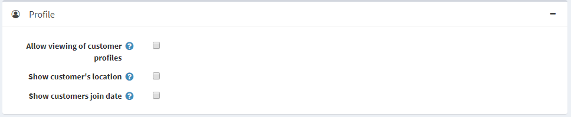
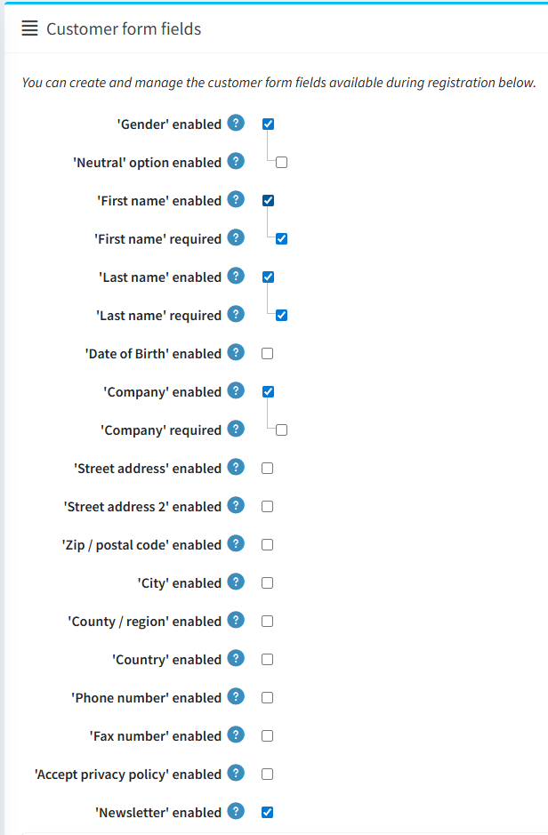
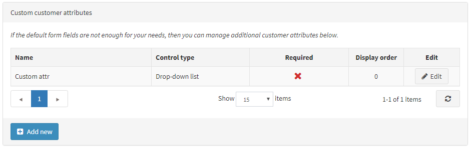
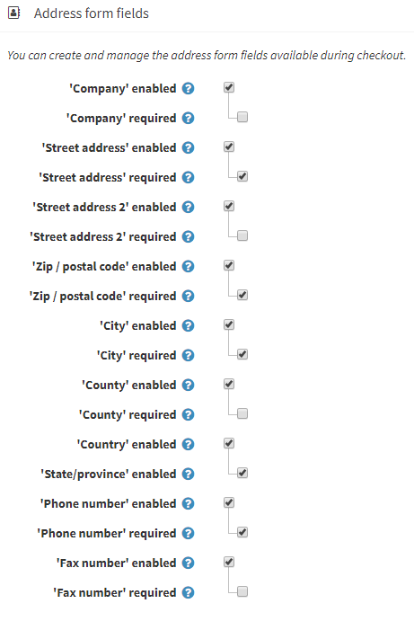
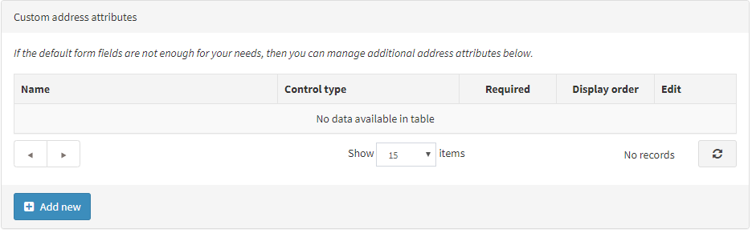

# 顧客設定

顧客設定包含啟用顧客上傳頭像、顯示顧客位置、變更姓名格式或加入日期等功能。

若要定義顧客設定，請前往 **設定 → 設定 → 顧客設定**。此時會顯示顧客設定視窗。此視窗包含六個面板：一般、密碼與安全性、帳戶、個人檔案、顧客表單欄位以及地址表單欄位。

1. **一般** 面板包含一般的顧客設定。

1. **密碼與安全性** 面板包含可用於設定安全性以及密碼複雜度的欄位。

1. **帳戶** 面板包含用於設定顧客帳戶的欄位。

1. **個人檔案** 面板包含用於設定顧客個人檔案的欄位。

1. **顧客表單欄位** 面板包含用於顧客註冊頁面的欄位。

1. **地址表單欄位** 面板包含用於在結帳過程中詳述顧客地址的欄位。

## 一般

定義一般顧客設定如下：

* 選擇 **註冊方式 (Registration method)** 如下：
  * **標準帳號建立 (Standard account creation)**：允許使用者註冊；無需審核。
  * **註冊後需要電子郵件驗證 (Email validation is required after registration)**：允許使用者註冊；但必須在帳號核准前，確認並接收寄送給他們的確認郵件。
  * **顧客需經由管理員核准 (A customer should be approved by administrator)**：允許使用者註冊；需要管理員核准。
  * **停用註冊 (Registration is disabled)**：選擇此選項可停用註冊功能。
* 勾選 **通知新顧客註冊 (Notify about new customer registration)** 核取方塊，以便在每當有新顧客註冊時，商店擁有者皆能收到電子郵件通知。
* 若顧客必須完成註冊才能購買可下載商品，請勾選 **購買可下載商品需註冊 (Require registration for downloadable products)** 核取方塊。
* 使用 **允許顧客查詢禮品卡餘額 (Allow customers to check gift card balance)** 欄位，以允許顧客查詢禮品卡餘額。
  > [!NOTE]
  >
  > 如果已勾選 **允許顧客查詢禮品卡餘額** 欄位，則必須在管理後台 (**設定 → 設定 → 一般設定 → CAPTCHA 面板**) 啟用 CAPTCHA 設定。此功能潛在風險較高，必須使用 CAPTCHA 以防止或增加暴力破解的難度。欲了解更多詳情，請參閱 [CAPTCHA 設定](xref:zh-Hant/getting-started/advanced-configuration/security-settings#captcha)。

* 選擇是否 **允許顧客選擇時區 (Allow customers to select time zone)**，該設定將影響前台帳號頁面。若不選，則使用預設時區。
* 從下拉式選單中選擇 **預設商店時區 (Default store time zone)**。
   > [!NOTE]
   >
   > 目前的時區會自動顯示。

* 勾選 **允許顧客移除關聯 (Allow customers to remove associations)**，以允許顧客移除外部驗證的關聯。

## 密碼與安全性

* 設定 **密碼最小長度**、**密碼最大長度**、**密碼必須包含至少一個小寫字母**、**密碼必須包含至少一個大寫字母**、**密碼必須包含至少一個非英數字元**、**密碼必須包含至少一個數字**，以變更密碼複雜度。
* **不可重複的密碼數量**是指不能與先前設定重複的密碼個數。
* 選擇 **預設密碼格式**，如下所示：
  * *明文 (Clear)*
  * *雜湊 (Hashed)*
  * *加密 (Encrypted)*
  > [!NOTE]
  >
  > 此設定用於儲存顧客密碼，僅適用於新註冊的顧客。

* 在 **密碼有效期限** 中，輸入密碼過期的天數。
  > [!NOTE]
  >
  > 若要使用 **密碼有效期限** 功能，請記得在顧客角色編輯頁面 (**顧客 → 顧客角色**) 中，為需要變更密碼的角色勾選 **啟用密碼有效期限** 屬性。欲知更多詳情，請參閱 [顧客角色](xref:zh-Hant/running-your-store/customer-management/customer-roles)。

* 在 **密碼復原連結有效天數** 欄位中，輸入密碼復原連結的有效天數。若不希望連結過期，請將其設為 0。
* 輸入 **最大登入失敗次數**。設為 0 則停用此功能。
* 在 **鎖定時間（登入失敗）** 中，輸入鎖定使用者的分鐘數。
* 若希望顧客在註冊時輸入兩次電子郵件，請勾選 **強制輸入兩次電子郵件** 核取方塊。
* **強制多重因素驗證**：強制針對存取控制清單 (Access control list) 中指定的顧客角色啟用多重因素驗證（必須至少啟用一個 MFA 提供者）。

## 帳號

* 勾選 **'Usernames' enabled** 核取方塊，即可啟用使用者名稱來進行登入與註冊，而不使用電子郵件。
  > [!NOTE]
  >
  > 不建議在正式環境中變更此選項。
  
  當勾選 **'Usernames' enabled** 核取方塊後，將會顯示以下選項：
  * **Allow customers to change their usernames**：若允許顧客變更其使用者名稱，請選取此選項。
  * **Allow customers to check the availability of usernames**：選取此選項可允許顧客在「我的帳號 - 顧客資訊」頁面點擊 *Save* 按鈕前，先檢查使用者名稱是否可用。在此情況下，將會顯示 **Check availability** 按鈕；請參考下方的範例。

* 若您想要啟用使用者名稱驗證（於前台網站的「我的帳號」頁面註冊或變更時），請選取 **Username validation is enabled** 欄位。當勾選此核取方塊後，將會顯示以下選項：
  * **Username validation rule**：在此欄位設定使用者名稱的驗證規則。您可以指定允許使用的字元清單或規則運算式 (regular expression)。若您使用規則運算式，請選取下方描述的 **Use regex for username validation** 欄位。
  * 選取 **Use regex for username validation** 欄位，即可使用規則運算式來進行使用者名稱驗證（於前台網站的「我的帳號」頁面註冊或變更時）。
* 選擇 **Customer name format**，選項如下：
  * *Show emails*
  * *Show usernames*
  * *Show full names*
  * *Show first name*
  顧客名稱將會顯示在商店中顧客的新聞與部落格留言旁、論壇頁面上以及其他位置。
* 若您想要啟用電話號碼驗證（於前台網站的「我的帳號」頁面註冊或變更時），請勾選 **Phone number validation is enabled** 核取方塊。當勾選此核取方塊後，將會顯示以下選項：
  * **Phone number validation rule**：在此欄位設定電話號碼的驗證規則。您可以指定允許使用的字元清單或規則運算式。若您使用規則運算式，請選取下方描述的 **Use regex for username validation** 欄位。
  * 選取 **Use regex for phone number validation** 欄位，即可使用規則運算式來進行電話號碼驗證（於前台網站的「我的帳號」頁面註冊或變更時）。
* **Allow customers to upload avatars**：顧客的頭像將會顯示在商店中顧客的新聞與部落格留言旁、論壇頁面上以及其他位置。若選取此選項，將會顯示以下核取方塊：
  * 勾選 **Default avatar enabled** 核取方塊以顯示預設的使用者頭像。
* 勾選 **Hide 'Downloadable products' tab** 核取方塊，即可在「我的帳號」頁面上隱藏此分頁。
* 勾選 **Hide 'Back in stock subscriptions' tab** 核取方塊，即可在「我的帳號」頁面上隱藏此分頁。
* 若您不想顯示電子報訂閱區塊，請勾選 **Hide newsletter box** 核取方塊。
* 勾選 **Newsletter box. Allow to unsubscribe** 核取方塊，即可在電子報區塊中顯示「取消訂閱」選項。例如，德國法規有此要求。
* 勾選 **Store last visited page** 核取方塊以儲存顧客最後造訪的頁面。隨後您可以在 **顧客 → 線上顧客** 頁面上檢視顧客最後造訪的頁面。您可以取消勾選此核取方塊以提升網站效能。
* 勾選 **Store IP address** 核取方塊以儲存顧客最後的 IP 位址。停用此功能可以提升效能。

## 個人檔案

* **允許檢視顧客個人檔案**：此設定可讓顧客在前台網站檢視其他顧客的詳細資訊。
* 若有需要，請勾選 **顯示顧客所在地** 核取方塊。
* 若有需要，請勾選 **顯示顧客加入日期** 核取方塊。

## 顧客表單欄位

在「顧客表單欄位」面板中，定義系統中是否啟用以下表單欄位：

* **啟用「性別」**
* **啟用「中性」選項**。如果啟用此選項，您將能夠指定三種性別選項之一：男、女、中性（根據德國法律）。
* **啟用「名字」**。啟用後，您還可以決定此欄位是否為必填。
* **啟用「姓氏」**。啟用後，您還可以決定此欄位是否為必填。
* **啟用「出生日期」**。啟用後，您還可以決定此欄位是否為必填，並輸入允許的最小年齡（例如，確保顧客年滿 18 歲）。
* **啟用「公司」**。啟用後，您還可以決定此欄位是否為必填。
* **啟用「街道地址」**。啟用後，您還可以決定此欄位是否為必填。
* **啟用「街道地址 2」**（如果啟用了第二個街道地址）。啟用後，您還可以決定此欄位是否為必填。
* **啟用「郵遞區號」**。啟用後，您還可以決定此欄位是否為必填。
* **啟用「城市」**。啟用後，您還可以決定此欄位是否為必填。
* **啟用「縣/市」**。啟用後，您還可以決定此欄位是否為必填。
* **啟用「國家」**。啟用後，您還可以決定此欄位是否為必填。
* **啟用「州/省」**。啟用後，您還可以決定此欄位是否為必填。注意：此欄位僅在啟用「國家」欄位時才會顯示。
* **啟用「電話號碼」**。啟用後，您還可以決定此欄位是否為必填。
* **啟用「傳真號碼」**。啟用後，您還可以決定此欄位是否為必填。
* 勾選 **啟用「接受隱私權政策」** 核取方塊，以要求顧客在註冊期間接受隱私權政策。
* 勾選 **啟用「電子報」** 核取方塊，以提供顧客在註冊期間訂閱電子報。

### 自訂顧客屬性

如果預設的表單欄位無法滿足您的需求，您可以使用此表格來管理額外的顧客屬性。顧客屬性的建立方式與結帳屬性相同。如需更多詳細資訊，請參閱 [結帳屬性](xref:zh-Hant/running-your-store/order-management/checkout-attributes)。

## 地址表單欄位

在「地址表單欄位」面板中，商店擁有者可以管理在註冊過程中可用的地址表單欄位。您可以選擇啟用並設定哪些欄位為必填，選項如下：

* **「公司」已啟用。** 啟用後，您可以進一步決定該欄位是否為必填。
* **「街道地址」已啟用。** 啟用後，您可以進一步決定該欄位是否為必填。
* **「街道地址 2」已啟用**（若已啟用第二街道地址欄位）。啟用後，您可以進一步決定該欄位是否為必填。
* **「郵遞區號」已啟用。** 啟用後，您可以進一步決定該欄位是否為必填。
* **「城市」已啟用。** 啟用後，您可以進一步決定該欄位是否為必填。
* **「縣市/地區」已啟用。** 啟用後，您可以進一步決定該欄位是否為必填。
* **「國家」已啟用。** 啟用後，您可以進一步決定該欄位是否為必填。
* **「州/省」已啟用。** 啟用後，您可以進一步決定該欄位是否為必填。注意：此欄位僅在啟用「國家」欄位時才會顯示。
* **「電話號碼」已啟用。** 啟用後，您可以進一步決定該欄位是否為必填。
* **「傳真號碼」已啟用。** 啟用後，您可以進一步決定該欄位是否為必填。

### 自訂地址屬性

> [!NOTE]
>
> 如果預設的地址欄位無法滿足您的需求，您可以使用此表格來管理額外的地址屬性。地址屬性的建立方式與結帳屬性相同。如需更多詳細資訊，請參閱 [結帳屬性](xref:zh-Hant/running-your-store/order-management/checkout-attributes)。

點擊頁面頂部的 **儲存**。

## 教學課程

* [設定密碼規則](https://www.youtube.com/watch?v=TwWArXNi0CA)