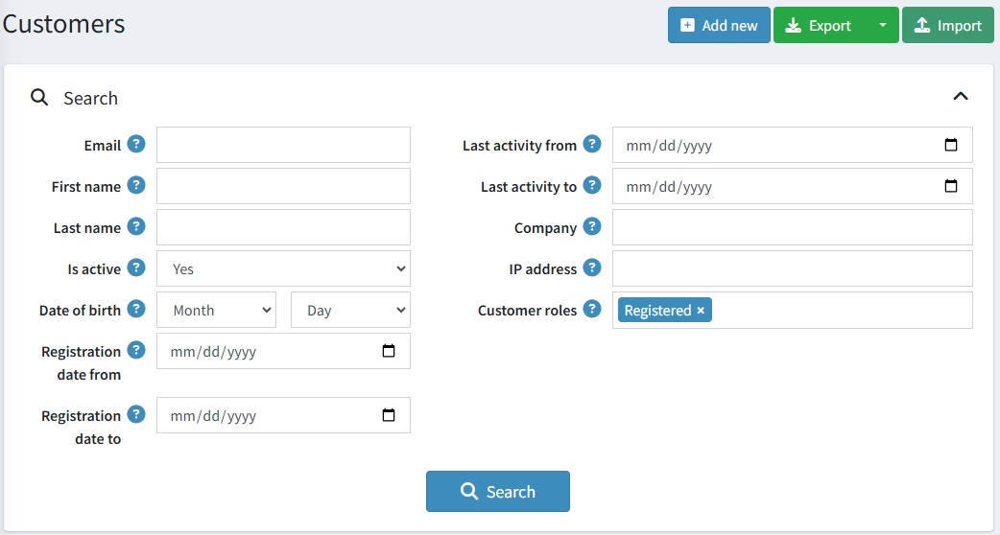
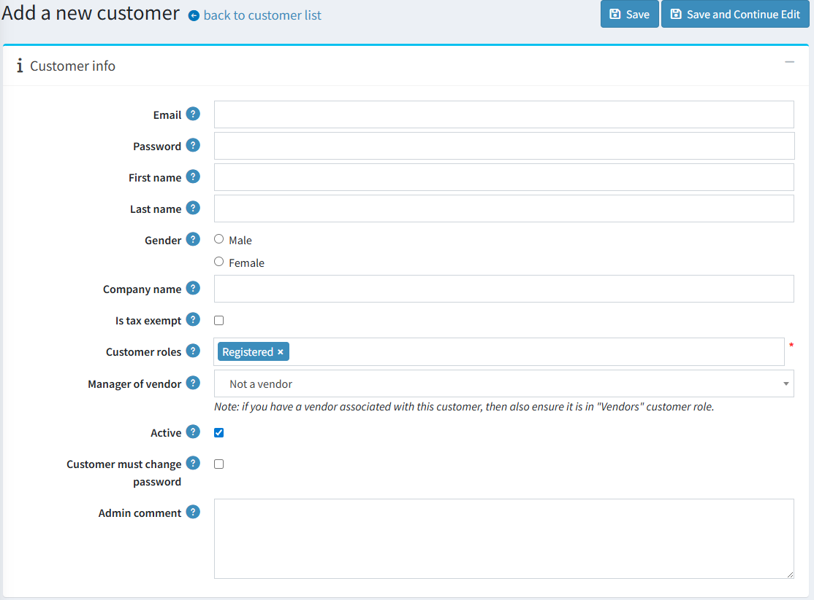
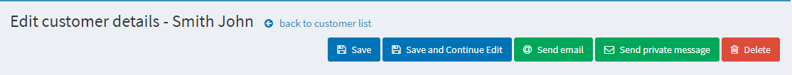
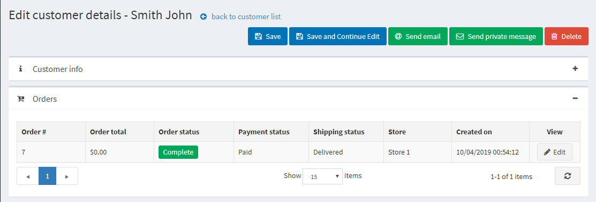
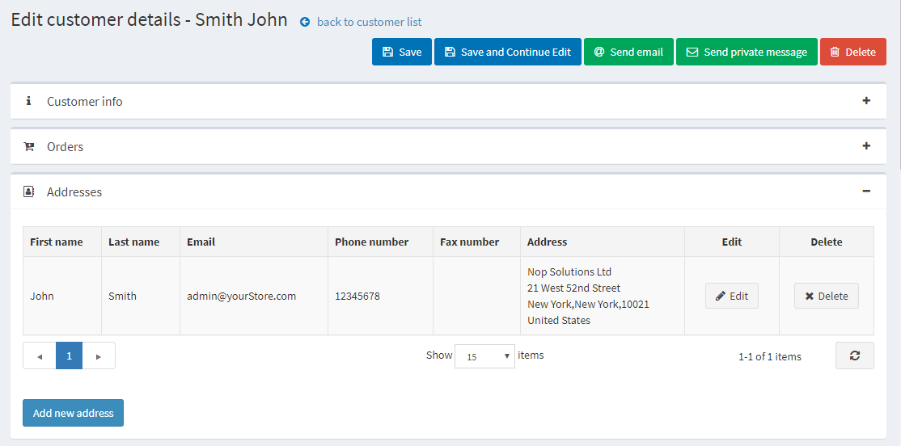
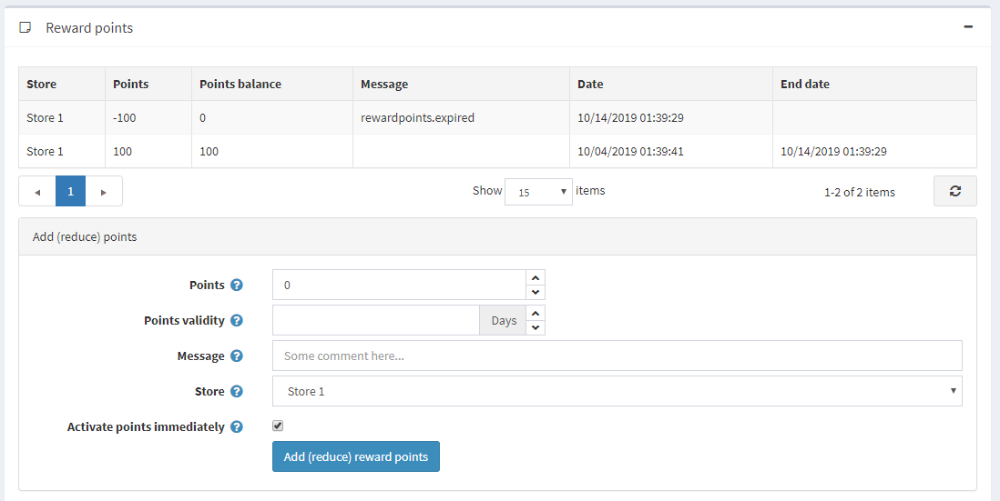

# 管理顧客

顧客清單包含所有現有顧客的詳細資料，並允許您新增顧客。此功能以及其他顧客管理設定，使 nopCommerce 成為具備內建 [全通路功能 (omnichannel feature)](https://www.nopCommerce.com/omnichannel-commerce) 的電子商務平台。在 nopCommerce 中，顧客包含了所有使用者，例如管理員、供應商與購買者。若要管理顧客，請前往 **顧客 → 顧客**。屆時將顯示下列視窗：

若要搜尋顧客，請在「顧客」視窗中輸入下列一項或多項搜尋條件：

- **電子郵件 (Email)**。
- **使用者名稱 (Username)**，若已在 [顧客設定](xref:zh-Hant/running-your-store/customer-management/customer-settings) 中啟用。
- **名字 (First name)**。
- **姓氏 (Last name)**。
- **啟用狀態 (Is active)**。依帳戶狀態搜尋顧客。
- **出生日期 (Date of birth)**，若已在 [顧客設定](xref:zh-Hant/running-your-store/customer-management/customer-settings) 中啟用。
- **公司 (Company)**，若已在 [顧客設定](xref:zh-Hant/running-your-store/customer-management/customer-settings) 中啟用。
- **電話 (Phone)**，若已在 [顧客設定](xref:zh-Hant/running-your-store/customer-management/customer-settings) 中啟用。
- **郵遞區號 (Zip code)**，若已在 [顧客設定](xref:zh-Hant/running-your-store/customer-management/customer-settings) 中啟用。
- **IP 位址 (IP address)**。
- **顧客角色 (Customer roles)** — 您可以選擇一或多個要顯示的顧客角色。
- **註冊日期起 (Registration date from)** 與 **註冊日期迄 (Registration date to)**。
- **最後活動時間起 (Last activity from)** 與 **最後活動時間迄 (Last activity to)**。

> [!NOTE]
>
> 您可以透過點擊 **匯出為 XML (全部)** 或 **匯出為 Excel (全部)** 將顧客資料匯出至外部檔案。您也可以透過點擊 **匯出為 XML (選取)** 或 **匯出為 Excel (選取)** 將所選的顧客資料匯出至外部檔案。

接著點擊 **搜尋 (Search)** 按鈕。

## 新增顧客

若要新增顧客，請在 *Customers* 視窗中點擊 **Add new**。
系統將會顯示 *Add a new customer* 視窗。請定義下列顧客詳細資料：

## 顧客資訊

*顧客資訊* 面板允許您輸入顧客的個人及帳戶資訊，例如更改密碼、指派或移除顧客角色。

您可以編輯以下欄位：

- **Email** 位址。
- **Password**（密碼）。
- **First name**（名字）。
- **Last name**（姓氏）。
- **Gender**（性別）。
- **Date of birth**（出生日期）。
- **Company name**（公司名稱）。
- **Is tax exempt**（是否免稅）指出該顧客是否免稅。
- **Customer roles**（顧客角色）— 單一或多個顧客角色。請注意，任何需要登入系統的角色（例如管理員、供應商）都應該具備「Registered」（已註冊）顧客角色。您可以在 [顧客角色](xref:zh-Hant/running-your-store/customer-management/customer-roles) 區段中設定顧客角色。
- 在 **Manager of vendor**（供應商管理員）下拉式清單中，若有需要，請選擇與此顧客帳戶相關聯的供應商。建立關聯後，該顧客將能夠登入所選供應商的入口網站，並管理其商品與訂單。請注意，如果您將某個供應商與此顧客關聯，則應確保此顧客記錄已包含在 [供應商](xref:zh-Hant/running-your-store/vendor-management) 清單中。
- 勾選 **Active**（啟用）核取方塊以啟用該顧客。
- **Customer must change password**（顧客必須變更密碼）— 勾選此項以要求顧客變更密碼。
- **Admin comment**（管理員備註）— 若有需要，供內部使用的管理員備註。

點擊 **Save**（儲存）按鈕以儲存變更，或點擊 **Save and continue edit**（儲存並繼續編輯）按鈕以繼續編輯更多顧客資訊。在這種情況下，您將會在顧客詳細資料頁面看到新增加的面板。

您也會看到 **Send email**（發送電子郵件）、**Send private message**（發送私人訊息，若已啟用 [論壇](xref:zh-Hant/running-your-store/content-management/forums) 功能）以及 **Delete**（刪除）按鈕。

點擊 **Send email** 按鈕後，會顯示 *發送電子郵件* 視窗，讓商店擁有者可以發送郵件給顧客。點擊 **Send private message** 按鈕後，會顯示 *發送私人訊息* 視窗，讓您可以發送訊息給顧客。若要使用私人訊息功能，請在 [論壇設定](xref:zh-Hant/running-your-store/content-management/forums) 中允許私人訊息功能。

## 訂單

在 *Orders* 面板中，您可以檢視顧客的訂單詳情。

## 地址

在 *地址* 面板中，您可以檢視、編輯並建立顧客的新地址。

點擊 **新增地址** 按鈕來新增一個顧客地址。填寫適當的欄位後點擊 **儲存**。新的地址將會新增至該顧客名下。

## 目前購物車與願望清單

在「目前購物車與願望清單」面板中，您可以檢視顧客的購物車與願望清單。

## 活動記錄

在「活動記錄」面板中，您可以檢視顧客的活動記錄。請參閱 [活動記錄 - 顧客活動類型](xref:zh-Hant/running-your-store/customer-management/activity-log#customer-activity-types) 章節，了解如何管理活動類型。

## 下單（模擬顧客）

在「下單（模擬顧客）」面板中，商店經營者可以在無需顧客密碼的情況下為其建立訂單。這對於不想註冊的顧客，或是大型網站透過客戶服務代表（CSR）以電話協助下單的情況非常實用。

此面板包含一個 **下單** 按鈕。點擊此按鈕後，您將被重新導向至前台網站。選擇顧客想要的商品，並像顧客在前台網站操作一樣將其加入購物車，接著使用 **結帳** 按鈕完成一般的結帳流程，最後點擊頁面頂端的 **結束工作階段** 連結以結束此工作階段。

## 補貨通知訂閱

在「補貨通知訂閱」面板中，可以查看顧客所訂閱的商品。

## 紅利點數

在「紅利點數」面板中，商店擁有者可以為顧客新增紅利點數，或是檢視他們的紅利點數使用記錄。當紅利點數計畫啟用時，此面板才會顯示。欲知更多資訊，請參考 [紅利點數](xref:zh-Hant/running-your-store/promotional-tools/reward-points) 章節。

### 新增（減少）點數

在此面板中：

- 輸入 **點數** 數量。若要減少點數，請輸入負值。
- 在 **點數有效期限** 欄位中，指定所獲點數的有效天數（僅適用於正數點數）。
- 輸入 **訊息** 或註解。
- 若您希望顧客在獲得紅利點數後立即使用，請勾選 **立即啟用點數** 核取方塊。若您未勾選此核取方塊，將會出現另一個選項：
- 若前一個核取方塊未勾選，請在 **紅利點數啟用** 欄位中，指定紅利點數啟用所需的時間週期（天數/小時數）。

## 參閱

- [顧客角色](xref:zh-Hant/running-your-store/customer-management/customer-roles)
- [供應商](xref:zh-Hant/running-your-store/vendor-management)

## 教學課程

- [nopCommerce 中的顧客管理](https://www.youtube.com/watch?v=DOl-g-NNFEM&list=PLnL_aDfmRHwsbhj621A-RFb1KnzeFxYz4&index=1)
- [重新指派已刪除的電子郵件地址](https://www.youtube.com/watch?v=lqmrWJdXZEE&t=1s)
- [模擬登入模式概覽](https://www.youtube.com/watch?v=KQi-CDVawJ4)