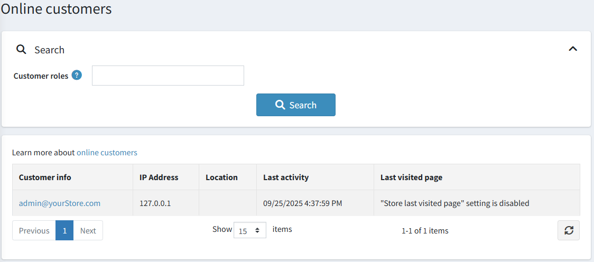

# 線上顧客

「線上顧客」區段讓商店擁有者可以檢視過去 20 分鐘內在線上的顧客。這項資訊對於商店擁有者很有用，因為它顯示了最後造訪的頁面，有助於決定將訪客轉換為購買者所需的行動。

若要存取此視窗，請前往 **顧客 → 線上顧客**。

商店擁有者可以透過 **顧客角色** 來篩選使用者。
「線上顧客」視窗包含以下欄位：

- **顧客資訊** — 您可以點擊連結來檢視並編輯顧客資訊。
- **IP 位址** — 顧客目前的 IP 位址。
- **位置** — 顧客依據 IP 位址判斷的位置。
- **最後活動** — 線上顧客最後登入的日期與時間。
- **最後造訪頁面** — 顧客最後造訪的頁面。

> [!NOTE]
>
> 若要查看最後造訪頁面，您需要在 **設定 → 設定 → 顧客設定** 頁面（*帳戶* 面板）中啟用 **儲存最後造訪頁面** 設定。

此頁面包含由 MaxMind 建立的 GeoLite2 資料，可從 [http://www.maxmind.com](http://www.maxmind.com) 取得。