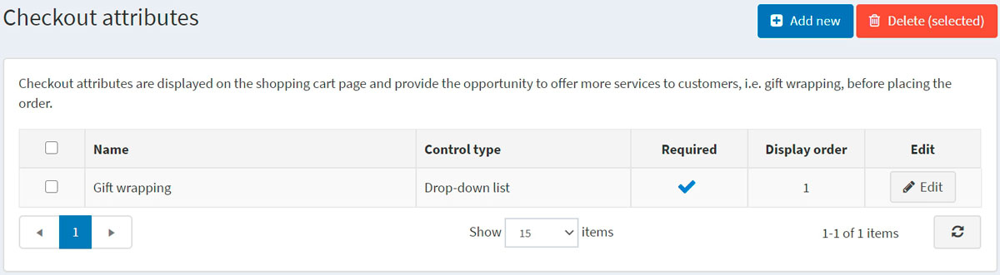
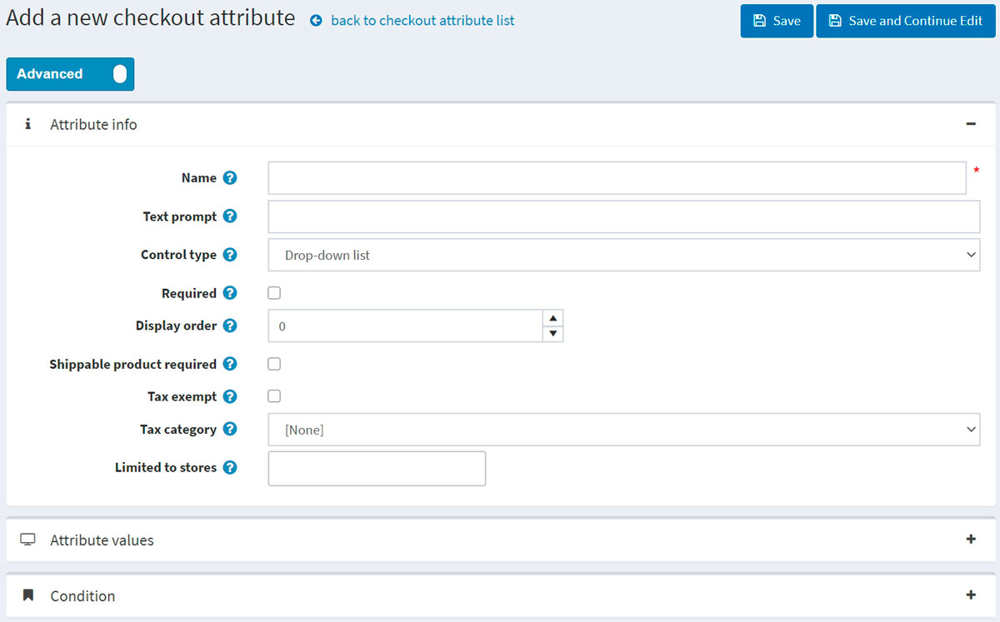
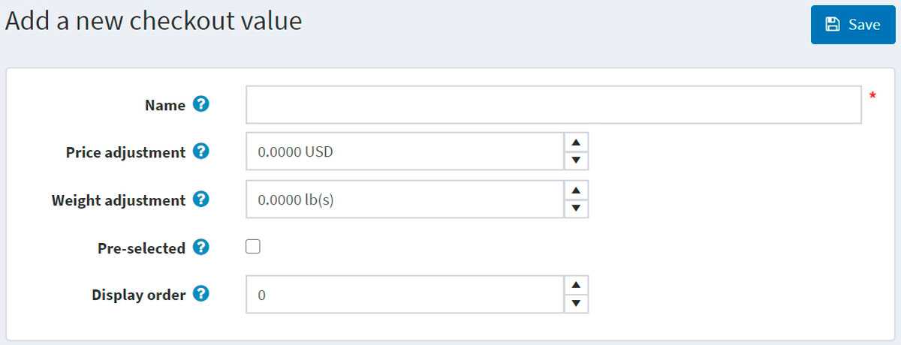
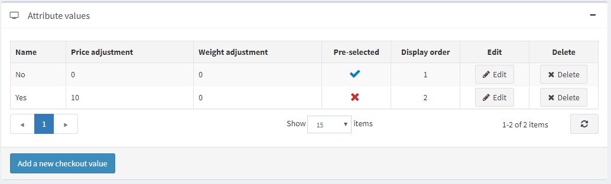
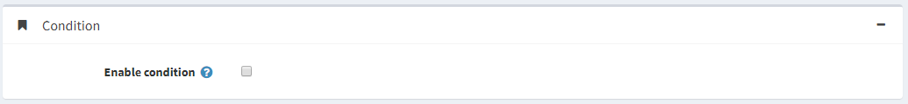

# 結帳屬性

結帳屬性代表在購物流程的最後階段所收集的額外訂單資訊。

> [!TIP]
>
> 透過使用結帳屬性，商店擁有者可以指定例如所購買的商品是否需要禮品包裝，或是像易碎商品那樣需要小心處理。

結帳屬性會顯示在購物車頁面上，並讓使用者在結帳前根據需要進行選擇。

若要設定或編輯結帳屬性，請前往 **目錄 → 屬性 → 結帳屬性**。

您可以勾選結帳屬性並點擊 **刪除 (所選)** 按鈕來將其刪除。

## 新增結帳屬性

若要建立新的結帳屬性，請點擊 **新增**。畫面將會顯示 *新增結帳屬性* 視窗如下：

此頁面提供兩種模式：**進階 (advanced)** 與 **基本 (basic)**。您可以切換至基本模式，僅顯示主要欄位；或使用進階模式，顯示所有可用的欄位。

在 *屬性資訊 (Attribute info)* 面板中，請定義以下資訊：

- **名稱 (Name)** — 屬性名稱。
- **文字提示 (Text prompt)** — 將會在購物車頁面的結帳區塊中顯示的問題或備註。
- 從 **控制類型 (Control type)** 下拉式選單中，選擇顯示屬性值所需的方法，例如 *下拉式選單 (Dropdown list)*、*選項按鈕清單 (Radio button list)*、*核取方塊 (Checkboxes)*、*文字方塊 (Textbox)*。
  > [!NOTE]
  >
  > 下拉式選單、選項按鈕清單、核取方塊和顏色方塊需要商店擁有者定義數值（例如：綠色、藍色、紅色等）。*文字方塊 (Textbox)* 和 *日期選擇器 (Date picker)* 控制類型不需要商店擁有者定義數值，因為系統會要求顧客自行填寫這些欄位。此外，針對某些控制類型，您可以指定驗證規則。例如，對於 *文字方塊 (Textbox)* 屬性，您可以定義 **最小長度 (Minimum length)**、**最大長度 (Maximum length)** 和 **預設值 (Default value)**。對於 *檔案上傳 (File upload)* 屬性，您可以定義 **允許的副檔名 (Allowed file extension)** 和 **最大檔案大小 (KB) (Maximum file size (KB))**。

- 如果在完成購買程序前必須選擇屬性值，請勾選 **必填 (Required)** 核取方塊。
- **顯示順序 (Display order)** — 結帳屬性的顯示順序編號。
- 若此屬性僅應顯示於需要運送的商品，請勾選 **需要運送商品 (Shippable product required)** 核取方塊。
- 勾選 **免稅 (Tax exempt)** 核取方塊表示此結帳屬性將不適用任何稅額。
- 若需課稅，請從 **稅務類別 (Tax category)** 下拉式選單中，選擇該結帳屬性的稅務類別。
- **限制商店 (Limited to stores)** 可讓您將該屬性限制於一個或多個商店使用。
  > [!NOTE]
  >
  > 為了使用此功能，您必須停用以下設定：**目錄設定 (Catalog settings) → 忽略「各商店限制」規則 (全站) (Ignore "limit per store" rules (sitewide))**。閱讀更多關於多商店功能 [here](xref:zh-Hant/getting-started/advanced-configuration/multi-store) 的資訊。

點擊 **儲存並繼續編輯 (Save and continue edit)** 以進入 *屬性值 (Attribute values)* 面板（若適用）。

### 新增結帳屬性值

在 *Attribute values* 面板中，點擊 **Add a new checkout attribute value** 來建立一個新的屬性值。

在 *Add a new checkout attribute value* 視窗中，定義以下資訊：

- **Name** — 屬性值的名稱。
  > [!TIP]
  >
  > 例如，針對「您是否需要易碎品處理服務？」這類問題，可以使用「是」或「否」。

- **Price adjustment** — 若勾選此屬性值，將會把輸入的金額加總至訂單總金額中。
- **Weight adjustment** — 若勾選此屬性值，將會變更訂單重量，變更幅度為輸入的數值。
- 勾選 **Pre-selected** 核取方塊，表示該屬性值會預設為顧客選取狀態。
- **Display order** — 屬性值的顯示順序數字。

您可以點擊 *Attribute values* 面板中屬性旁邊的對應按鈕，來 **Edit**（編輯）和 **Delete**（刪除）屬性值。

## 新增條件

在 *Condition* 面板中，商店擁有者可以為結帳屬性指定一個顯示條件（取決於其他屬性）。僅在選擇了前一個屬性時，條件屬性才會顯示。

點擊 **儲存**。新的屬性將顯示在公開商店的購物車頁面上。

## 教學課程

- [新增結帳屬性](https://www.youtube.com/watch?v=sJcZP1qjHmY&list=PLnL_aDfmRHwsbhj621A-RFb1KnzeFxYz4&index=3)
- [條件式結帳屬性概覽](https://www.youtube.com/watch?v=z3UiXgK8Jgo&list=PLnL_aDfmRHwsbhj621A-RFb1KnzeFxYz4&index=18)