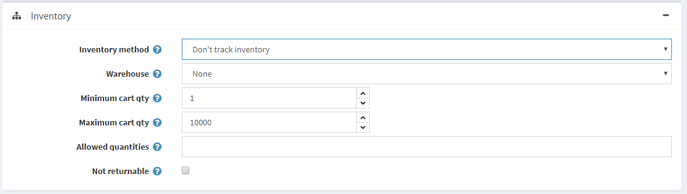
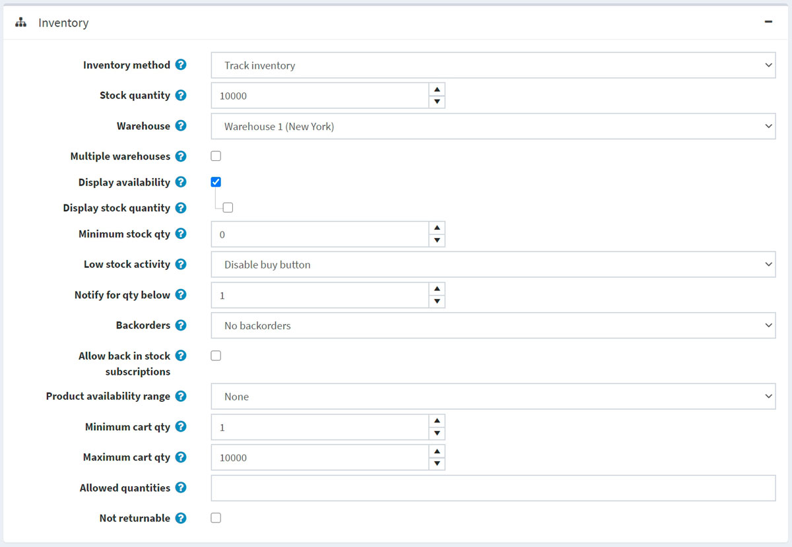
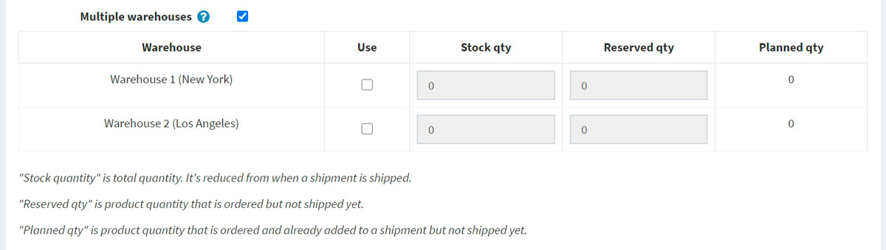
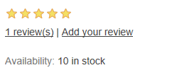
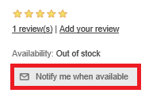
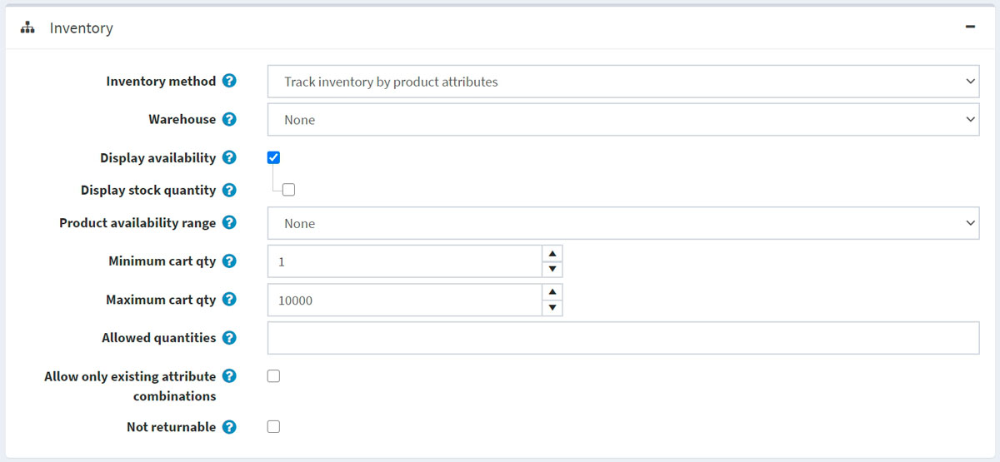
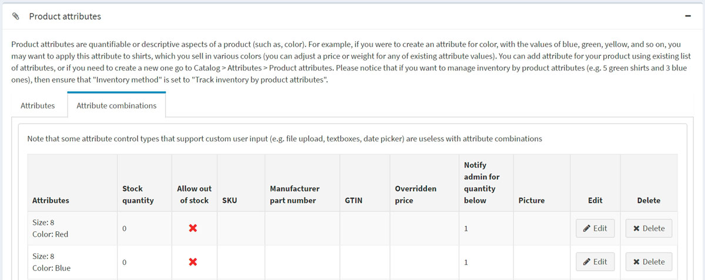
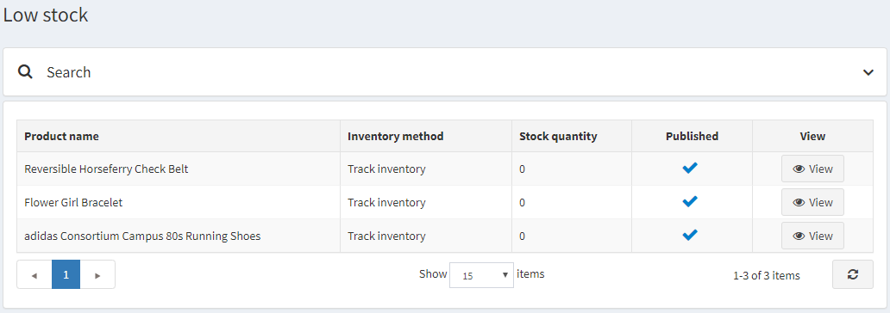

# 庫存管理

庫存管理是一種用於控制庫存水平的系統。在 nopCommerce 中，它包含了設定庫存以及追蹤低庫存量的功能。

若要設定庫存，請前往 **目錄 → 商品 → 編輯商品**。在 *編輯商品詳情* 視窗中，移至 *庫存* 面板。在此面板中，您可以選擇以下三種庫存管理方式之一：

1. [不追蹤庫存](#dont-track-inventory)
1. [追蹤庫存](#track-inventory)
1. [透過商品屬性追蹤庫存](#track-inventory-by-product-attributes)

在接下來的章節中，我們將探討這些方法之間的差異。

## 不追蹤庫存

有些商品可能不需要進行庫存追蹤。例如：服務、二手商品或客製化商品。在這種情況下，商店經營者可以選擇不追蹤，只要在 **庫存方式** 欄位中選擇 *不追蹤庫存* 選項即可。

在此情況下，商店經營者可以定義以下項目：

- **倉庫**：在計算運費時將會使用此倉庫。請參閱 [倉庫](xref:zh-Hant/getting-started/configure-shipping/advanced-configuration/warehouses) 章節以了解更多資訊。
- **最小購物車數量**：允許放入顧客購物車的商品數量。例如，設定為 3，表示僅允許顧客購買 3 件（含）以上該商品。
- **最大購物車數量**：允許放入顧客購物車的商品數量。例如，設定為 5，表示僅允許顧客購買 5 件（含）以下該商品。
- 在 **允許數量** 欄位中，輸入您希望限制此商品購買數量的清單，並以逗號分隔。顧客將會看到一個下拉式選單來選擇您在此輸入的數值，而不是透過文字輸入框自行填寫任何數量。
- 若此商品不可退貨，請勾選 **不可退貨** 核取方塊。在這種情況下，顧客將無法提交退貨請求。

## 追蹤庫存

如果需要進行庫存追蹤，商店擁有者可以在兩個選項中選擇一種 **庫存方法**：*追蹤庫存*（按商品）或 *按商品屬性追蹤庫存*。*追蹤庫存* 選項適用於那些沒有商品變體，僅需知道剩餘商品數量的商店。在本節中，我們將介紹 *追蹤庫存* 選項。
一旦選擇此選項，該區段將會展開並顯示新的欄位：

請依照下列方式設定庫存：

- **庫存數量** 為總數量。每當訂單出貨時，此數量會隨之減少。
- 選擇計算運費時所使用的 **倉庫**。您可以在 **設定 → 運送 → 倉庫** 頁面管理倉庫。詳細資訊請參閱 [倉庫](xref:zh-Hant/getting-started/configure-shipping/advanced-configuration/warehouses) 頁面。
- 如果您想要支援多個倉庫的運送與庫存管理，請勾選 **多個倉庫** 核取方塊。透過這種方式，您可以針對每個倉庫進行庫存管理：
  
    如果您希望在此商品使用該倉庫，請點擊對應列中的 **使用**。
  - 輸入 **庫存數量**，即為總數量。每當訂單出貨時，此數量會隨之減少。
  - 輸入 **預留數量**，這是指已訂購但尚未出貨或尚未加入出貨單的商品數量。
  - **計畫數量** 是指已訂購且已加入出貨單但尚未實際出貨的商品數量。

- 為了避免顧客下單後才發現商品缺貨，您可以採取某些行動。勾選 **顯示庫存狀態** 核取方塊，即可在前台網站顯示庫存狀況。
  - 若有需要，勾選 **顯示庫存數量** 核取方塊，讓顧客能在商品詳細資訊頁面看到商品庫存數量（此核取方塊僅在勾選 **顯示庫存狀態** 後顯示）。下方的螢幕截圖展示了顧客在前台網站會看到的情形：

      

- 在 **最低庫存數量** 欄位中，輸入將觸發後續行動的最小值。
- 從 **低庫存行為** 下拉式清單中，選擇當庫存數量低於最低庫存數量時所採取的行動，如下所示：
  - **無**：商店擁有者可以選擇不採取任何行動。這表示顧客可以繼續訂購商品。
  - **停用購買按鈕**：當庫存不足時，購買按鈕會變為停用狀態。因此，顧客無法購買此商品，但仍能看見該商品存在於商店中。
  - **取消發佈**：商品將不再於商店中顯示。當商品即將完全停止販售時使用。

- 在 **低於此數量時通知** 欄位中，輸入一個數值，當庫存低於此數值時，系統會發送電子郵件通知管理員。
- 商店擁有者可以設定 **缺貨訂單 (Backorders)**，即購買當下無法立即履行的訂單。從缺貨訂單下拉式清單中，選擇所需的缺貨模式，如下所示：
  - **不允許缺貨訂單**：當沒有庫存時，顧客無法購買此商品。
  - **允許數量低於 0**：即使沒有庫存，顧客仍可購買此商品。
  - **允許數量低於 0 並通知顧客**：即使沒有庫存，顧客仍可購買此商品。此外，他們會收到包含以下訊息的通知：*缺貨 - 已加入缺貨訂單，一旦到貨將立即出貨（此情況下也應啟用 **顯示庫存狀態** 選項）*。

- 勾選 **允許到貨通知訂閱**，讓顧客能夠訂閱商品到貨通知，如下圖所示：
  
  

- 選擇當商品暫時無庫存時，要顯示給顧客看的 **商品庫存狀態範圍**。您可以在 **設定 → 運送 → 日期與範圍** 頁面的 *商品庫存狀態範圍* 面板中設定這些範圍。詳細資訊請參閱 [日期與範圍](xref:zh-Hant/getting-started/configure-shipping/advanced-configuration/dates-and-ranges) 頁面。

- **最低購物車數量** 是指顧客購物車中允許的數量，例如設定為 3，則僅允許顧客購買 3 件或更多的此商品。
- **最高購物車數量** 是指顧客購物車中允許的數量，例如設定為 5，則僅允許顧客購買 5 件或更少的此商品。
- 在 **允許數量** 欄位中，輸入以逗號分隔的數量清單，限制此商品的購買數量。顧客將會看到一個下拉式選單來選擇您輸入的數值，而不是透過數量輸入框輸入任意數值。
- 如果此商品無法退貨，請勾選 **不可退貨** 核取方塊。在這種情況下，顧客將無法提交退貨請求。

## 依據商品屬性追蹤庫存

如果您有各種不同的商品屬性組合，且需要追蹤其庫存數量，請選擇「依據商品屬性追蹤庫存」(Track inventory by product attributes) 的庫存方法。
選擇此選項後，區塊將會展開並顯示新的欄位：

- 選擇計算運費時所使用的 **倉庫** (Warehouse)。您可以在 **設定 → 貨運 → 倉庫** 頁面管理倉庫。詳細資訊請參閱 [倉庫](xref:zh-Hant/getting-started/configure-shipping/advanced-configuration/warehouses) 頁面。
- 為了避免顧客下單後才發現商品缺貨，您可以採取某些措施。勾選 **顯示庫存狀態** (Display availability) 核取方塊，以便在前台網站顯示庫存狀況。
  - 若有需要，請勾選 **顯示庫存數量** (Display stock quantity) 核取方塊，讓顧客可以在商品詳細資訊頁面看到商品庫存數量（此核取方塊僅在勾選 **顯示庫存狀態** 後才會顯示）。以下截圖示範了顧客在前台網站所看到的畫面：

    

- 選擇當商品目前無庫存時，要顯示給顧客看的 **商品可用性範圍** (Product availability range)。您可以在 **設定 → 貨運 → 日期與範圍** 頁面的「商品可用性範圍」面板中設定可用性範圍。詳細資訊請參閱 [日期與範圍](xref:zh-Hant/getting-started/configure-shipping/advanced-configuration/dates-and-ranges) 頁面。

- **購物車最少數量** (Minimum cart qty) 是指顧客購物車中允許的數量，例如設定為 3，代表顧客購買該商品時必須購買 3 個或以上。
- **購物車最多數量** (Maximum cart qty) 是指顧客購物車中允許的數量，例如設定為 5，代表顧客購買該商品時最多只能購買 5 個。
- 在 **允許的數量** (Allowed quantities) 欄位中，輸入以逗號分隔的數量清單，限制此商品的購買數量。顧客將不會看到可以輸入任意數量的文字方塊，而是會看到一個包含您在此處輸入數值的下拉式選單。
- 勾選 **僅允許現有的屬性組合** (Allow only existing attribute combinations)，則僅允許將庫存數量大於 0 的現有屬性組合加入購物車或願望清單。在此情況下，您必須建立所有現有庫存的商品屬性組合。
- 若此商品不可退貨，請勾選 **不可退貨** (Not returnable) 核取方塊。在此情況下，顧客將無法提交退貨請求。

> [!NOTE]
>
> 若要為不同的屬性組合設定 **庫存數量** (Stock quantity)，請前往編輯商品詳細資訊頁面中「商品屬性」面板的 **屬性組合** (Attribute combinations) 索引標籤。在此索引標籤中，您可以定義是否針對特定屬性組合 **允許缺貨** (Allow out of stock)，以利即使在商品缺貨時仍能核准訂單。
  
>
> [!TIP]
>
> 若要追蹤目前庫存不足的商品，請前往 **報表 → 低庫存** (Reports → Low stock)。
> 低庫存報表包含目前庫存不足的商品清單，亦即庫存數量等於或小於商品詳細資訊頁面「庫存」區段中所設定之最低庫存數量的商品。
  
  點擊 **檢視** (View) 即可查看商品詳細資訊頁面，並於該處更改這些庫存設定。
  關於 nopCommerce 報表的更多詳細資訊，請造訪 [報表](xref:zh-Hant/running-your-store/reports) 頁面。

## 參閱

- [商品屬性](xref:zh-Hant/running-your-store/catalog/products/product-attributes)
- [倉庫](xref:zh-Hant/getting-started/configure-shipping/advanced-configuration/warehouses)

## 教學課程

- [在 nopCommerce 中管理預購訂單 (backorders)](https://www.youtube.com/watch?v=CMhQ39clCKM)