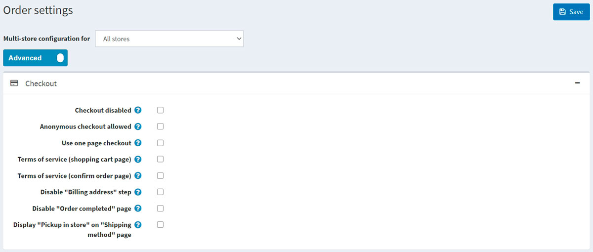
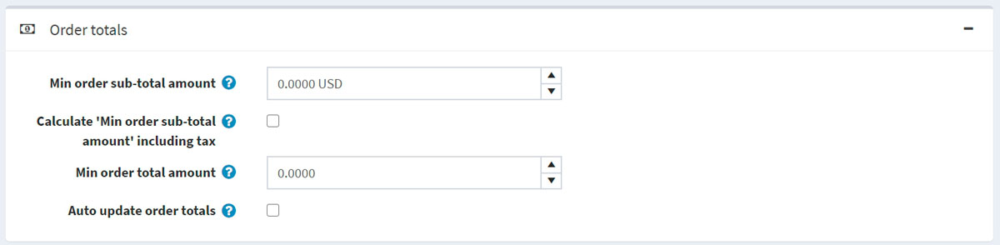
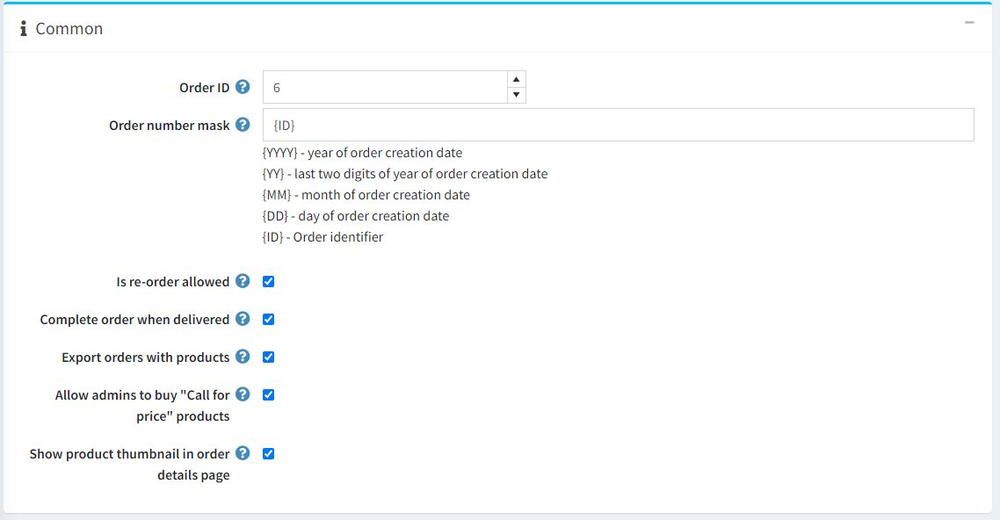
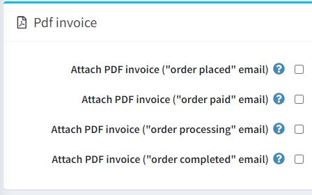
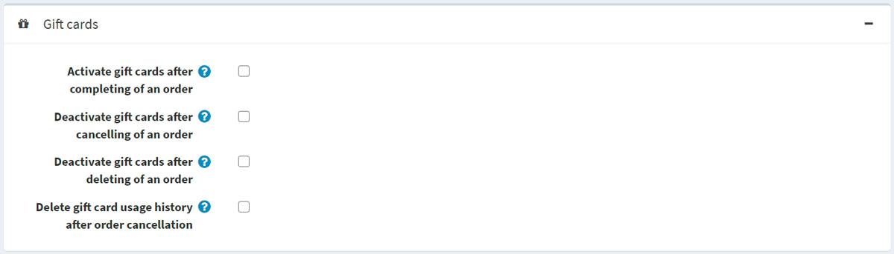

# 訂單設定

若要定義訂單設定，請前往 **設定 → 設定 → 訂單設定**。此時會顯示 *訂單設定* 視窗。

此頁面支援多商店設定；這表示您可以為所有商店定義相同的設定，或為不同商店設定不同的內容。如果您想管理特定商店的設定，請從多商店設定的下拉式選單中選擇該商店名稱，並勾選左側所需的核取方塊，以設定自訂的值。如需進一步詳情，請參閱 [多商店](xref:zh-Hant/getting-started/advanced-configuration/multi-store)。

在此視窗中，您可以定義下列訂單設定：

## 結帳

在「結帳」面板中定義以下設定：

* **結帳停用 (Checkout disabled)** 以停用結帳流程。
* **允許匿名結帳 (Anonymous checkout allowed)** 以允許顧客在未註冊或未登入的情況下購買商品。
* **使用單頁結帳 (Use one page checkout)**，這是顧客用來向您購買商品或服務的單一網頁。
* **付款資訊頁籤顯示訂單總計 (Order totals on payment info tab)**，以在付款資訊頁籤中顯示商品清單與訂單總計（單頁結帳）。
* 是否要求顧客在處理訂單前接受 **服務條款 (Terms of service)**（在 **購物車頁面** 上）。
* 是否要求顧客在處理訂單前接受 **服務條款 (Terms of service)**（在 **確認訂單頁面** 上）。
* **停用「帳單地址」步驟 (Disable "Billing address" step)**。帳單地址將會預先填寫，並使用預設的註冊資料儲存（若已選擇訪客結帳則無法使用）。請確保在 **後台 → 設定 → 顧客設定** 中，那些無法預先填寫的適當地址欄位並非必填（或已停用）。
* **停用「訂單完成」頁面 (Disable "Order completed" page)**，以便在訂單送出後自動將顧客重新導向至訂單詳細資訊頁面。
* **在「配送方式」頁面顯示「店內取貨」 (Display "Pickup in store" on "Shipping method" page)**，或在配送地址頁面上顯示。

## 訂單總計

在「訂單總計」面板中定義以下設定：

* **訂單小計最低金額 (Min order sub-total amount)**。低於此金額的訂單將無法成立。
* **計算「訂單小計最低金額」時包含稅金 (Calculate "Min order sub-total amount" including tax)**。若勾選此項，在驗證上一步指定的 **Min order sub-total amount** 欄位時，訂單小計將包含稅金進行計算。
* **訂單總計最低金額 (Min order total amount)**。低於此金額的訂單將無法成立。
* **自動更新訂單總計 (Auto update order totals)**：在管理後台編輯訂單時自動更新訂單總計（目前處於 BETA 測試階段）。

## 一般

在「一般」面板中定義以下設定：

* **訂單編號 (Order ID)** 計數器。若您希望訂單編號從特定數字開始，此功能非常實用。這僅會影響設定後建立的訂單。其數值必須大於當前最大的訂單編號。
* 在 **訂單編號遮罩 (Order number mask)** 中，您可以建立自訂的訂單編號。例如，以 {YYYY} 開頭，即代表訂單建立年份。
* **允許重新訂購 (Is re-order allowed)** 可讓顧客進行重新訂購。重新訂購機制會自動將之前訂單中的所有商品加入購物車。
* **送達時完成訂單 (Complete order when delivered)** 可將訂單狀態設為「已完成」，僅在運送狀態為「已送達」時觸發。否則，只要狀態為「已出貨」即可。
* **匯出包含商品的訂單 (Export orders with products)**。
* **允許管理員購買「來電詢價」商品 (Allow admins to buy "Call for price" products)** 可允許管理員（在模擬顧客模式下）購買標記為「來電詢價」的商品。
* **在訂單詳細資料頁面顯示商品縮圖 (Show product thumbnail in order details page)** 以便在訂單詳細資料頁面中顯示商品縮圖。

## PDF 發票

在 *PDF 發票* 面板中定義以下設定：

* **附上 PDF 發票（「訂單已建立」電子郵件）**。
* **附上 PDF 發票（「訂單已付款」電子郵件）**。
* **附上 PDF 發票（「訂單處理中」電子郵件）**。
* **附上 PDF 發票（「訂單已完成」電子郵件）**。

> [!TIP]
>
> 瞭解如何在 [PDF 設定](xref:zh-Hant/getting-started/advanced-configuration/pdf-settings) 章節中設定 PDF。

## 禮品卡

在 *禮品卡* 面板中定義下列設定：

* **訂單完成後啟用禮品卡**：當訂單完成時，啟用相關的禮品卡。
* **訂單取消後停用禮品卡**：當訂單取消時，停用相關的禮品卡。
* **訂單刪除後停用禮品卡**：當訂單刪除時，停用相關的禮品卡。
* **訂單取消後刪除禮品卡使用紀錄**：當訂單取消後，刪除禮品卡的使用紀錄。

## 退貨申請設定

在 *退貨申請設定* 面板中，您可以設定退貨申請。欲知更多詳情，請參閱 [退貨申請設定](xref:zh-Hant/running-your-store/order-management/return-requests#return-request-settings) 章節。

## 參閱

* [訂單](xref:zh-Hant/running-your-store/order-management/orders)
* [退貨申請](xref:zh-Hant/running-your-store/order-management/return-requests)
* [PDF 設定](xref:zh-Hant/getting-started/advanced-configuration/pdf-settings)