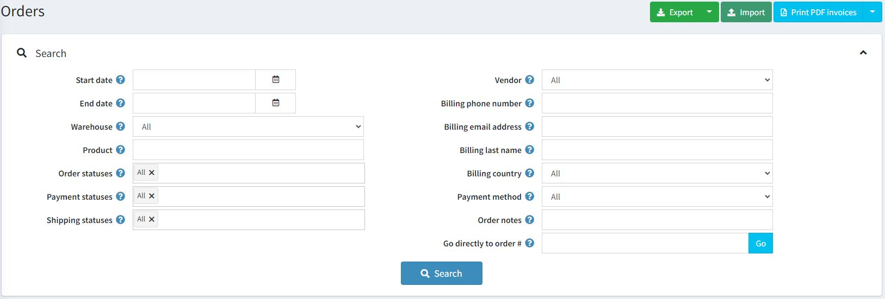
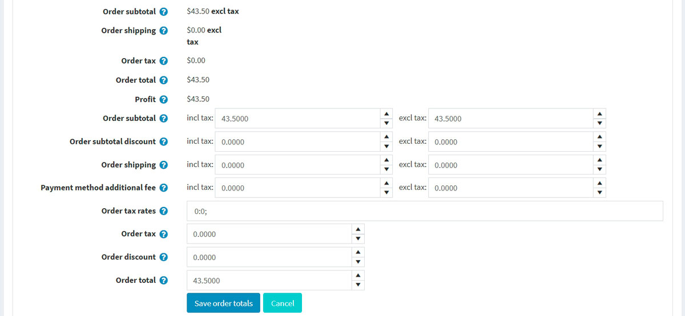
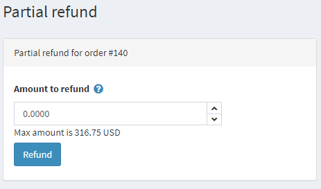
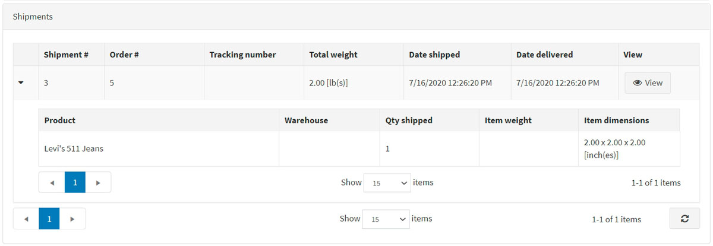
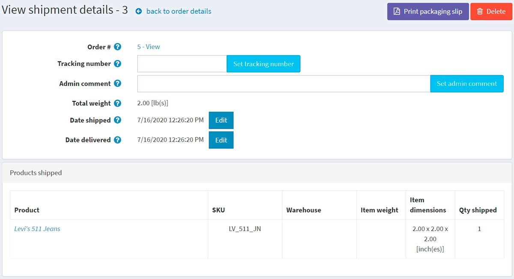
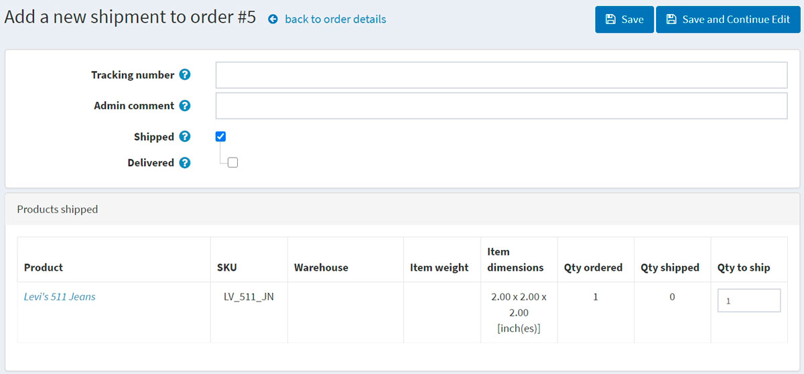
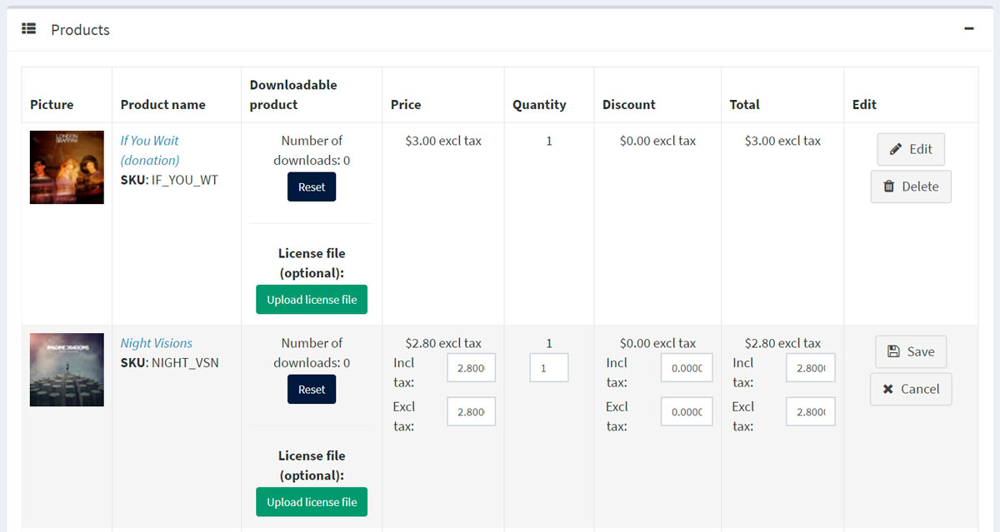
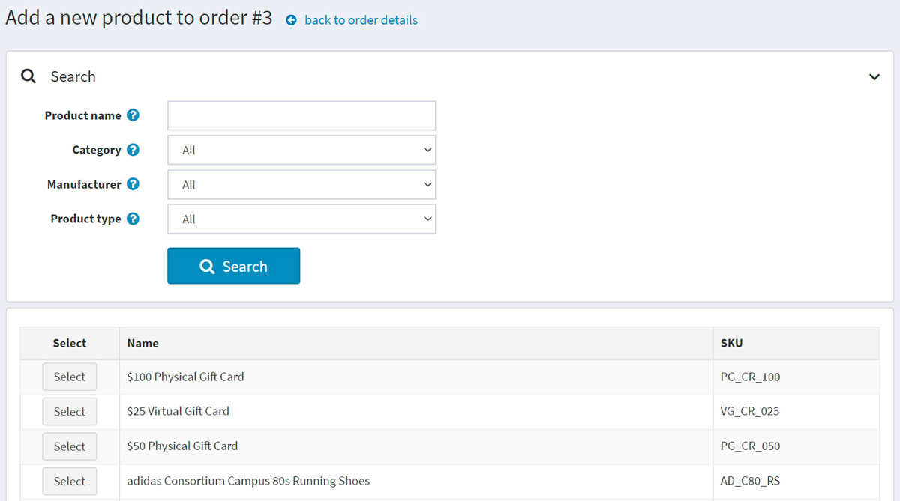
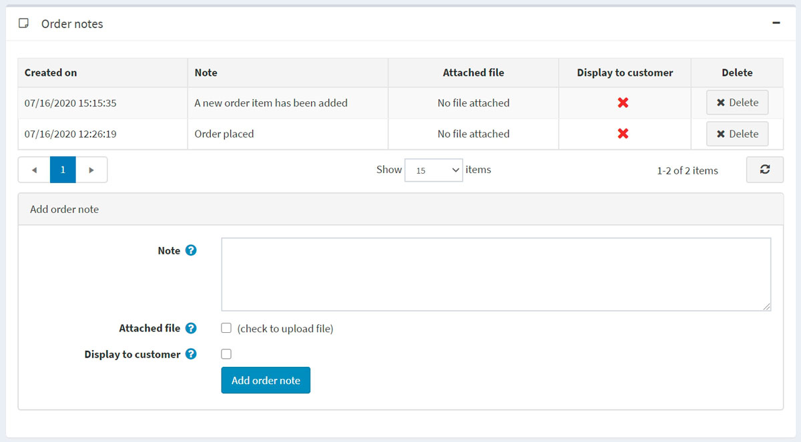

# 訂單

若要檢視與管理訂單，請前往 **銷售 → 訂單**。訂單頁面會列出所有目前的訂單。當顧客完成交易後，新的訂單就會出現在訂單頁面上。

頁面上方的區域讓商店擁有者可以搜尋訂單。輸入特定的搜尋條件並使用各種篩選器，即可找到商店中產生的任何訂單。每當完成搜尋時，搜尋結果將顯示在螢幕的下半部。您可以點擊 **檢視** 來查看訂單詳細資訊。

## 搜尋訂單

若要搜尋訂單，請輸入以下一項或多項搜尋條件：

* **開始日期** 與 **結束日期**：定義訂單建立的期間。
* **倉庫**：載入來自指定倉庫商品的訂單。
* **商品** — 輸入商品名稱。
* **訂單狀態** – 選擇下列其中一項：*全部*、*待處理*、*處理中*、*已完成*、*已取消*。
* **付款狀態** — 選擇特定的付款狀態進行搜尋：*全部*、*待處理*、*已授權*、*已付款*、*部分退款*、*已退款*、*已作廢*。
* **出貨狀態** — 選擇特定的出貨狀態進行搜尋：*全部*、*無需出貨*、*尚未出貨*、*部分出貨*、*已出貨*、*已送達*。
* **商店** — 設定訂單所屬的特定商店。
* **供應商** — 依特定的供應商進行搜尋。您將會看到包含該指定供應商商品的訂單。
* **帳單電話號碼** — 顧客的電話號碼。
* **帳單電子郵件地址** — 顧客的電子郵件地址。
* **帳單姓氏** — 顧客的姓氏。
* **帳單國家** — 顧客的國家。
* **付款方式** — 設定結帳時使用的特定付款方式。
* **訂單備註** — 在訂單備註中搜尋。留空則載入所有訂單。
* **直接前往訂單編號 #** — 輸入訂單編號並點擊 **前往** 以顯示所需的訂單。

### 匯出訂單

您可以透過點擊頁面上方的 **匯出 (Export)** 按鈕，將訂單匯出至外部檔案。點擊 **匯出 (Export)** 按鈕後，您將會看到一個下拉式選單，讓您可以選擇 **匯出為 XML (全部找到)** 或 **匯出為 XML (已選取)**，以及 **匯出為 Excel (全部找到)** 或 **匯出為 Excel (已選取)**。

### 匯入訂單

您可以透過點擊 **匯入**、選擇檔案，並點擊 **從 Excel 匯入** 按鈕，從 Excel 匯入訂單。匯入的訂單會以訂單 GUID 作為識別依據。若訂單 GUID 已存在，則該訂單的詳細資訊將會被更新。

> [!WARNING]
>
> 匯入作業需要大量的記憶體資源。因此，不建議一次匯入超過 500 到 1,000 筆記錄。若您有更多的記錄，建議將其拆分為多個 Excel 檔案並分開匯入。

## 訂單詳細資訊

若要檢視完整的訂單資訊，請點擊訂單清單中該訂單旁的 **View**。

點擊右上角的 **Invoice (PDF)** 按鈕，即可將訂單產生為 PDF 格式的發票。如果您想要刪除訂單，請點擊 **Delete**。

### 資訊

在 **資訊** 面板中，商店管理者可以執行下列操作：

* 檢視 **訂單編號 (Order #)**，這是唯一的訂單識別碼。
* 檢視 **建立日期 (Created on)** — 訂單下達或建立的日期與時間。
* 檢視下單的 **顧客 (Customer)**。
* 檢視 **訂單狀態 (Order status)**。僅當付款狀態設為 *已付款 (Paid)* 且出貨狀態設為 *已送達 (Delivered)* 時，訂單狀態才會顯示為 *已完成 (Completed)*。您可以點擊 **變更狀態 (Change status)** 按鈕手動變更訂單狀態。然而，僅建議進階使用者使用此選項，因為在這種情況下，所有相關動作（例如庫存調整、發送通知郵件、紅利點數、禮品卡啟用/停用）都必須手動完成。
* **取消訂單 (Cancel order)**。系統會顯示確認訊息；點擊 **是 (Yes)** 可從系統中移除該訂單。

> [!NOTE]
>
> 當顧客使用「手動信用卡」付款方式（允許將信用卡資訊儲存於資料庫中）時，**編輯信用卡 (Edit credit card)** 按鈕才會顯示。若使用其他付款方式，此按鈕將不會顯示。

* 檢視 **訂單小計 (Order subtotal)**、**訂單運費 (Order shipping)**、**訂單稅額 (Order tax)**、**訂單總額 (Order total)** 及 **利潤 (Profit)**。如果您點擊 **編輯訂單總額 (Edit order totals)** 按鈕，將能夠如以下螢幕截圖所示編輯訂單總額：
 

* 檢視該訂單使用的 **付款方式 (Payment method)**。
* 檢視 **付款狀態 (Payment status)**。狀態可以是下列其中之一：*待處理 (Pending)*、*已授權 (Authorized)*、*已付款 (已請款) (Paid (captured))*、*已退款 (Refunded)*、*已部分退款 (Partially refunded)* 或 *已作廢 (Voided)*。

 > [!NOTE]
 >
 > 並非所有付款閘道都支援上述所有狀態。請閱讀 [付款方式 (Payment methods)](xref:zh-Hant/getting-started/configure-payments/payment-methods/index) 章節以了解更多關於付款方式的資訊。

 如果付款狀態為 *已授權 (Authorized)*，將會顯示 **作廢 (Void)** 與 **請款 (Capture)** 訂單的相關按鈕。**請款 (Capture)** 用於從顧客端收取款項。**作廢 (Void)** 則用於取消尚未請款的訂單。

 如果付款狀態為 *待處理 (Pending)*，管理者可以點擊 **標記為已付款 (Mark as paid)**，以表示該訂單已付款。

 如果付款狀態為 *已付款 (Paid)*，則會顯示 **退款 (Refund)** 與 **部分退款 (Partial refund)** 按鈕。點擊 **退款 (Refund)** 後，將會顯示確認視窗。點擊 **部分退款 (Partial refund)** 按鈕後，將會顯示 *部分退款* 視窗。此視窗允許管理者依照下列方式退還訂單總額的一部分：

 

* 檢視此訂單下單所在的 **商店 (Store)**。
* 檢視供內部使用的 **訂單 GUID (Order GUID)**。
* 檢視顧客下單時使用的 **顧客 IP 位址 (Customer IP address)**。

### 帳單與配送

在 **帳單與配送** 面板中，您可以檢視並視需求編輯帳單與配送資訊。

* 檢視 **帳單地址** 與 **配送地址**。您可以選擇點擊 **在 Google 地圖上檢視地址** 連結，以定位所需的配送地址。點擊 **編輯** 按鈕即可編輯帳單或配送地址。
* 視需求檢視並編輯 **配送方式**。
* 檢視 **配送狀態**。

> [!NOTE]
>
> 商店擁有者可以為單一訂單建立多次出貨。如果您建立了一筆出貨單但未包含所有商品，該訂單的配送狀態將會顯示為 **部分出貨**。一旦所有商品皆已出貨，狀態將變更為 **已出貨**。當所有出貨皆已送達，狀態將變更為 **已送達**。

* 檢視 **出貨清單**。
 
 點擊出貨項目旁的 **檢視** 即可查看詳細資訊。系統將會顯示出貨資訊視窗：
 

 **新增出貨** 按鈕可讓您為單一訂單建立多筆出貨，當訂單中至少有一項商品尚未出貨時，此按鈕即會顯示。點擊 **新增出貨** 按鈕可為訂單新增一筆出貨，接著您會看到 **新增出貨至訂單** 視窗：
  
  
* 在 **追蹤號碼** 欄位中，輸入該筆出貨的追蹤號碼。追蹤號碼可讓您與顧客透過電話，或是由物流業者（郵局或私人快遞服務，例如 FedEx 或 UPS）經營的線上系統查詢配送進度。每當出貨在運送途中通過特定站點時，物流業者的系統會進行識別，並更新追蹤資料庫中的最新位置與時間資訊。
* 視需求填寫 **管理員備註** 欄位。
* 勾選 **已出貨** 核取方塊，以當前日期標記該筆出貨為「已出貨」。
* 若勾選上述核取方塊，**已送達** 核取方塊即會開放。勾選此核取方塊以當前日期標記該筆出貨為「已送達」。
* 在 **已出貨商品** 面板中：於 **出貨數量** 欄位，輸入該筆訂單項目中需要出貨的實際數量。

### 商品

在 **商品** 面板中，商店負責人可以：

* **檢視商品資訊**，包含價格、數量及總價。
* 點擊 **商品名稱** 連結以檢視商品詳細資料頁面。若該商品為可下載商品，點擊 **重設 (Reset)** 以重設下載次數，或是點擊 **上傳授權檔案 (Upload license file)**。此外，當商品的 *下載啟用類型 (Download activation type)* 設為 *手動 (Manually)* 時，管理員可以選擇點擊 **啟用 (Activate)** 以允許從網站下載該商品，或點擊 **停用 (Deactivate)** 以禁止從網站下載該商品。
* **編輯** 商品的 **價格**、**數量**、**折扣** 與 **總計**。
* 從系統中 **刪除** 商品。
 
* 點擊 **新增商品 (Add product)**。從清單中選擇商品。接著在 *新增商品至訂單 (Add a new product to order)* 視窗中，找到所需的商品。隨後填寫必要數值並點擊 **新增商品 (Add product)**。請記得在新增商品至訂單後，更新訂單總計。
 

### 訂單註記

在 **訂單註記** 面板中，商店管理員可以檢視為了資訊用途而加入到訂單中的註記、刪除註記，並新增新的註記。註記可以包含 **附加檔案**，並且可以設定為在公開商店中 **顯示給顧客**。

## 參閱

* [新增商品](xref:zh-Hant/running-your-store/catalog/products/add-products)
* [出貨](xref:zh-Hant/running-your-store/order-management/shipping-management)
* [管理訂單的 YouTube 教學影片](https://www.youtube.com/watch?v=z6TUJOO3gVg&index=5&list=PLnL_aDfmRHwsbhj621A-RFb1KnzeFxYz4)