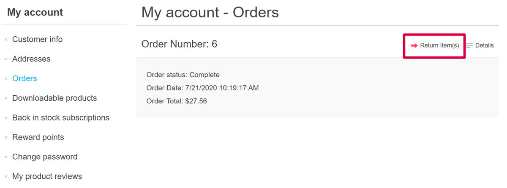
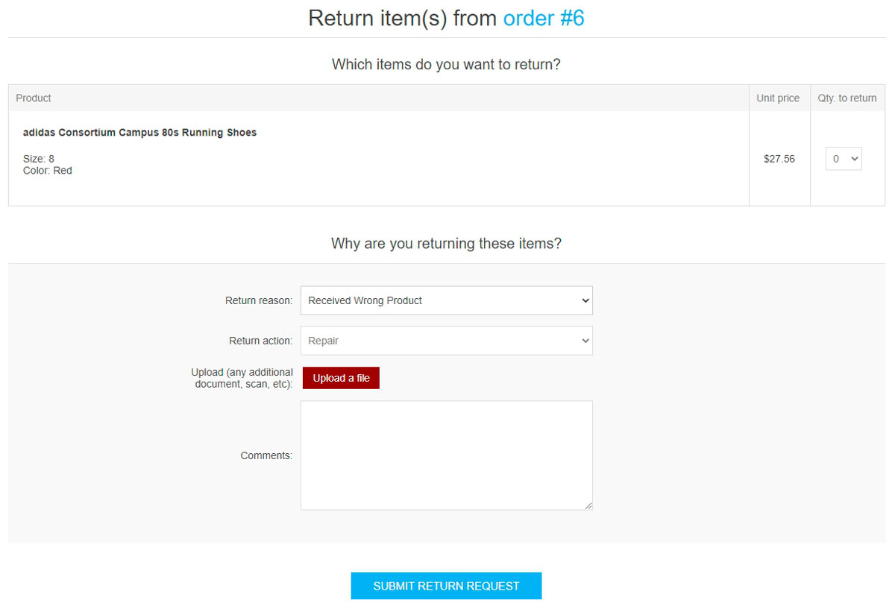
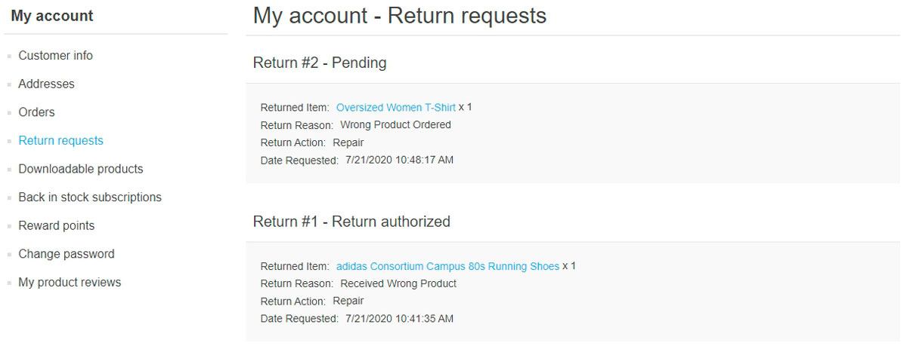
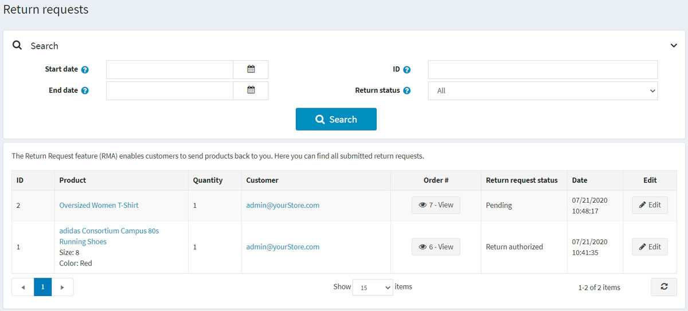
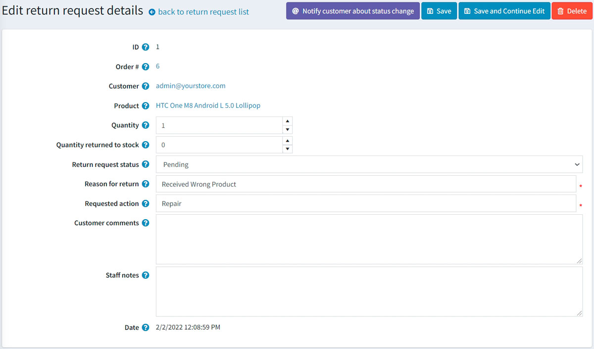
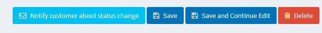
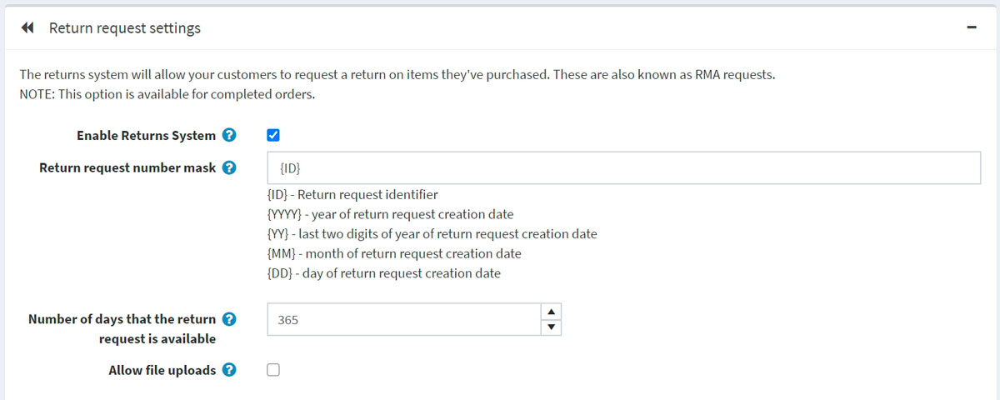
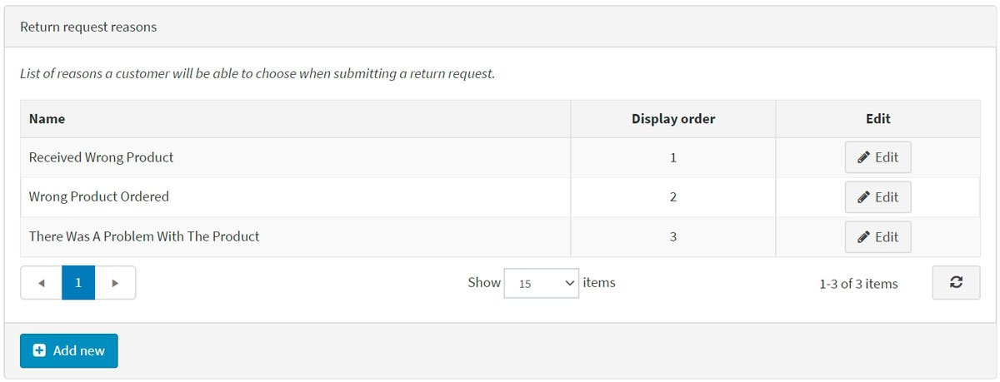
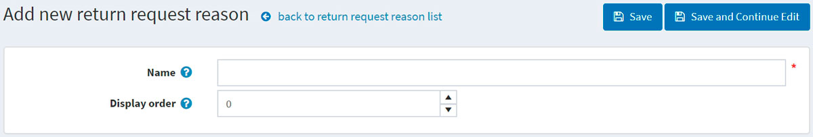
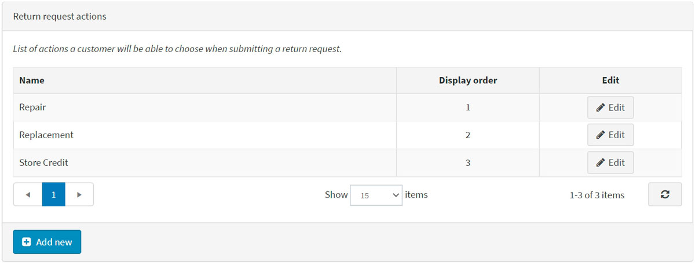

# 退貨請求

退貨請求功能讓顧客可以針對先前購買的商品提出退貨申請。這些請求也稱為 RMA 請求。此選項僅適用於已完成的訂單。退貨請求的設定是在管理後台的 **設定 → 設定 → 訂單設定** 中的 *退貨請求設定* 面板進行管理。

若要啟用退貨請求，請勾選 **啟用退貨系統** 核取方塊。
啟用此選項後，前台網站的訂單詳細資料頁面中，針對已完成的訂單將會顯示 **退貨商品** 按鈕。

若要前往 [退貨請求設定區段，請按這裡](#return-request-settings)。

在接下來的章節中，我們將說明顧客如何使用退貨請求功能，以及如何在管理後台管理退貨請求。

## 提交退貨請求

若要提交退貨請求，顧客需採取以下步驟：

1. 在前台商店中，前往「我的帳戶」視窗並點擊 **Orders**。系統將顯示以下頁面：

1. 點擊欲退貨之已完成訂單旁邊的 **Return Item(s)** 按鈕。系統將顯示「退貨訂單 # 中的商品」視窗，如下列範例所示：
  
    * **Qty to return** 下拉式選單可讓您選擇欲退貨的商品數量。
    * **Return reason** 下拉式選單可讓您選擇退貨原因。例如：訂購了錯誤商品、收到了錯誤商品等。請閱讀 [下方](#return-request-settings) 關於如何管理退貨原因的說明。
    * **Return action** 下拉式選單可讓您選擇所需的退貨處理方式。例如：商品維修、商品更換、退款等。請閱讀 [下方](#return-request-settings) 關於如何管理退貨處理方式的說明。
    * 若您想為您的請求附加額外的文件或圖片，請使用 **Upload a file** 選項。
     > [!NOTE]
     >
     > 僅在勾選了 **Allow file uploads** 核取方塊時，此選項才會顯示。請閱讀 [下方](#return-request-settings) 關於如何設定此功能的說明。

    * 在 **Comments** 欄位中，顧客可以輸入選填的備註以提供更多資訊。
1. 在使用退貨請求功能後，顧客可以點擊前台商店「我的帳戶」頁面中的 **Return requests**，檢視已建立的退貨請求及其狀態：
  

## 管理退貨請求

商店擁有者現在可以在管理後台管理此退貨請求。

若要檢視與編輯退貨請求，請前往 **銷售 → 退貨請求**。所有退貨請求將顯示如下：

點擊退貨請求旁的 **編輯**；隨即會顯示 *編輯退貨請求詳細資料* 視窗：

商店管理員可以執行以下操作：

* 檢視退貨請求 **ID**。
* 檢視 **訂單編號**。點擊訂單編號將重新導向至相關的訂單詳細資料頁面。
* 檢視 **顧客**。點擊顧客電子郵件將重新導向至相關的顧客詳細資料頁面。
* 檢視 **商品**。點擊商品名稱將重新導向至相關的商品詳細資料頁面。
* 輸入退回商品的 **數量**。
* 填寫 **退回庫存數量** 欄位。這代表應退回庫存的商品數量。
* 選擇 **退貨請求狀態**：
  * *待處理 (Pending)*
  * *已收到 (Received)*
  * *退貨已授權 (Return authorized)*
  * *商品已維修 (Item(s) repaired)*
  * *商品已退款 (Item(s) refunded)*
  * *請求已拒絕 (Request rejected)*
  * *已取消 (Cancelled)*

* 如有必要，可在 **退貨原因** 欄位中編輯退貨原因。
* 如有必要，可在 **請求動作** 欄位中編輯請求動作。
* 如有必要，可在 **顧客備註** 欄位中編輯顧客輸入的評論。
* 在 **員工註解** 欄位中，輸入用於資訊目的的選填註解。這些註解不會顯示給顧客。
* 檢視提交退貨請求的 **日期**。

> [!NOTE]
>
> 點擊 **通知顧客關於狀態變更** 按鈕，即可發送電子郵件通知顧客退貨請求的狀態變更。

## 退貨請求設定

若要定義退貨請求設定，請前往 **設定 → 設定 → 訂單設定**。

此頁面支援多商店設定；這意味著可以為所有商店定義相同的設定，或為每個商店設定不同的內容。如果您想管理特定商店的設定，請從多商店設定下拉式清單中選擇該商店名稱，並勾選左側對應的核取方塊，以設定自訂值。如需進一步說明，請參閱 [多商店](xref:zh-Hant/getting-started/advanced-configuration/multi-store)。

前往 *退貨請求設定* 面板：

在此面板中，您可以定義：

* **啟用退貨系統**：讓您的顧客能夠針對已購買的商品提交退貨請求。
* **退貨請求編號遮罩**：若有需要，請在此欄位指定自訂的退貨請求編號格式。
* **退貨請求有效天數**：設定退貨請求連結在顧客專區中可使用的天數。
  > [!TIP]
  >
  > 例如，如果商店負責人允許購買後 30 天內退貨，則此欄位應設為 30。當顧客登入網站並查看「我的帳戶」時，超過 30 天完成的訂單將不會顯示 **退貨商品** 按鈕。

* **允許檔案上傳**：若您希望顧客在提交退貨請求時可以上傳檔案（例如圖片），請勾選此項目。此選項對於遇到訂單問題（如收到損壞商品或錯誤產品）的顧客特別實用。

### 退貨申請原因

此面板列出了顧客在提交退貨申請時可以選擇的原因清單。

點擊 **新增** 以增加新的申請原因。隨即會顯示 *新增退貨申請原因* 視窗，如下所示：

輸入退貨申請原因的 **名稱** 與 **顯示順序** 數字（1 代表清單中的第一個項目）。點擊 **儲存** 以儲存變更。

### 退貨申請動作

此面板列出了顧客在提交退貨申請時可以選擇的動作清單。

點擊 **Add new** 以新增一個請求動作。此時會顯示「新增退貨申請動作」視窗，如下所示：

輸入退貨申請動作的 **Name**（名稱）與 **Display order**（顯示順序）數字（1 代表清單中的第一個項目）。點擊 **Save** 以儲存變更。

## 參見

* [YouTube 教學：管理退貨請求](https://www.youtube.com/watch?v=VqF2GZ2ip_0&list=PLnL_aDfmRHwsbhj621A-RFb1KnzeFxYz4&index=17)
* [訂單設定](xref:zh-Hant/running-your-store/order-management/order-settings)
* [訂單](xref:zh-Hant/running-your-store/order-management/orders)