# 詢價請求 (RFQ) 與報價支援

## 概觀

此功能實作為一個獨立的外掛，允許顧客針對購物車中的商品提交 **詢價請求 (Request for Quote, RFQ)**。這對於協商大量折扣或網站上未提供之特殊定價特別有用。

作為回應，網站管理員可以建立並寄送正式的 **報價單 (Quote)** 給顧客，列出特殊優惠條件。

## 設定與組態

此外掛的組態設定相當直觀：

- **啟用**：整個功能可以透過單一設定來啟用或停用。
    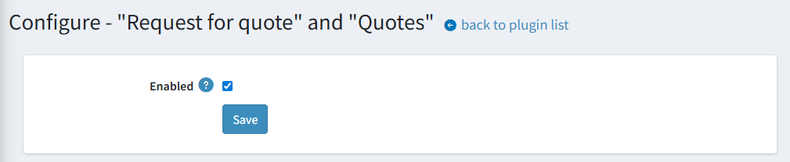
- **存取控制**：可以分別為公開的前台網站和管理後台設定存取控制清單 (ACL) 權限，以管理誰可以使用此功能。
    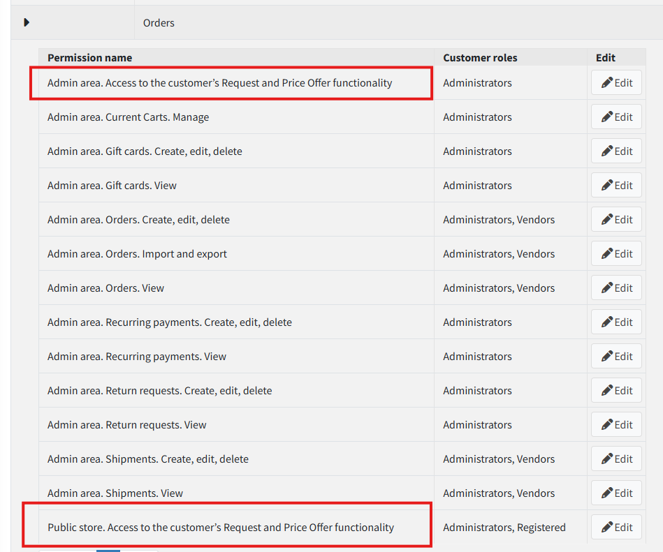

## 使用方式

### 顧客流程

1. **發起 RFQ**：若外掛已啟用且 ACL 允許，購物車頁面上會出現一個新按鈕。
    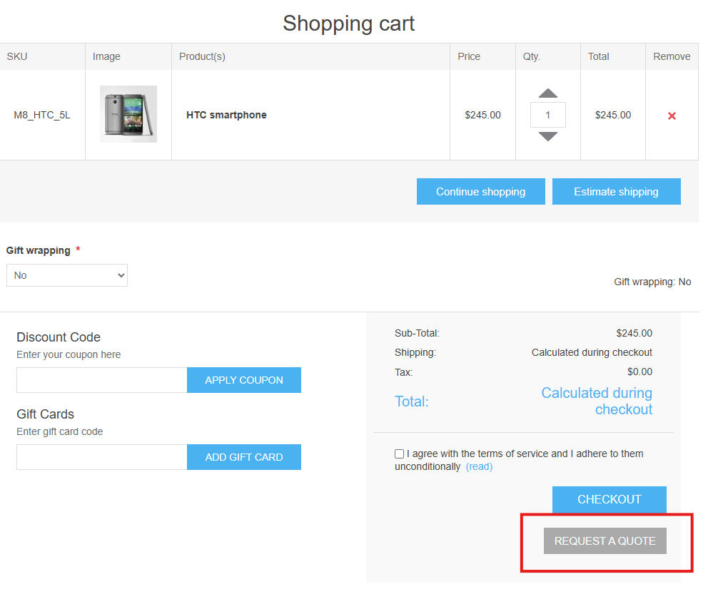
    點擊該按鈕會將使用者導向 RFQ 建立表單。
    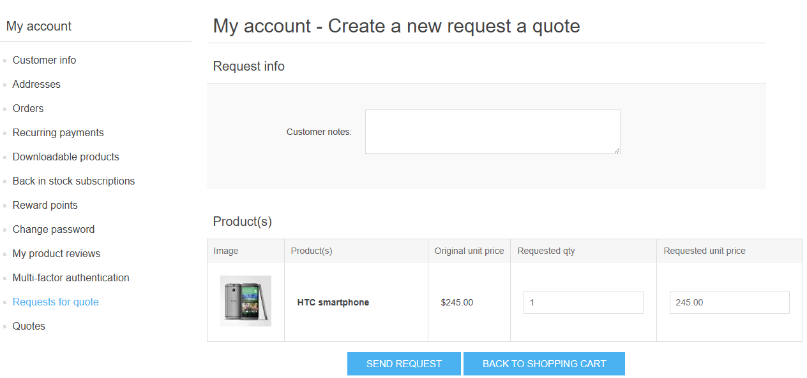
1. **編輯 RFQ**：在此表單上，使用者可以在提交前調整請求內容。在寄出之前，RFQ 不會儲存至資料庫。
    - 在請求中新增備註。
    - 為每個項目提議自訂數量與單價。
    - 使用者可以點擊 **「回到購物車」(Back to shopping cart)** 返回購物車。
1. **提交 RFQ**：當使用者點擊 **「送出請求」(Send request)** 後，RFQ 即會送出，之後使用者將無法編輯。唯一可用的動作是取消或刪除它。
    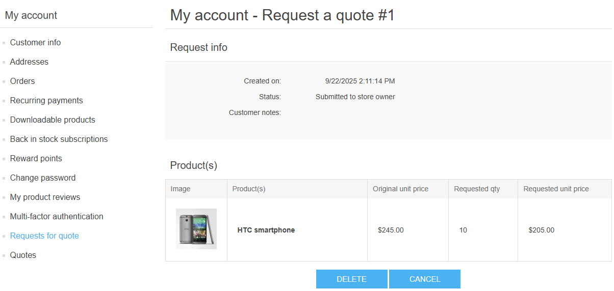
1. **管理 RFQ 與報價單**：提交請求後，使用者的帳戶區塊會出現兩個新的選單項目：
    - **「詢價請求」(Requests for quote)**：所有已提交 RFQ 的清單。
        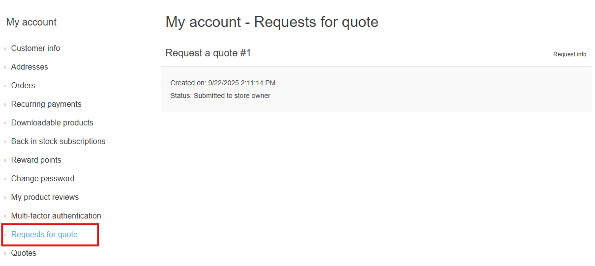
    - **「報價單」(Quotes)**：從商店管理員收到的所有報價清單。當收到新的報價單時，使用者會收到電子郵件通知。
    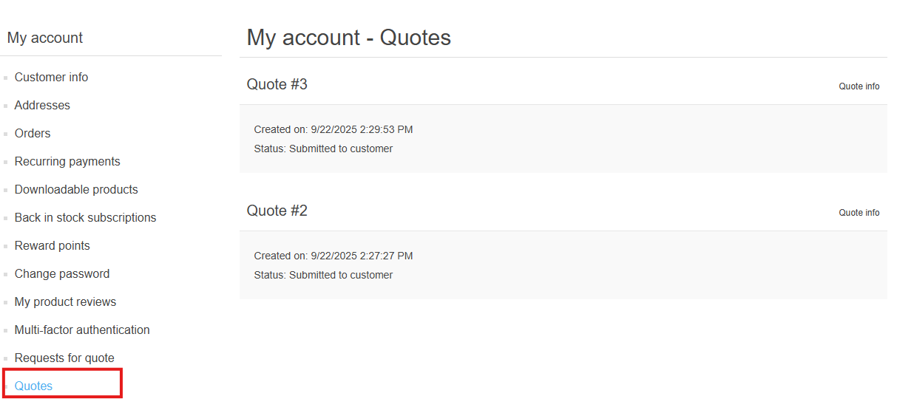
1. **從報價單建立訂單**：如果收到的報價單可以接受且尚未過期，使用者可以點擊 **「建立訂單」(Create the order)**。
    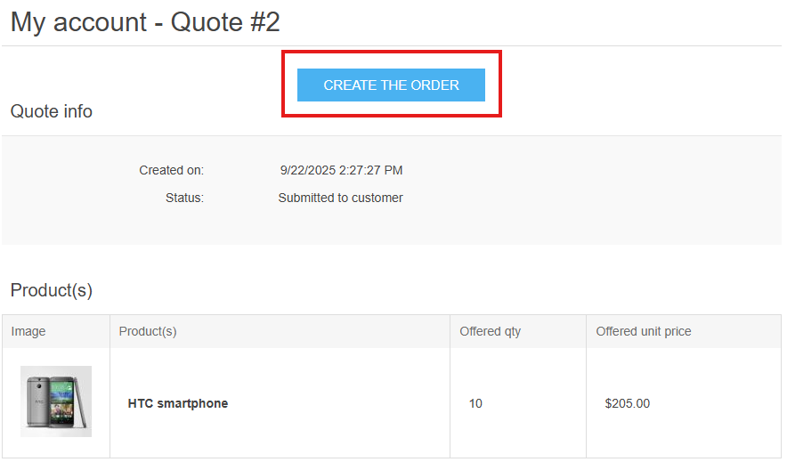
    此動作會執行以下步驟：
    - 清除使用者目前的購物車。
    - 建立一個包含報價單中確切項目與價格的新購物車。
    - 使用者繼續進行標準的結帳流程。
1. **報價模式限制**：
    - 一旦購物車由報價單產生，即視為處於「報價模式」。
    - 使用者無法將任何其他項目加入購物車，也無法修改報價單中的項目。嘗試這樣做將會取消報價模式並清空購物車。
    - 使用者可以點擊 **「退出報價模式」(Exit quote mode)** 來清除購物車並返回主要商店頁面。
    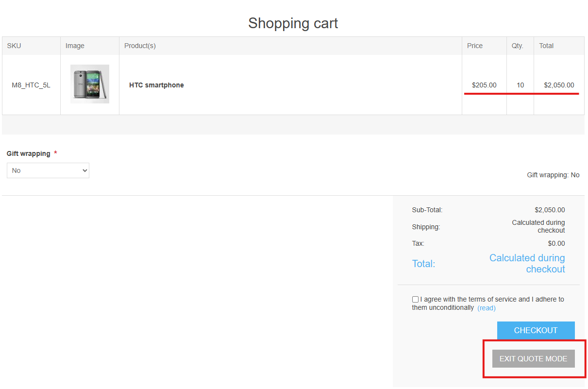

### 管理員流程

1. **通知與管理**：當使用者提交 RFQ 時，商店擁有者會收到電子郵件通知。管理後台會出現兩個新的選單項目，用於管理 RFQ 與報價單，點擊後會進入對應的清單。
    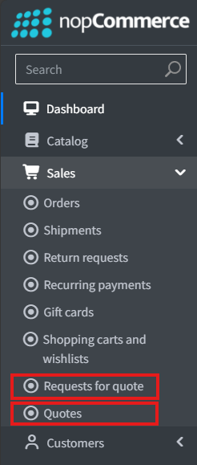
1. **審核 RFQ**：從 RFQ 清單中，管理員可以檢視使用者的請求詳細資訊。在編輯頁面上，管理員可以：
    - 修改任何商品列項目。
    - 從請求中刪除項目。
    - 取消或刪除整個 RFQ。
    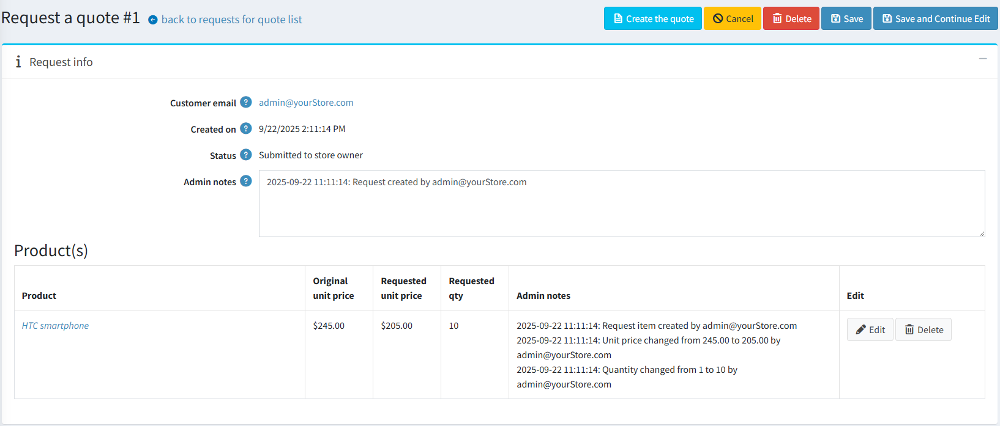
1. **建立報價單**：
    - **從 RFQ 建立**：管理員可以透過點擊 RFQ 詳細資料頁面上的 **「建立報價單」(Create the quote)** 按鈕，直接將 RFQ 轉換為報價單。
    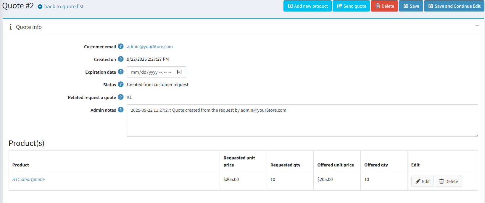
    - **從零開始建立**：也可以從主要報價單清單頁面獨立建立新的報價單。
1. **編輯報價單**：在報價單編輯頁面上，管理員可以：
    - 修改現有的商品資料。
    - 透過兩個步驟新增商品：
        - 首先搜尋商品；
        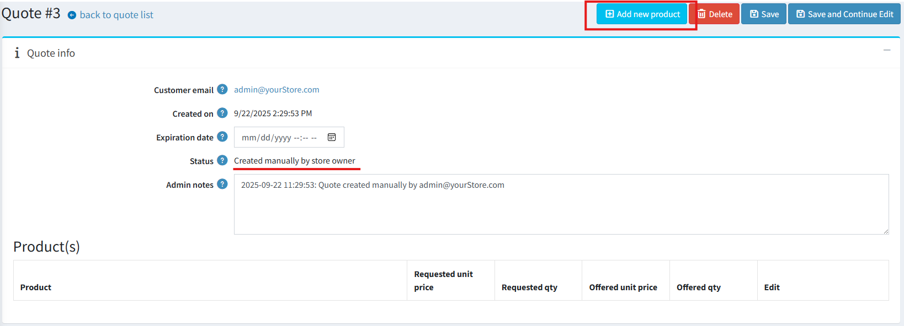
        - 然後設定所需的數量與價格；
        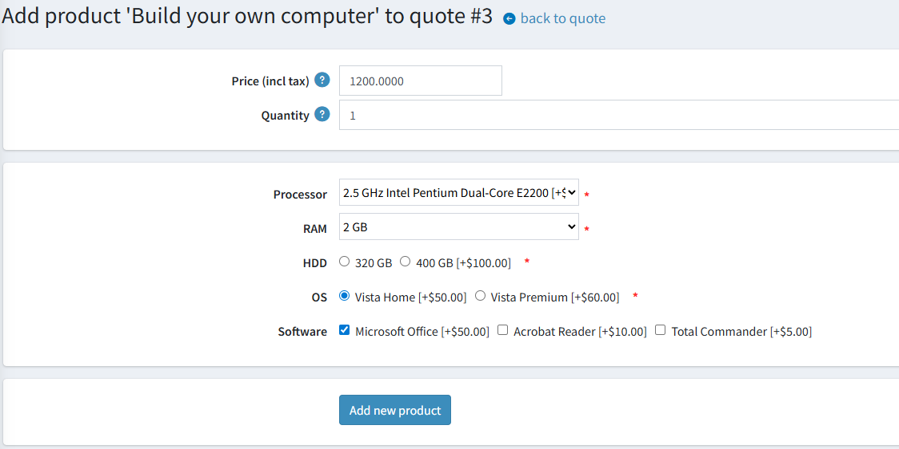
    - 為優惠設定過期日期。超過此日期後，使用者將無法從該報價單建立訂單。
1. **寄送報價單**：報價單會儲存在資料庫中，但在管理員點擊 **「寄送報價單」(Send quote)** 之前，對使用者而言是隱藏的。寄出後，使用者會收到電子郵件通知。
1. **提交後規則**：
    - 一旦報價單已寄送給使用者，管理員即無法再對其進行編輯。
    - 只有在使用者尚未根據該報價單建立訂單的情況下，才能刪除已寄出的報價單。