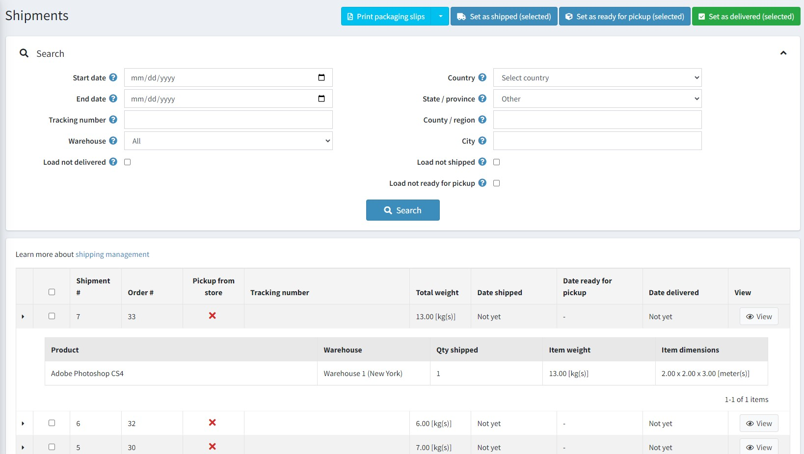
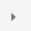
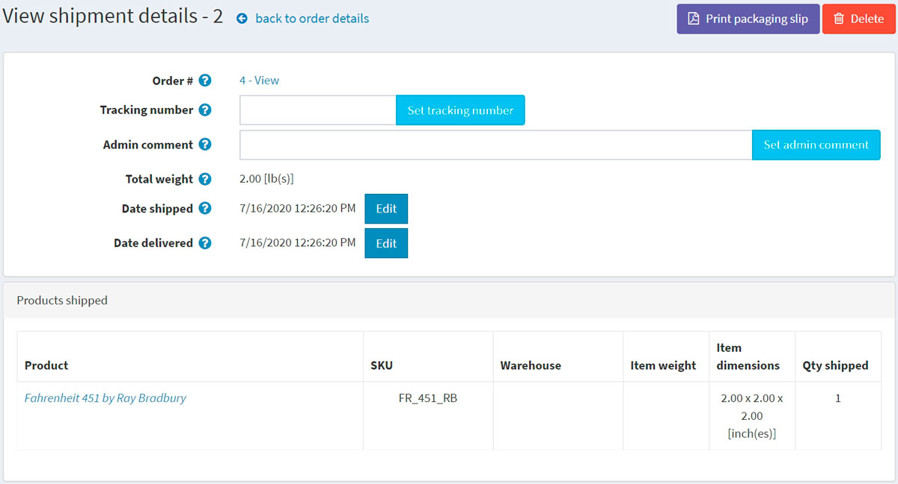
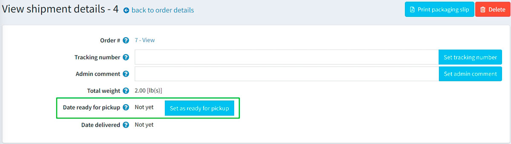

# 出貨管理

若要搜尋並檢視出貨記錄，請前往 **銷售 → 出貨**。

## 出貨清單

頁面頂端區域讓您能夠透過各種搜尋條件來搜尋出貨記錄：

* **開始日期** 與 **結束日期**：搜尋在這段期間內建立的出貨記錄。
* 輸入 **追蹤號碼**：若您想尋找具有特定追蹤號碼的出貨記錄。
* 選擇 **倉庫**：搜尋從特定倉庫寄出的出貨記錄。
* 勾選 **載入未送達** 核取方塊：若您不想載入已經送達的項目。
* 使用 **國家、州/省、郡/區域、城市**：依據出貨目的地進行搜尋。
* 勾選 **載入未出貨** 核取方塊：若您不想載入已經出貨的項目。
* 勾選 **載入未準備好取貨** 核取方塊：若您想載入尚未準備好取貨的項目。

選取特定的出貨記錄，即可執行 **設為已出貨 (已選)**、**設為已送達 (已選)** 或 **設為準備取貨 (已選)**。您也可以選擇 **列印包裝明細 (已選)** 或 **列印包裝明細 (全部)** 來列印出貨單據。

在出貨清單中，商店擁有者可以透過點擊出貨記錄第一欄的  來檢視該出貨的所有項目。

## 出貨詳情

如果您點擊 **檢視**，將會開啟如下的「檢視出貨詳情」視窗：

在此視窗中，您可以執行以下操作：

* 前往訂單頁面。
* 設定出貨的 **追蹤號碼**。
* 新增供內部使用的 **管理員註解**。
* 查看 **出貨總重量**。
* 將出貨標記為 **已出貨**。
* 編輯 **出貨日期**。
* 將出貨標記為 **已送達**。
* 編輯 **送達日期**。
* **列印包裝明細**。
* **刪除** 該出貨記錄。

如果顧客在結帳過程中選擇了「店內取貨」的出貨方式，您將能夠將該出貨標記為「準備取貨」。在「檢視出貨詳情」頁面上，此按鈕顯示如下：

## 出貨設定

若要設定出貨功能，請前往 [設定出貨](xref:zh-Hant/getting-started/configure-shipping/index) 章節。

## 參閱

* [訂單](xref:zh-Hant/running-your-store/order-management/orders)
* [新增商品](xref:zh-Hant/running-your-store/catalog/products/add-products)