# 購物車與願望清單

「購物車與願望清單」區塊讓商店擁有者可以在單一頁面上檢視所有商店中，所有顧客現有的購物車與願望清單。若要存取此頁面，請前往 **銷售 → 購物車與願望清單**。

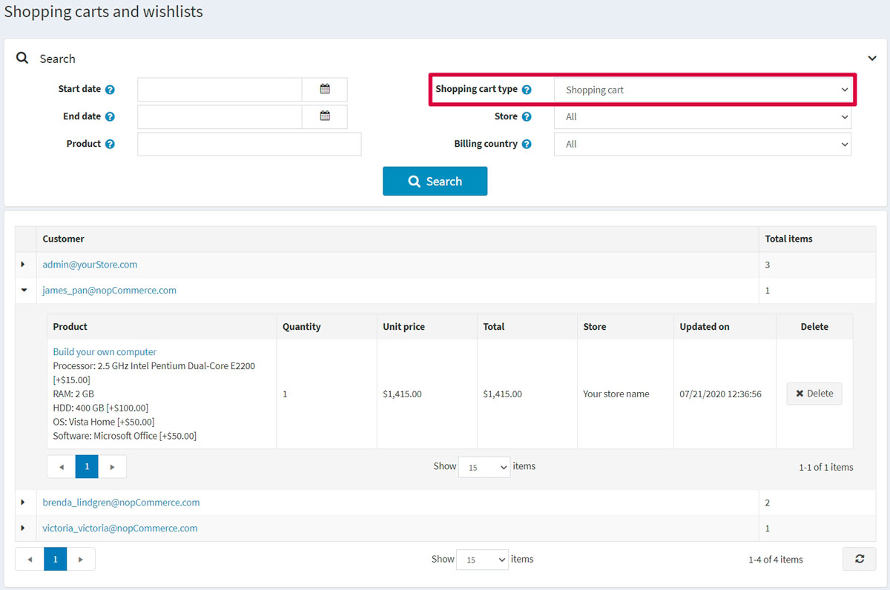

在頁面上方的「搜尋」區域中，選擇您所需的 **購物車類型**：*購物車* 或 *願望清單*。

您可以點擊第一欄中的下列圖示來展開商品：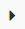。

在清單中，您可以透過點擊顧客連結前往顧客詳細資訊頁面。您也可以點擊商品名稱來前往商品編輯詳細資訊頁面，或是點擊 **刪除** 按鈕將商品從購物車中移除。

## 購物車

從 **銷售 → 購物車與願望清單** 的 **購物車類型** 下拉式選單中選擇「購物車」，並點擊 **搜尋**，即可查看購物車列表。此列表包含所有已放入購物車但尚未購買的商品。

下方的螢幕截圖顯示了顧客在前台網站看到的購物車頁面：
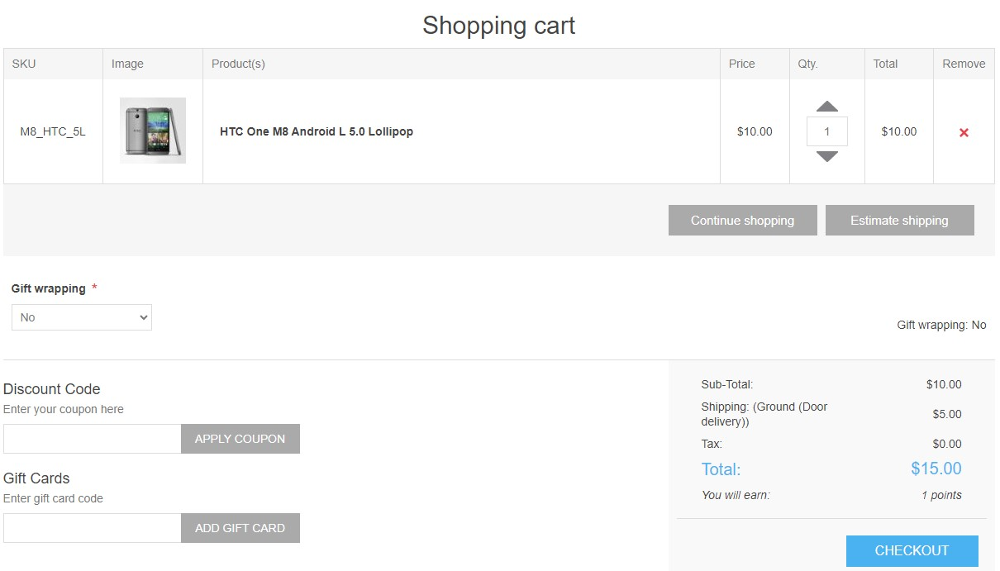

購物車頁面包含幾個元素。如果有需要，其中一些元素可以停用：

1. **移除** 欄位中的按鈕允許從購物車中移除商品。
1. **數量** 欄位中的按鈕允許顧客在 **數量** 欄位輸入適當的數字來變更商品數量。
1. **繼續購物** 按鈕允許顧客回到商品目錄。
1. **預估運費** 按鈕允許顧客預估運費。點擊此按鈕後，會顯示以下彈出視窗：
  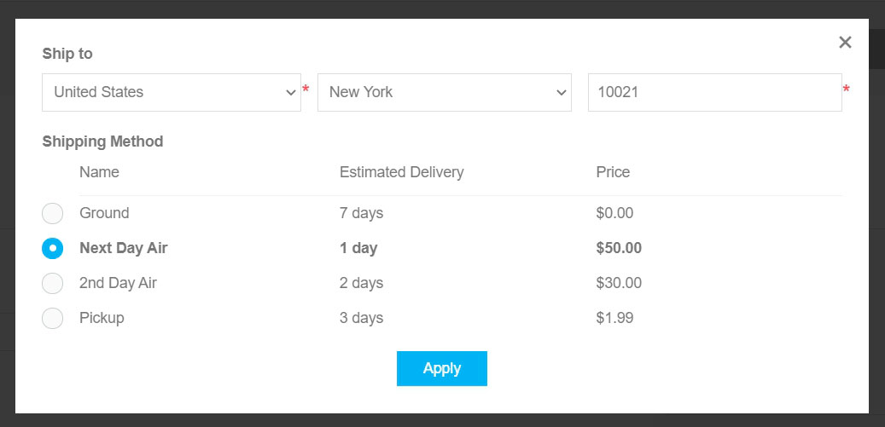
  在此視窗中，顧客可以輸入寄送地址並查看適用的物流選項。
  您可以透過取消勾選 **設定 → 設定 → 運送設定** 頁面上的 **啟用預估運費（購物車頁面）** 核取方塊，來停用購物車頁面上的運費預估功能。
1. 您可以在上方提供的購物車螢幕截圖中看到 **禮品包裝** 下拉式選單。這是一個結帳屬性。請參閱 [結帳屬性](xref:zh-Hant/running-your-store/order-management/checkout-attributes) 章節，以了解如何管理結帳屬性。
1. **優惠碼** 區塊允許顧客輸入優惠碼。您可以透過取消勾選 **設定 → 設定 → 購物車設定** 頁面上的 **顯示優惠券輸入框** 核取方塊來停用此功能。請參閱 [折扣](xref:zh-Hant/running-your-store/promotional-tools/discounts) 章節，以了解更多有關折扣的資訊。
1. **禮品卡** 區塊允許顧客使用禮品卡。您可以透過取消勾選 **設定 → 設定 → 購物車設定** 頁面上的 **顯示禮品卡輸入框** 核取方塊來停用此功能。請參閱 [禮品卡](xref:zh-Hant/running-your-store/promotional-tools/gift-cards) 章節，以了解更多有關禮品卡的資訊。
1. 在購物車總計區塊中，顧客可以看到運費。請參閱 [設定運送](xref:zh-Hant/getting-started/configure-shipping/index) 章節，以了解如何設定運送方式。
1. 在同一個區塊中，顧客可以看到稅務資訊。請參閱 [設定稅務](xref:zh-Hant/getting-started/configure-taxes/index) 章節，以了解如何設定稅務。
1. 在同一個區塊中，顧客可以看到將會獲得多少紅利點數。請參閱 [紅利點數](xref:zh-Hant/running-your-store/promotional-tools/reward-points) 章節，以了解如何設定紅利點數。
1. 在同一個區塊中，顧客可以看到服務條款。您可以透過取消勾選 **設定 → 設定 → 訂單設定** 頁面上的 **服務條款（購物車頁面）** 核取方塊來停用此顯示。

> [!NOTE]
>
> 如果您不想讓顧客將特定商品加入購物車，請在商品編輯頁面的「價格」面板中勾選 **停用購買按鈕** 核取方塊。請參閱 [新增商品](xref:zh-Hant/running-your-store/catalog/products/add-products) 章節，以了解更多關於新增商品的資訊。

> [!NOTE]
>
> 歡迎瀏覽我們的 [市集](http://www.nopcommerce.com/marketplace)，尋找可協助您管理棄置購物車並挽回流失銷售的外掛。

## 願望清單

從 **銷售 → 購物車與願望清單** 頁面上的 **購物車類型** 下拉式選單中選擇 *願望清單* 選項，然後點擊 **搜尋** 以檢視願望清單。

願望清單是顧客可以與朋友分享，或是儲存起來以便日後移至購物車的商品清單。如果已針對某項商品啟用加入願望清單功能，則在公開商店的商品詳細頁面上會顯示 **加入願望清單** 按鈕。當不同變體的商品被加入願望清單時，顧客所選擇的所有變體都會包含在願望清單中。

> [!TIP]
>
> 例如，如果顧客加入同一件襯衫但顏色不同，則每件襯衫都會作為獨立的項目出現在願望清單中。如果顧客多次將同一項商品加入願望清單，該商品只會出現一次，但數量會更新以反映加入的次數。

下方的螢幕截圖說明了顧客如何在公開商店中查看願望清單頁面：
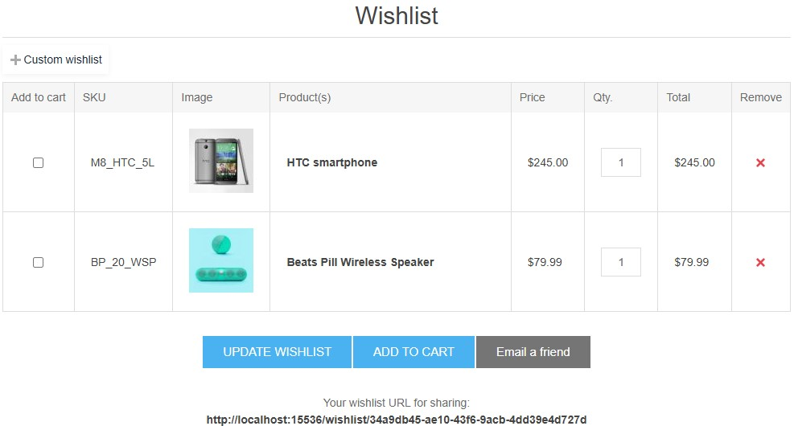

願望清單頁面上有幾個元素：

1. **移除** 欄位中的按鈕允許從願望清單中移除項目。
1. **更新願望清單** 按鈕允許顧客在 **數量 (Qty)** 欄位中輸入適當的數字來變更商品數量。
1. **加入購物車** 按鈕允許顧客將選定的商品加入購物車。
1. **寄送郵件給朋友** 按鈕允許顧客透過電子郵件將願望清單發送給朋友。您可以透過取消勾選 **設定 → 設定 → 購物車設定** 頁面上的 **允許顧客以電子郵件寄送願望清單** 核取方塊來停用此功能。
1. **您用於分享的願望清單 URL** 允許顧客分享願望清單。

> [!NOTE]
>
> 如果您不想允許顧客將特定商品加入願望清單，請在商品編輯頁面的 *價格* 面板中勾選 **停用願望清單按鈕** 核取方塊。關於新增商品的詳細資訊，請閱讀 [新增商品](xref:zh-Hant/running-your-store/catalog/products/add-products) 章節。

### 多重願望清單

已註冊的顧客可以建立並管理多個願望清單，以便更好地整理心儀的商品。預設情況下，每位顧客都有一個無法重新命名或刪除的「願望清單」。

核心概念：

- **預設願望清單：** 每位已註冊的顧客都有一個名為「願望清單」的預設願望清單。此清單是永久性的，無法修改或移除。
- **自訂願望清單：** 已註冊的使用者可以建立額外且個人化的願望清單。這些清單可以由使用者自行命名、管理與刪除。

使用者情境：

1. 檢視願望清單
  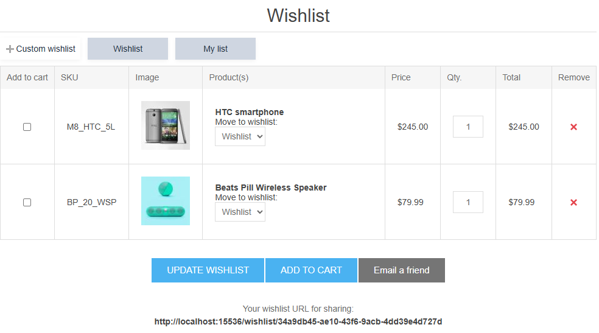

   - 瀏覽至主要的「願望清單」頁面時，會顯示預設「願望清單」中所包含的商品。
   - 此頁面也會顯示所有已建立的自訂願望清單列表。
   - 選擇一個自訂願望清單後，畫面將更新，僅顯示該特定清單中所包含的商品。

1. 建立自訂願望清單
   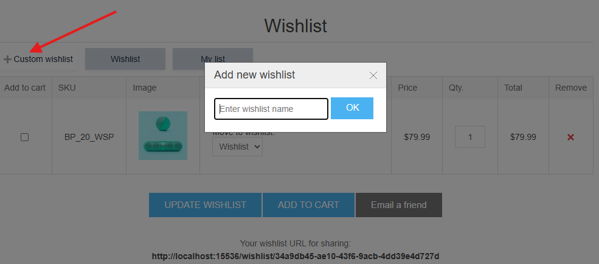
   - 只有已註冊的使用者才有權限建立新的願望清單。
   - 在「願望清單」主頁面上，提供「建立新願望清單」的選項。
   - 使用者可以為他們的新願望清單提供自訂名稱。

1. 刪除自訂願望清單
   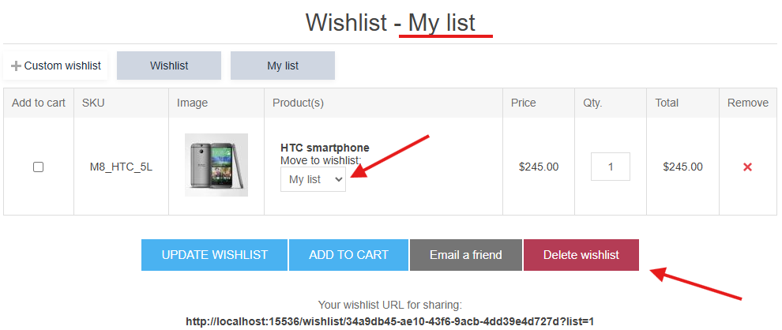
   - 當檢視自訂願望清單的內容時，會出現一個「刪除」按鈕。
   - 在永久刪除該願望清單之前，系統會向使用者顯示確認提示。
   > [!NOTE]
   > 預設的「願望清單」無法刪除。

1. 將商品加入願望清單

   將商品加入願望清單的流程（例如：點擊商品頁面或分類頁面上的「愛心」圖示）會根據使用者是否建立了自訂願望清單而有所不同。

    **情境 1：不存在自訂願望清單**
    - 當使用者將商品加入願望清單時，該商品會自動加入預設的「願望清單」。

    **情境 2：至少存在一個自訂願望清單**
    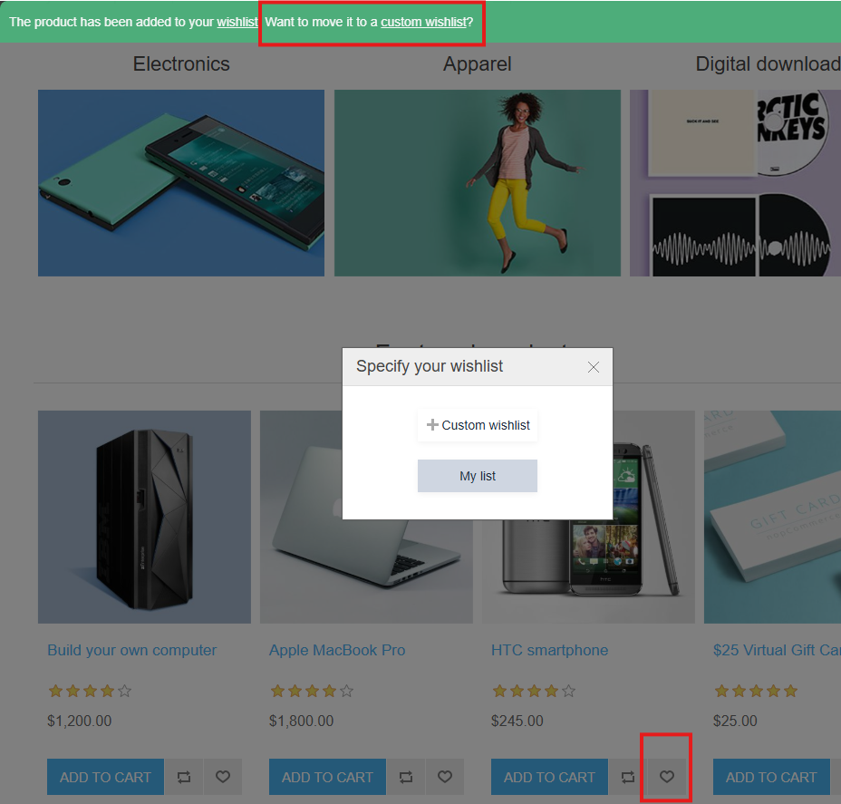
    - 商品仍會立即加入預設的「願望清單」。
    - 加入後，系統會出現通知，確認商品已加入。此通知將包含一個連結，例如「將其移至自訂願望清單」。
    - 點擊此連結會開啟一個彈出視窗，使用者可以：
      - 選擇一個現有的自訂願望清單，將商品移至該處。
      - 選擇建立一個新的願望清單，隨後該商品將包含於其中。
    - 選擇目的地後，使用者可以被重新導向至選定的願望清單，或是繼續購物。

1. 在願望清單之間移動商品
  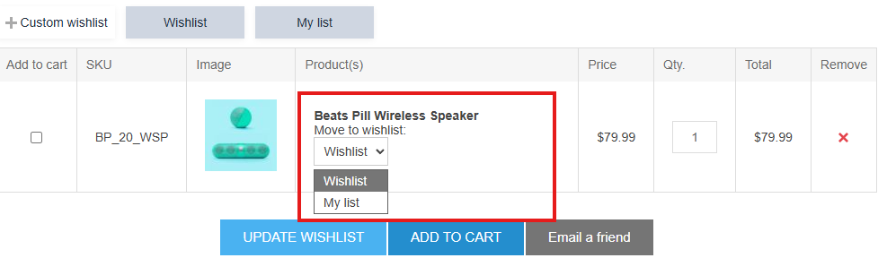
   - 此功能僅在使用者至少建立過一個自訂願望清單時才可用。
   - 在「願望清單」頁面上，每個商品項目都會顯示一個下拉式選單。
   - 此選單會列出所有可用的願望清單（包含預設的「願望清單」）。
   - 從下拉式選單中選擇一個願望清單，即可將商品從目前的清單移至選定的清單中。

## 購物車與願望清單設定

若要變更購物車與願望清單的設定，請前往 **設定 → 設定 → 購物車設定** 頁面。

此頁面支援多商店設定；這意味著可以為所有商店定義相同的設定，或是針對不同的商店設定不同的值。如果您想要管理特定商店的設定，請從多商店設定下拉式清單中選擇該商店名稱，並勾選左側對應的核取方塊，以設定自訂值。如需進一步詳情，請參閱 [多商店](xref:zh-Hant/getting-started/advanced-configuration/multi-store)。

### 一般設定

在「一般」面板中，您可以定義：
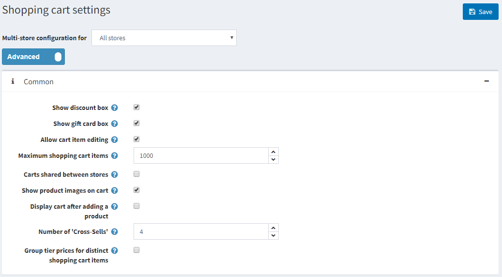

- **顯示折扣方塊**：在購物車頁面顯示折扣優惠碼輸入框。
- **顯示禮品卡方塊**：在購物車頁面顯示禮品卡輸入框。
- **允許編輯購物車項目**：啟用後，顧客可以編輯購物車中的項目。當商品包含顧客輸入的數值時，此功能非常實用。
- **購物車最大項目數**：允許加入購物車的產品數量上限。
- 勾選 **商店間共用購物車** 核取方塊，可讓多個商店共用購物車（及願望清單）。
- **在購物車顯示產品圖片**：在商店購物車中顯示產品圖片。
- **加入產品後顯示購物車**：產品加入購物車後，立即顯示購物車頁面。若未勾選此項目，顧客將維持在加入購物車前的頁面。
- **交叉銷售數量**：您希望在前台網站的購物車結帳頁面上顯示的交叉銷售產品數量。若您不想顯示交叉銷售產品，請輸入 0。

### 小型購物車設定

在「小型購物車」面板中，您可以定義：
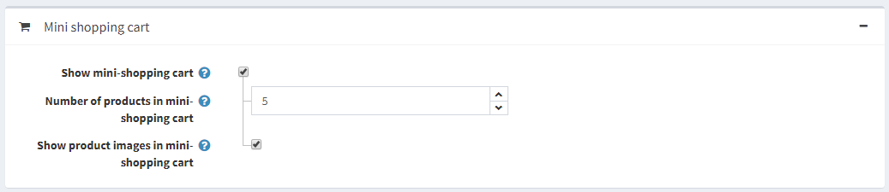

- **顯示小型購物車** – 當滑鼠游標懸停在「購物車」連結上時，會於主視窗右上角出現的下拉式選單，如下圖所示：
  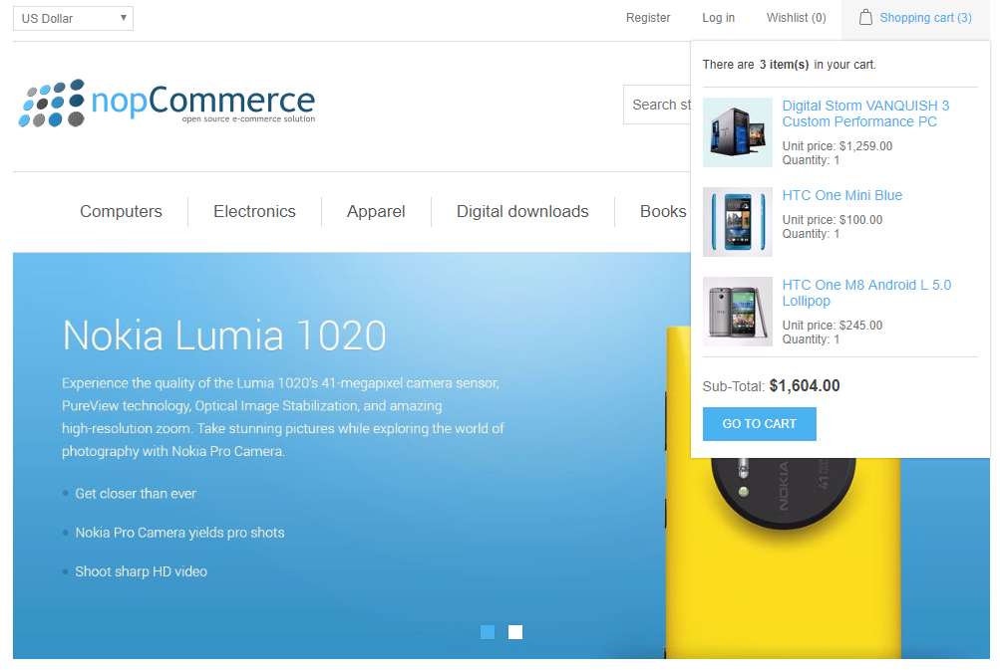
  勾選此欄位後，將會顯示下列欄位：
  - **小型購物車中的商品數量** — 在前台網站的小型購物車下拉式選單中，所能顯示的商品最大數量。
  - **在小型購物車中顯示商品圖片** — 決定是否要在小型購物車的下拉式選單中顯示圖片。

### 願望清單設定

在 *願望清單* 面板中，您可以定義：
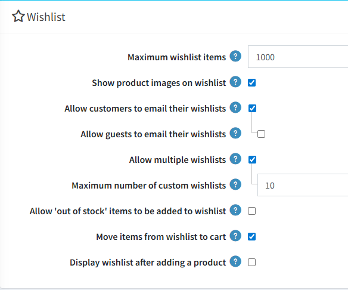

- **願望清單商品上限** — 允許新增至願望清單中不同商品的最大數量。
- **在願望清單顯示商品圖片**：勾選後將在顧客的願望清單中顯示商品圖片。
- **允許顧客將願望清單以電子郵件寄給朋友**：當啟用此欄位時，將會顯示下列欄位：
  - **允許訪客將願望清單以電子郵件寄給朋友**。
- **允許建立多個願望清單**：指定顧客是否可以使用多個願望清單。
  - **自訂願望清單最大數量**：指出顧客可以使用的自訂願望清單數量。
- **允許將「缺貨」商品新增至願望清單**。
- 勾選 **將項目從願望清單移至購物車** 核取方塊，可在點擊「加入購物車」按鈕時，將商品從願望清單移動至購物車。若未勾選，商品則會以複製方式加入。
- **加入商品後顯示願望清單**：勾選後，將會在商品加入願望清單後立即顯示願望清單頁面。若未勾選此核取方塊，顧客將會停留在原本加入商品的頁面上。

## 參閱

- [訂單](xref:zh-Hant/running-your-store/order-management/orders)
- [促銷工具](xref:zh-Hant/running-your-store/promotional-tools/index)

## 教學課程

- [nopCommerce 願望清單概覽](https://www.youtube.com/watch?v=9EN7oZSwIVE)