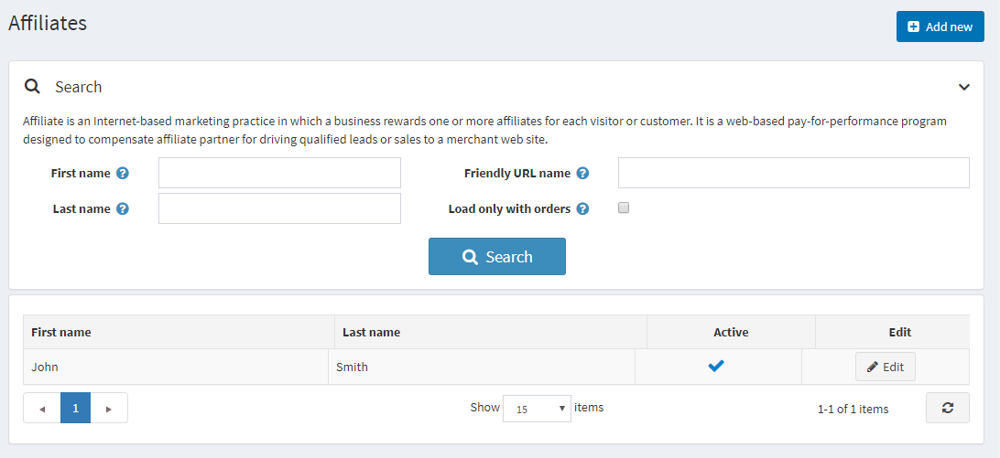
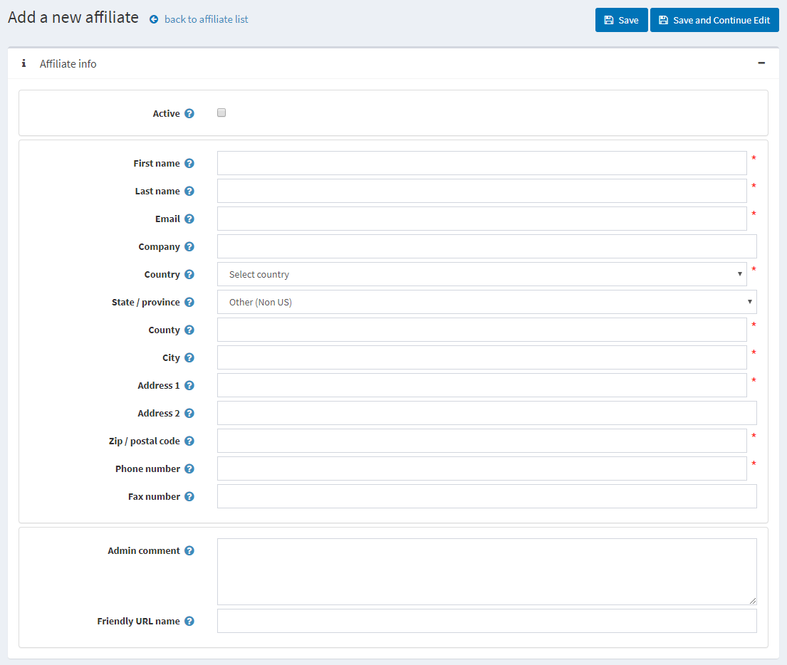

# 聯盟行銷 (Affiliates)

聯盟行銷是一種基於網際網路的行銷實踐，透過聯盟會員帶來的網站流量（每位訪客或顧客）給予獎勵。這是一個基於網路的績效付費計畫，旨在補償聯盟夥伴，感謝他們將潛在顧客或銷售從其網站引導至商家的網站。

聯盟會員是將顧客推薦至您網站的第三方。nopCommerce 軟體可以追蹤這些推薦，以便商店管理員決定支付給聯盟會員的佣金。一旦顧客被指派了一個聯盟會員 ID，他們所下的每一筆訂單也都會標記該 ID。

在 nopCommerce 中，聯盟夥伴連結看起來如下：`http://www.yourstore.com/?AffiliateID=N`（其中 N 為聯盟會員 ID）。商店擁有人也可以為了行銷目的指定「友善網址 (friendly URL)」名稱欄位：`http://www.yourstore.com/?affiliate=your_friendly_name_here`。當您造訪聯盟會員詳細資料頁面時，會顯示此 URL。每當此超連結在聯盟會員網站上被點擊時，nopCommerce 就會搜尋聯盟會員 ID 的查詢字串參數。

## 新增聯盟會員

若要新增聯盟會員，請前往 **行銷活動 → 聯盟行銷** 並點擊 **新增**。

定義聯盟會員詳細資料：

- 勾選 **啟用 (Active)** 核取方塊以啟用該聯盟會員。
- **名字 (First name)**。
- **姓氏 (Last name)**。
- **電子郵件 (Email)**。
- **公司 (Company)** 名稱。
- 從下拉式清單中選擇 **國家 (Country)**。
- 若選擇的國家是美國，請同時指定 **州/省 (State/province)**。
- **縣/地區 (County/region)**。
- **城市 (City)**。
- **地址 1 (Address 1)**。
- **地址 2 (Address 2)**。
- **郵遞區號 (Zip/postal code)**。
- **電話號碼 (Phone number)**。
- **傳真號碼 (Fax number)**。
- 在 **管理員註解 (Admin comment)** 欄位中，您可以輸入選填的註解或供內部使用的資訊。
- 您可以指定 **友善網址名稱 (Friendly URL name)**，這是用於行銷目的的友善聯盟連結，或者您可以將此欄位留空，屆時將使用預設的 URL。預設情況下，聯盟夥伴的 URL 格式為：`http://www.yourstore.com/?AffiliateID=N`（其中 N 為聯盟會員 ID）。

如果您點擊 **儲存並繼續編輯**，您將會看到另外兩個面板，可以在其中查看該聯盟會員的成效：

- *聯盟顧客* 面板顯示所有透過該聯盟連結而來的顧客清單。
- *聯盟訂單* 面板顯示所有透過該聯盟連結產生的訂單清單。當聯盟顧客下訂單時，您可以在此面板中看到該訂單。

## 參閱

- [訂單管理](xref:zh-Hant/running-your-store/order-management/index)
- [顧客管理](xref:zh-Hant/running-your-store/customer-management/index)