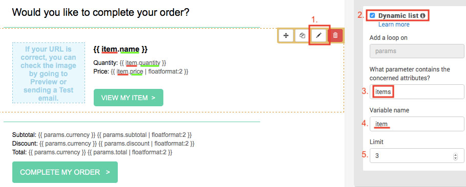
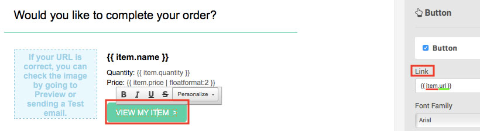
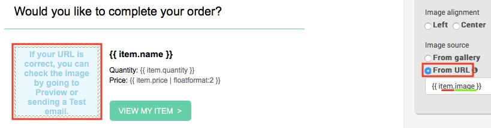
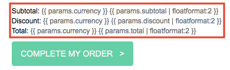
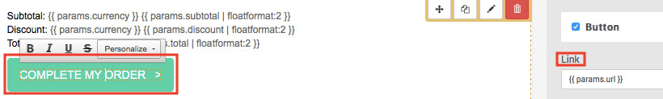
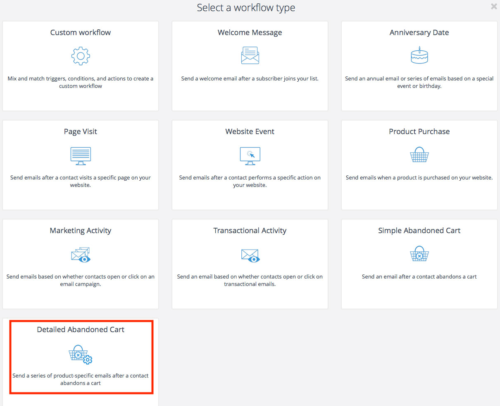
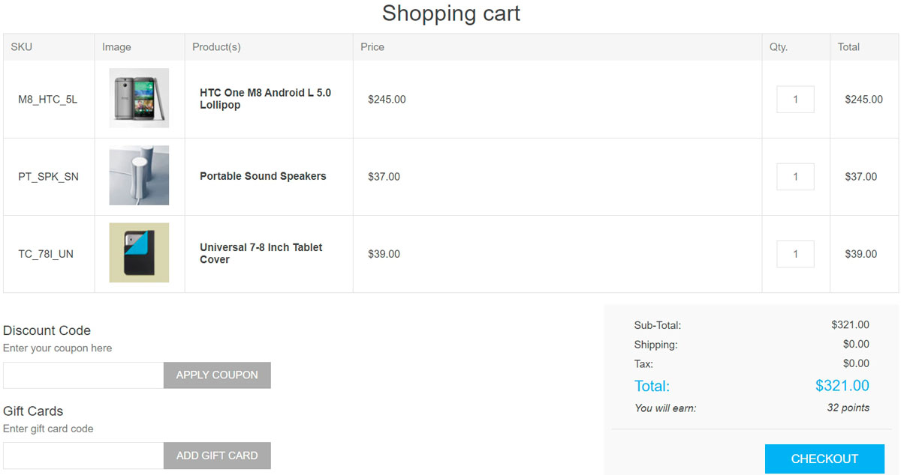
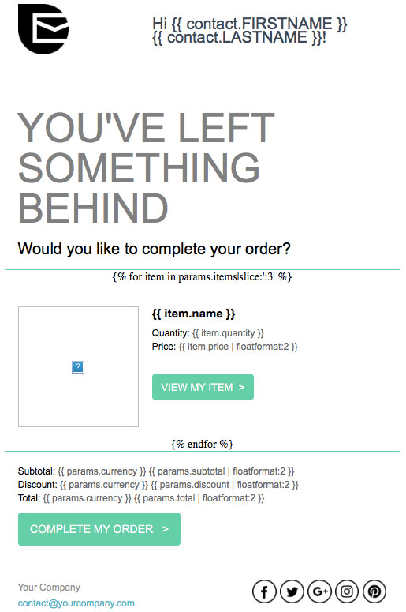
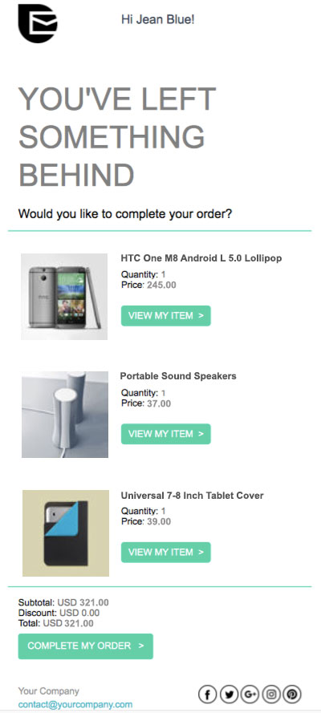

# 復原廢棄購物車

在本教學中，您將學習如何建立廢棄購物車電子郵件，以及如何設定工作流程來找回流失的銷售。您也將了解哪些 nopCommerce 訂單資料與 Brevo 平台相容。

## 開始之前

您需要準備以下項目：

* Brevo 帳號憑證。如果您尚未擁有，請[免費註冊](https://get.brevo.com/v70whp)。
* 請確保您的帳號已啟用 Brevo 的 [*New Template Language*](https://get.brevo.com/eg4z2v) 電子郵件範本語言。
* 請依照[這些步驟](xref:zh-Hant/running-your-store/promotional-tools/brevo-integration/set-up-brevo-plugin)來設定 Brevo 外掛。

## 建立購物車未結帳提醒郵件範本

首先，登入您的 Brevo 帳號，接著前往 Automation 平台 > [Email Templates](https://get.brevo.com/e8j7a)。點選右上角的 **New Template** 按鈕。

此郵件範本可以使用多種資料類型進行個人化設定：

* [儲存在 Brevo 清單中的聯絡人屬性](#personalize-your-email-with-contact-attributes)
* [未結帳商品詳細資訊](#personalize-your-email-with-the-abandoned-items-details)
* [購物車未結帳詳細資訊](#personalize-your-email-with-the-abandoned-cart-details)

### 使用聯絡人屬性個人化您的電子郵件

讓我們從 [使用聯絡人屬性進行個人化](https://get.brevo.com/bynyff) 開始。

在下方的範例中，我們包含了以下個人化內容：

* 使用 {{ contact.FIRSTNAME }} 顯示收件人的名字
* 使用 {{ contact.LASTNAME }} 顯示收件人的姓氏

> [!NOTE]
> FIRSTNAME 和 LASTNAME 必須是您 Brevo 帳戶中已存在的屬性。

現在，讓我們使用訂單變數（例如遺留商品的名稱、圖片、價格等）來個人化電子郵件範本。為此，我們將使用 *New Template Language* 來插入動態清單。

### 使用棄置商品詳細資訊個人化您的電子郵件

您可以直接從 Brevo 範本內容中的動態清單加入以下變數：

| 商品資料 | 在您的範本中插入此佔位符 |
| ------------- | ------------- |
| 名稱 | {{ item.name }} |
| SKU | {{ item.sku }} |
| 類別 | {{ item.category }} |
| ID | {{ item.id }} |
| 商品變體 ID | {{ item.variant_id }} |
| 商品變體名稱 | {{ item.variant_name }} |
| 價格 | {{ item.price }} |
| 數量 | {{ item.quantity }} |
| 購買商品的商店前台連結 | {{ item.url }} |
| 圖片 | {{ item.image }} |

在 *拖放編輯器 (Drag & Drop Editor)* 中，選取您想要顯示棄置商品的區塊。

1. 點擊 **鉛筆圖示** 來編輯設計區塊的設定。
1. 啟用 **動態清單 (dynamic list)** 選項。
1. 在 **參數 (parameter)** 欄位中，輸入 `items`。
1. 在 **變數 (variable)** 欄位中，輸入 `item`。
1. 設定要顯示的商品數量上限。例如，如果購物車中剩下 5 件商品，而您將上限設為 3，則電子郵件中只會顯示 3 件商品。

現在將變數加入到您的電子郵件範本中。在上述範例中，我們加入了：

* `{{ item.name }}` - 商品名稱
* `{{ item.quantity }}` - 商品數量
* `{{ item.price | floatformat: 2 }}` - 商品價格

若要加入商品連結，請選取 **行動呼籲 (CTA)** 按鈕。在右側邊欄的 *連結 (Link)* 下方，輸入 `{{ item.url }}`。

若要加入商品圖片，請選取該圖片。在右側邊欄的 *圖片來源 (Image source)* 下方，選擇 *來自 URL (From URL)*，然後輸入 `{{ item.image }}`。

完成設計後，點擊綠色的 **儲存並離開 (Save & Quit)** 按鈕。接著點擊 **儲存並啟用 (Save & Activate)** 按鈕。

### 使用遺失購物車明細個人化您的電子郵件

您可以將下列變數直接包含在您的 Brevo 範本內容中：

| 購物車明細 | 插入此佔位符 |
| ------------- | ------------- |
| 關聯（Affiliation） | {{ params.affiliation }} |
| 貨幣 | {{ params.currency }} |
| 折扣 | {{ params.discount }} |
| 運費 | {{ params.shipping }} |
| 小計 | {{ params.subtotal }} |
| 稅額 | {{ params.tax }} |
| 稅前總計 | {{ params.tax }} |
| 總計 | {{ params.total_before_tax }} |
| 購物車連結 | {{ params.url }} |

> [!NOTE]
> 購物車連結頁面中顯示的項目，會根據開啟該連線的裝置來源而有所不同。例如，假設顧客正在使用筆記型電腦瀏覽，如果他們從手機點擊了遺失購物車的電子郵件，將不會顯示他們先前遺失的購物車內容。

在「拖放編輯器」（Drag & Drop Editor）中，選取您想要顯示遺失購物車資訊的區塊，然後加入您想要的訂單變數。

我們建議使用 [floatformat](https://get.brevo.com/ogcn5b) 來格式化數字。在下方的範例中，我們加入了：

* `{{ params.currency }}` - 遺失購物車的貨幣
* `{{ params.subtotal | floatformat: 2 }}` - 遺失購物車的小計
* `{{ params.discount | floatformat: 2 }}` - 遺失購物車的折扣
* `{{ params.total | floatformat: 2 }}` - 遺失購物車的總計

若要加入遺失購物車的連結，請選取 **行動呼籲 (CTA)** 按鈕。在右側邊欄的「連結」（Link）下方，輸入 `{{ params.url }}`。

一旦設計完成，請點擊綠色的 **儲存並離開** (Save & Quit) 按鈕。接著點擊 **儲存並啟用** (Save & Activate) 按鈕。

## 建立購物車未結帳流程

> [!NOTE]
> 顧客必須透過電子郵件地址進行識別才能觸發此流程，意即顧客需登入您 nopCommerce 商店的帳戶，或是在結帳過程中輸入他們的電子郵件地址。

前往您的 Brevo 帳戶中的 [Automation](https://get.brevo.com/tvl7ng) 分頁。

點擊 **+ CREATE A NEW WORKFLOW**，接著選擇 **Detailed Abandoned Cart** 並依照步驟操作。

在 *Send an email*（發送電子郵件）步驟中，從下拉式選單選擇您剛才建立並啟用的電子郵件範本。

當流程設定完成後，點擊 **DONE** 以儲存並啟用它。

歡迎參考以下教學課程，以協助您建立此流程：

* [復原未結帳購物車：自動發送電子郵件 (步驟 3)](https://get.brevo.com/gqqwh)

## 範例

假設顧客 Jean Blue <jean.blue@brevo.com> 已經造訪過您的商店，但購物車中仍留有以下 3 項商品。

您的範本看起來會像這樣：

Jean Blue 收到的電子郵件看起來會像這樣：

## 深入了解

* [發送訂單確認電子郵件](xref:zh-Hant/running-your-store/promotional-tools/brevo-integration/send-an-order-confirmation-email)