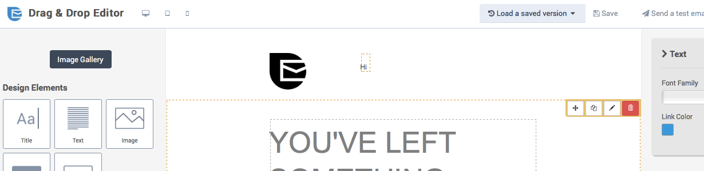
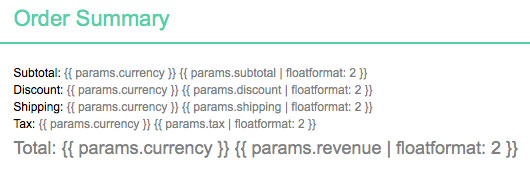
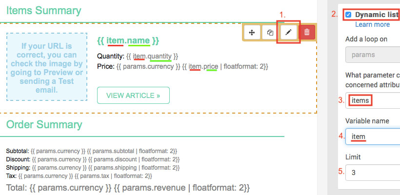
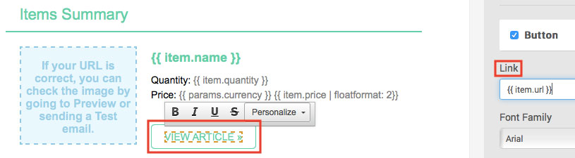
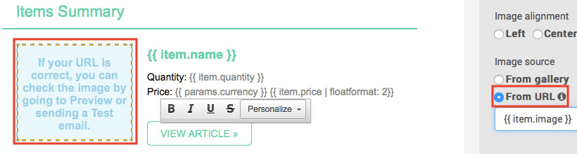
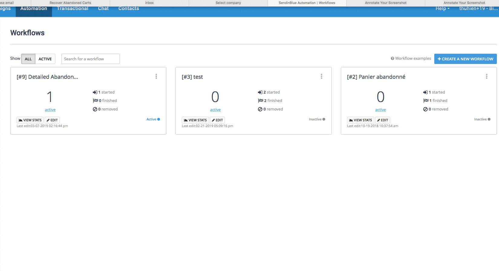
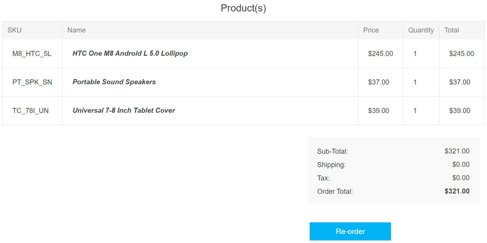
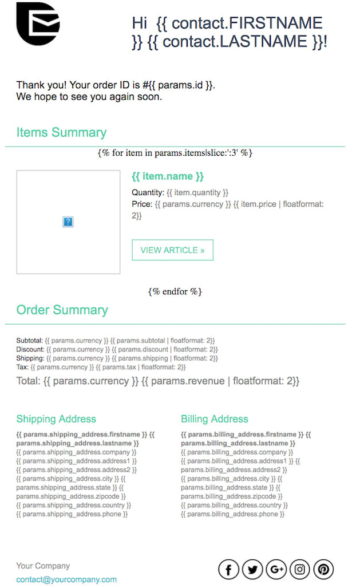
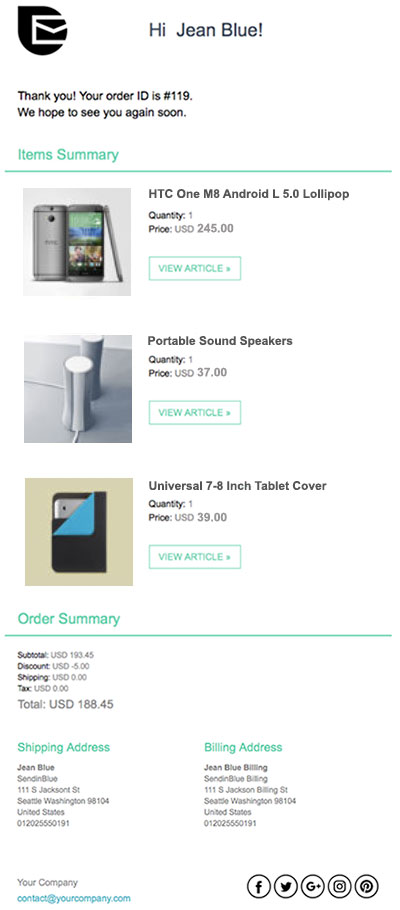

# 發送訂單確認電子郵件

在本教學中，您將學習如何建立訂單確認電子郵件範本，並設定工作流程以保持與買家的互動。您也將了解哪些 nopCommerce 訂單資料與 Brevo 平台相容。

## 開始之前

您將需要以下項目：

* Brevo 帳號憑證。如果您還沒有帳號，請 [免費註冊](https://get.brevo.com/v70whp)。
* 請確保您的帳號已啟用 Brevo 的 [*新範本語言 (New Template Language)*](https://get.brevo.com/eg4z2v) 功能以寄送電子郵件。
* 請依照 [這些步驟](xref:zh-Hant/running-your-store/promotional-tools/brevo-integration/set-up-brevo-plugin) 來設定 Brevo 外掛。

## 建立訂單確認郵件範本

首先，登入您的 Brevo 帳戶，然後前往 Automation 平台 > [Email Templates](https://get.brevo.com/e8j7a)。點擊右上角的 **New Template** 按鈕。

此郵件範本可以使用多種類型的資料進行個人化設定：

* [儲存在您的 Brevo 清單中的聯絡人屬性](#personalize-your-email-with-contact-attributes)
* [訂單詳細資訊](#personalize-your-email-with-the-order-details)
* [訂購商品的詳細資訊](#personalize-your-email-with-the-ordered-items-details)

### 使用聯絡人屬性個性化您的電子郵件

讓我們從使用 [聯絡人屬性](https://get.brevo.com/bynyff) 進行個性化設定開始。

在下方的範例中，我們包含了以下個性化設定：

* 使用 `{{ contact.FIRSTNAME }}` 顯示收件人的名字
* 使用 `{{ contact.LASTNAME }}` 顯示收件人的姓氏

> [!NOTE]
> FIRSTNAME 和 LASTNAME 必須是您 Brevo 帳號中已存在的屬性。

### 使用訂單詳情個人化您的電子郵件

您可以直接在 Brevo 範本內容中包含以下變數：

| 訂單資料 | 收貨地址資料 | 帳單地址資料 |
| ------------- | ------------- | ------------- |
| {{ params.url }} | {{ params.shipping_address.firstname }} | {{ params.billing_address.firstname }} |
| {{ params.currency }} | {{ params.shipping_address.lastname }} | {{ params.billing_address.lastname }} |
| {{ params.date }} | {{ params.shipping_address.company }} | {{ params.billing_address.company }} |
| {{ params.discount }} | {{ params.shipping_address.phone }} | {{ params.billing_address.phone }} |
| {{ params.id }} | {{ params.shipping_address.address1 }} | {{ params.billing_address.address1 }} |
| {{ params.revenue }} | {{ params.shipping_address.address2 }} | {{ params.billing_address.address2 }} |
| {{ params.shipping }} | {{ params.shipping_address.city }} | {{ params.billing_address.city }} |
| {{ params.subtotal }} | {{ params.shipping_address.country }} | {{ params.billing_address.country }} |
| {{ params.tax }} | {{ params.shipping_address.state }} | {{ params.billing_address.state }} |
| {{ params.total_before_tax }} | {{ params.shipping_address.zipcode }} | {{ params.billing_address.zipcode }} |

在「拖放編輯器」（Drag & Drop Editor）中，選擇您想要顯示訂單資訊的區塊，然後加入您的變數。

我們建議使用 [floatformat](https://get.brevo.com/ogcn5b) 來格式化數字。在下方的範例中，我們加入了：

* `{{ params.currency | floatformat: 2 }}` - 訂單貨幣
* `{{ params.subtotal | floatformat: 2 }}` - 訂單小計
* `{{ params.discount | floatformat: 2 }}` - 訂單折扣
* `{{ params.total | floatformat: 2 }}` - 訂單總計

現在，讓我們使用訂購商品來個人化電子郵件範本。為此，我們將使用「新範本語言」（New Template Language）來插入動態清單。

### 使用已訂購項目的詳細資訊來個人化您的電子郵件

您可以將下列變數直接包含在 Brevo 訊息範本內容的動態清單中：

| 項目資料 | 在您的範本中插入此佔位符 |
| ------------- | ------------- |
| 名稱 | {{ item.name }} |
| SKU | {{ item.sku }} |
| 分類 | {{ item.category }} |
| ID | {{ item.id }} |
| 項目變體 ID | {{ item.variant_id }} |
| 項目變體名稱 | {{ item.variant_name }} |
| 價格 | {{ item.price }} |
| 數量 | {{ item.quantity }} |
| 前台網站的商品連結 | {{ item.url }} |
| 圖片 | {{ item.image }} |

在 *拖放編輯器 (Drag & Drop Editor)* 中，選取您想要顯示已訂購項目的區塊。

1. 點擊 **鉛筆圖示** 以編輯該設計區塊的設定。
1. 啟用 **動態清單 (dynamic list)** 選項。
1. 在 **參數 (parameter)** 欄位中，輸入 `items`。
1. 在 **變數 (variable)** 欄位中，輸入 `item`。
1. 設定要顯示的項目數量限制。例如，如果有 5 個項目，而您將限制設為 3，則電子郵件中僅會顯示 3 個項目。

現在將變數加入您的電子郵件範本中。在上述範例中，我們加入了：

* `{{ item.name }}` - 項目名稱
* `{{ item.quantity }}` - 項目數量
* `{{ item.price | floatformat: 2 }}` - 項目價格

若要加入該項目的連結，請選取 **行動呼籲 (Call-To-Action, CTA)** 按鈕。在右側側邊欄的 *連結 (Link)* 下方，輸入 `{{ item.url }}`。

若要加入該項目的圖片，請選取該圖片。在右側側邊欄的 *圖片來源 (Image source)* 下方，選擇 *來自 URL (From URL)*，然後輸入 `{{ item.image }}`。

設計完成後，點擊綠色的 **儲存並退出 (Save & Quit)** 按鈕。接著點擊 **儲存並啟用 (Save & Activate)** 按鈕。

## 建立訂單確認工作流程

> [!NOTE]
>
> 顧客必須透過其電子郵件地址進行識別，才能觸發此工作流程；換句話說，顧客必須登入您的 nopCommerce 商店帳號，或是在結帳過程中輸入其電子郵件地址。

前往您的 Brevo 帳號中的 [Automation](https://get.brevo.com/tvl7ng) 分頁。

點擊 **+ CREATE A NEW WORKFLOW**，接著選擇 **Product Purchase** 並依照步驟操作。

1. **步驟 1/3** — 事件發生

   * 選擇 *Custom Event (Track Event)*。
   * 輸入 `order_completed`。
   * 點擊 **NEXT**。

1. **步驟 2/3** — 加入延遲

   * 選擇延遲時間。例如：5 秒。
   * 點擊 **NEXT**。

1. **步驟 3/3** — 發送電子郵件

   * 從下拉式選單中，選擇您剛才建立並啟用的電子郵件範本。
   * 選擇 **Use my event data to customize the email**。
   * 選擇 **The event data which triggered the workflow**。
   * 點擊 **FINISH**。

當您的工作流程完成後，點擊 **DONE** 以儲存並啟用它。

## 範例

假設顧客 Jean Blue <jean.blue@brevo.com> 已從您的商店購買了以下 3 項商品。

您的範本看起來會像這樣：

Jean Blue 在 <jean.blue@brevo.com> 收到的電子郵件看起來會像這樣：

## 進一步了解

* [復原已放棄的購物車](xref:zh-Hant/running-your-store/promotional-tools/brevo-integration/recover-abandoned-carts)