# 設定 Brevo 外掛

本章節說明如何將 Brevo 整合至您的商店。

## 安裝並啟用外掛

Brevo 外掛是 nopCommerce 內建的外掛。您可以在 **設定 → 本地外掛** 找到它。為了更快找到外掛，您可以使用搜尋面板中的 **群組** 欄位，將外掛篩選為 *Misc* 類型：
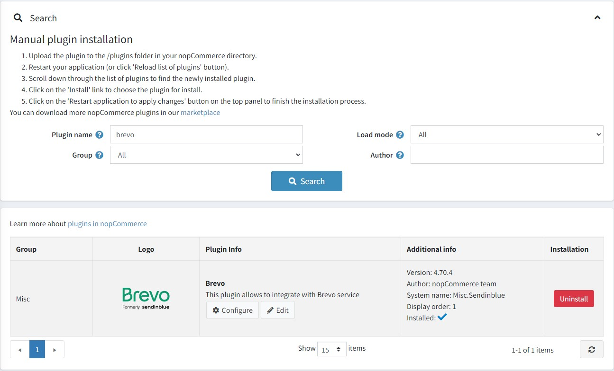

若外掛尚未安裝，請使用 **安裝** 按鈕進行安裝。接著，點擊 **編輯** 按鈕來啟用它。在此情況下，您會看到 *編輯外掛詳細資料* 視窗。使用 **已啟用** 核取方塊將外掛標記為已啟用，然後點擊 **儲存** 按鈕。

## 如何設定此外掛

1. 點擊 **Configure** 按鈕。您將會看到 *Configure - Brevo* 視窗：
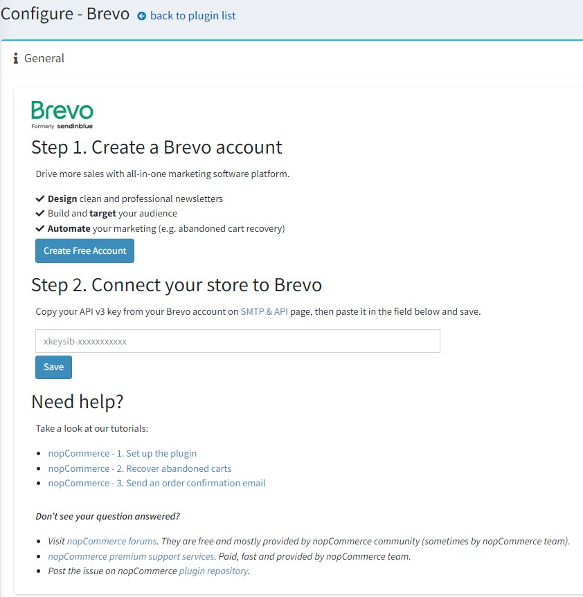

1. 您需要使用 [this link](https://get.brevo.com/5f897rrc6cwa) 建立一個免費的 Brevo 帳號。

1. 在 [SMTP & API](https://account.brevo.com/advanced/api/) 頁面中，輸入來自您 Brevo 帳號的 **API v3 key**。

1. 點擊 **Save** 按鈕。

1. 完成上述步驟後，您應該就能看到您的帳號詳細資訊。
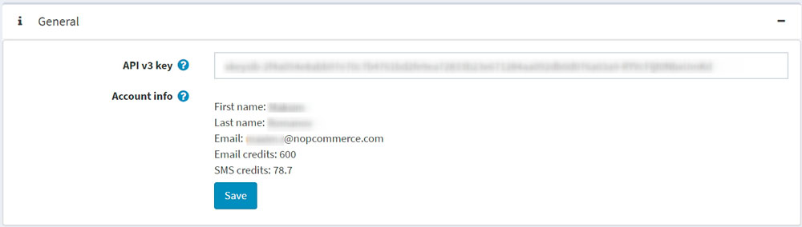

1. 前往 **Contacts** 面板，將您的 nopCommerce 顧客與您的 Brevo 帳號進行同步。
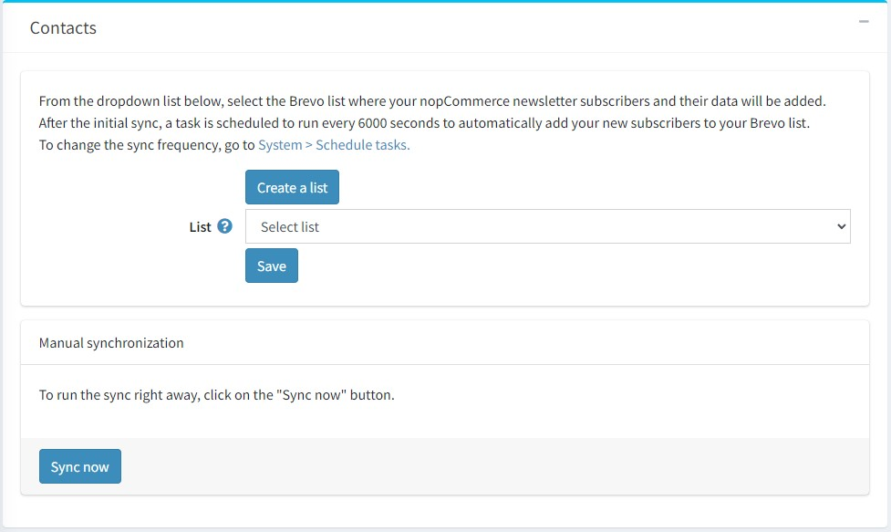

* 若要建立新的 Brevo 清單，請點擊 **Create a list** 按鈕，這將會導向至您的 Brevo 帳號。
* 從下拉式選單中，選擇要加入 nopCommerce 訂閱者及其聯絡資料的清單。點擊 **Save** 按鈕。

### 同步哪些資料？

以下表單欄位會同步為聯絡人屬性：

* EMAIL
* FIRSTNAME
* LASTNAME
* SMS
* STORE_ID
* USERNAME
* PHONE
* COUNTRY
* GENDER
* DATE_OF_BIRTH
* COMPANY
* ADDRESS_1
* ADDRESS_2
* ZIP_CODE
* CITY
* COUNTY
* STATE
* FAX

> [!NOTE]
>
> 關於同步，請注意這些表單欄位必須為顧客啟用。請前往 **設定 → 設定 → 顧客設定 → 顧客表單欄位**。

訂單資料會同步為交易屬性：

* ORDER_ID：訂單編號
* ORDER_PRICE：訂單金額
* ORDER_DATE：訂單日期

> [!NOTE]
>
> 當訂單的付款狀態為「已付款（Paid）」時才會進行同步。

### 聯絡人同步的頻率為何？

在初始同步完成後，系統會排程一項工作，每 6000 秒自動將您的新訂閱者加入到您的 Brevo 清單中。

點擊 **立即同步 (Sync now)** 按鈕即可立即執行同步。

若要變更同步頻率，請前往 **系統 → 排程工作**。
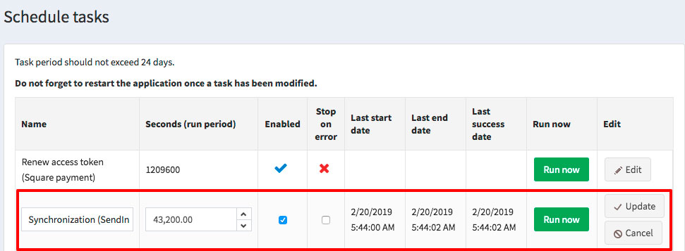

## 發送交易郵件

前往 **交易郵件 (Transactional emails)** 面板，透過 Brevo SMTP 發送您的交易郵件。
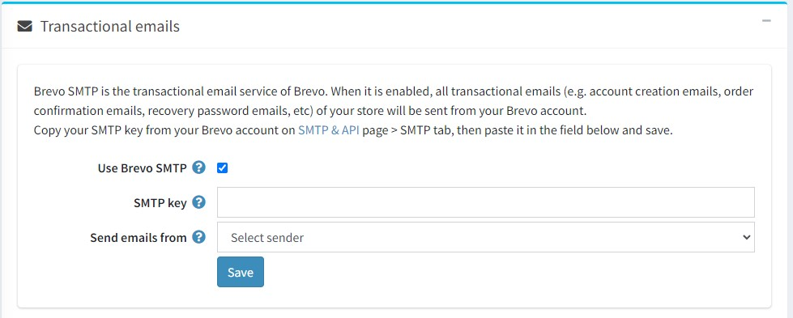

1. 勾選 **使用 Brevo SMTP (Use Brevo SMTP)** 核取方塊。
1. 貼上您的 SMTP 密碼，該密碼可在 [here](https://account.brevo.com/advanced/api) 找到。
1. 從下拉式選單中，選擇您希望用來發送郵件的寄件人。
1. 點擊 **儲存 (Save)** 按鈕。

接著您應該可以看到郵件通知清單。此清單列出了您所發送的所有交易郵件（例如訂單確認郵件）。
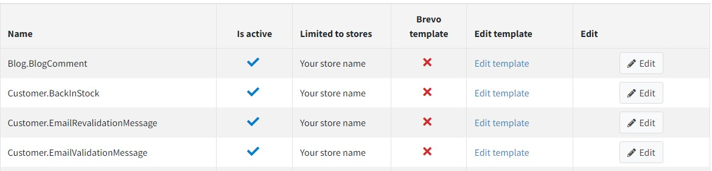

對於每個範本，您可以：

* 選擇它是啟用還是停用狀態。
* 選擇使用預設的 nopCommerce 範本或 Brevo 範本。若要進行此操作：

 1. 點擊 **編輯 (Edit)** 按鈕
 1. 從下拉選單中選擇您的範本
 1. 點擊 **更新 (Update)**

* 編輯其內容。

> [!NOTE]
>
> 如果您 *已經選取* 了 **Brevo 郵件範本 (Brevo email template)**，請點擊 **編輯範本 (Edit template)**，以便在您的 Brevo 帳戶中編輯範本內容。
> 如果您 *尚未選取* **Brevo 郵件範本**，點擊 **編輯範本 (Edit template)** 將會把您重新導向至 nopCommerce 管理後台的訊息範本編輯頁面。深入瞭解訊息範本編輯流程 [here](xref:zh-Hant/running-your-store/content-management/message-templates)。您也可以從該頁面發送測試郵件以檢查內容。請注意，每封測試郵件都會消耗郵件額度。

## 發送簡訊

前往 **SMS** 面板，除了電子郵件外，您還可以向顧客發送簡訊通知。
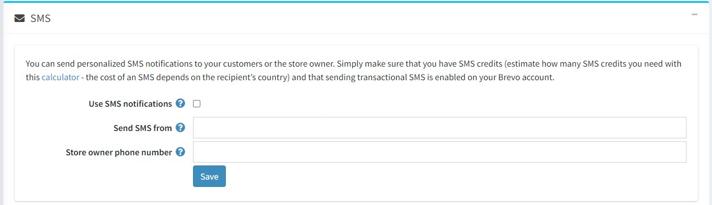

1. 勾選 **使用簡訊通知 (Use SMS notifications)** 核取方塊。
1. 輸入英數字組成的寄件者名稱（最多 11 個字元）。
1. 輸入您的電話號碼。
1. 點擊 **儲存 (Save)** 按鈕。

若要向 Brevo 清單發送簡訊行銷活動：
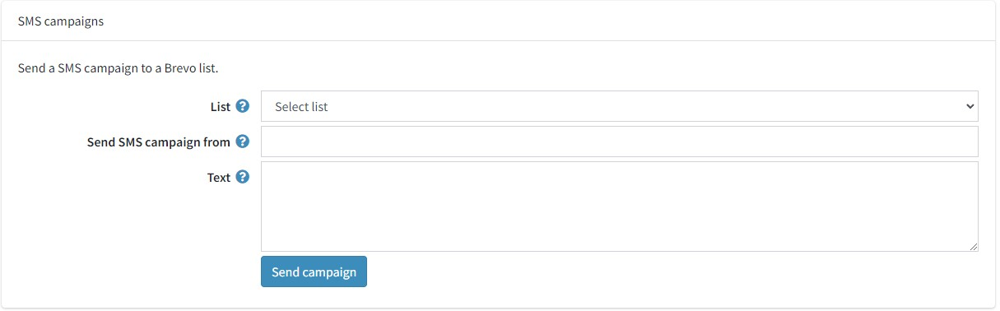

1. 前往 **簡訊行銷活動 (SMS campaigns)** 區塊。
1. 選擇要發送簡訊行銷活動的聯絡人 **清單 (List)**。
1. 在 **簡訊行銷活動發送者 (Send SMS campaign from)** 欄位中輸入寄件者名稱。字元數限制為 11 個（需為英數格式）。
1. 使用 **文字 (Text)** 欄位指定簡訊行銷活動的內容。單則訊息的字元數限制為 160 個。
1. 點擊 **儲存行銷活動 (Save campaign)**。

外掛現已設定完成。您可以直接從 Brevo 存取所有交易型電子郵件的統計數據。

## 設定行銷自動化工作流程

> [!NOTE]
>
> 顧客必須透過電子郵件地址進行識別才能觸發工作流程，亦即顧客必須在 nopCommerce 商店登入帳戶，或是在結帳過程中輸入其電子郵件地址。

前往 **行銷自動化 (Marketing Automation)** 面板以安裝行銷自動化追蹤指令碼，藉此追蹤您商店中購物者的活動。當訪客註冊、潛在顧客放棄購物車、顧客完成購買或其他事件發生時，您將能夠透過傳送一系列電子郵件或簡訊來自動化您的行銷流程。
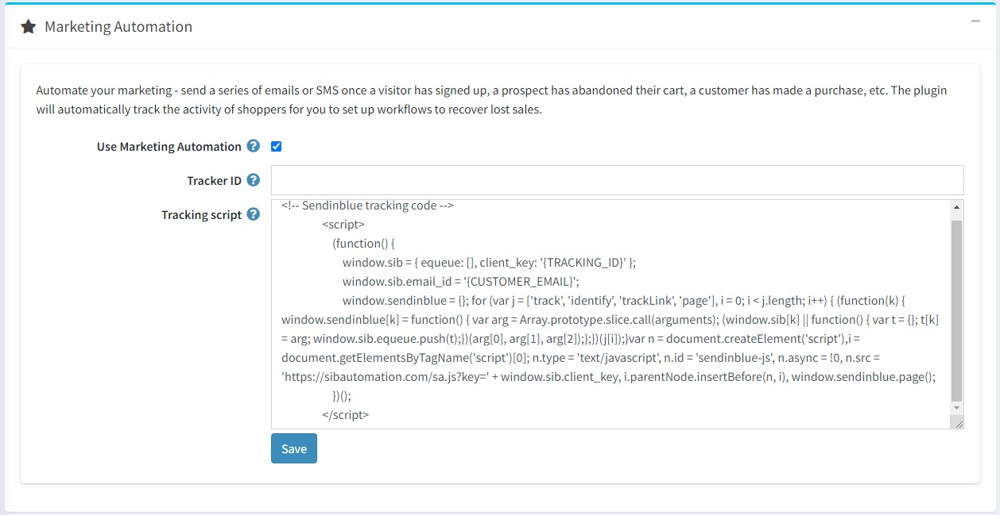

1. 勾選 **使用行銷自動化 (Use Marketing Automation)** 核取方塊。
1. 如果您的 Brevo 帳戶已啟用 *行銷自動化平台 (Marketing Automation platform)*，此外掛將會自動填入您的 **追蹤器 ID (Tracker ID)**。
1. 將 Brevo 產生的追蹤指令碼貼上至 **追蹤指令碼 (Tracking script)** 欄位。{TRACKING_ID} 與 {CUSTOMER_EMAIL} 將會被動態取代。
1. 確保 Brevo 小工具已在 **設定 (Configuration) → 小工具 (Widgets)** 頁面中啟用。
1. 點擊 **儲存 (Save)** 按鈕。

一旦行銷自動化功能啟用並正常運作，您將會在您的 Brevo 帳戶中的 *自動化 (Automation) → 紀錄 (Logs) → 事件紀錄 (Event logs)* 下方找到下列紀錄：

* 頁面 (Page)
* 識別 (Identify)
* 追蹤事件 (Track events)

此外掛會自動追蹤購物者的活動，讓您能夠設定工作流程來挽回流失的銷售，以及設定訂單確認工作流程。系統會傳遞 3 個追蹤事件：

* cart_updated：當項目新增至購物車時傳遞。
* cart_deleted：當購物車被清空時傳遞。
* order_completed：當訂單完成時傳遞。這代表付款狀態為「已付款 (Paid)」。
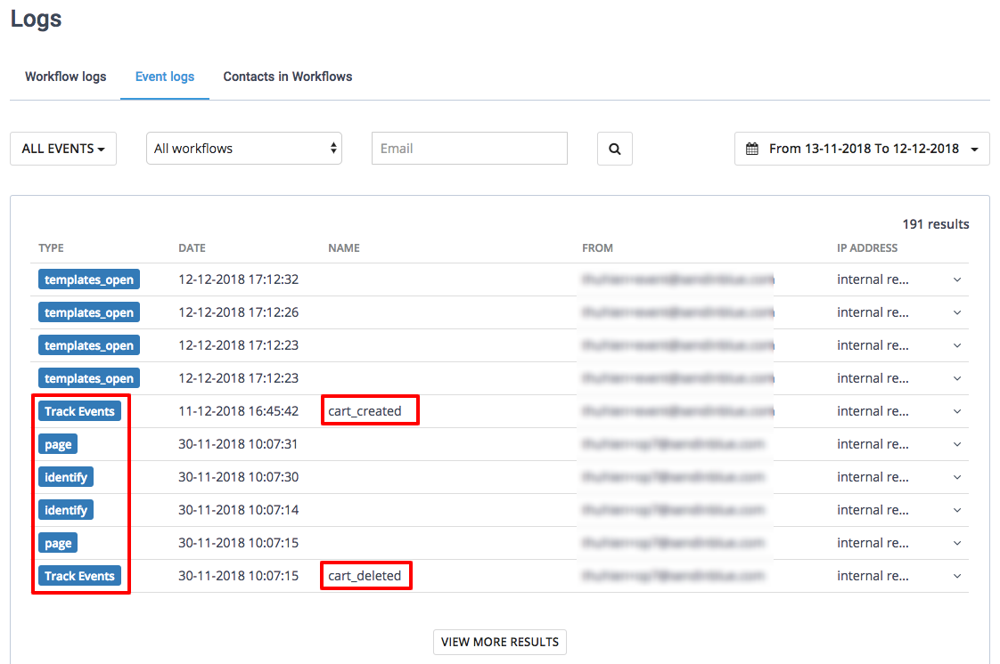

## 了解更多

* 了解如何 [建立購物車未結帳提醒郵件](xref:zh-Hant/running-your-store/promotional-tools/brevo-integration/recover-abandoned-carts)。
* 了解如何 [建立訂單確認郵件](xref:zh-Hant/running-your-store/promotional-tools/brevo-integration/send-an-order-confirmation-email)。