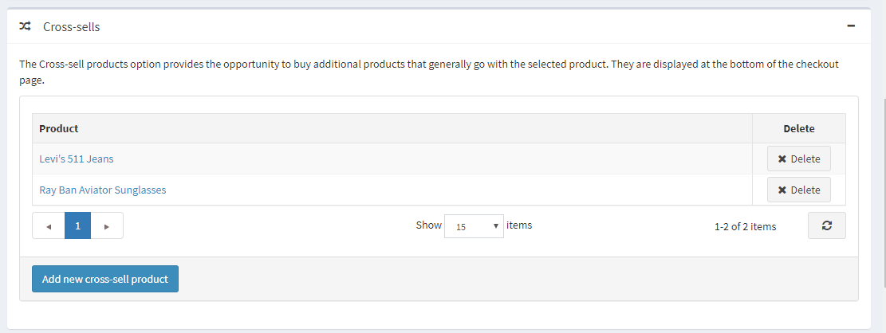
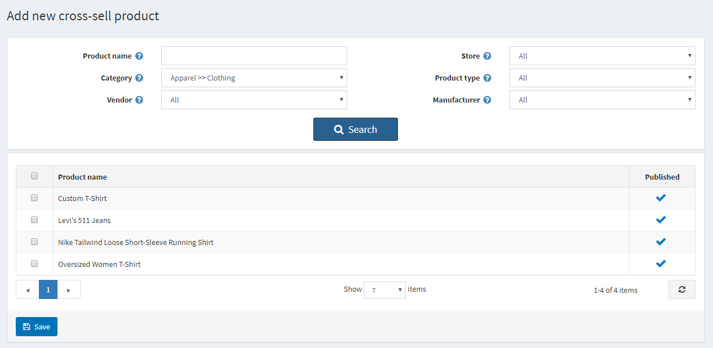
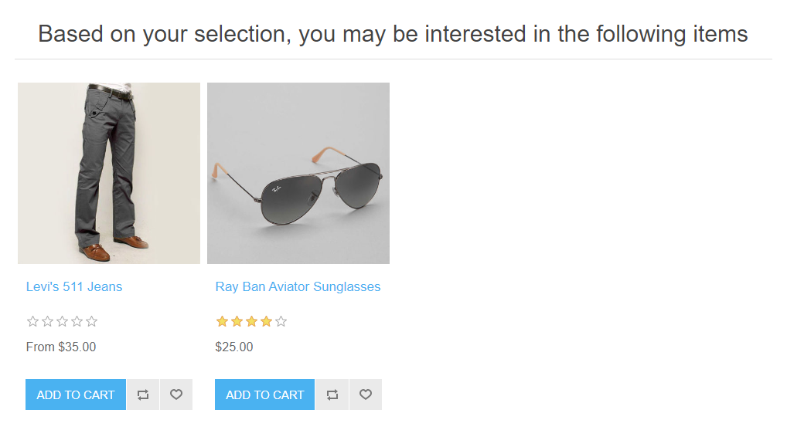
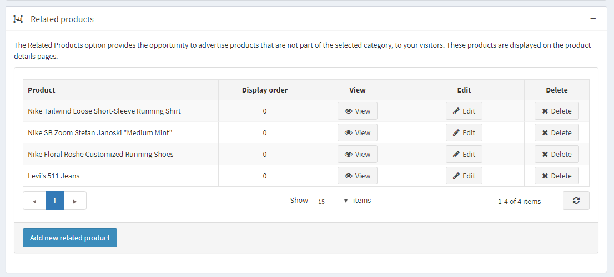
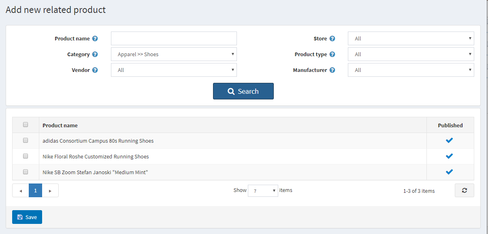
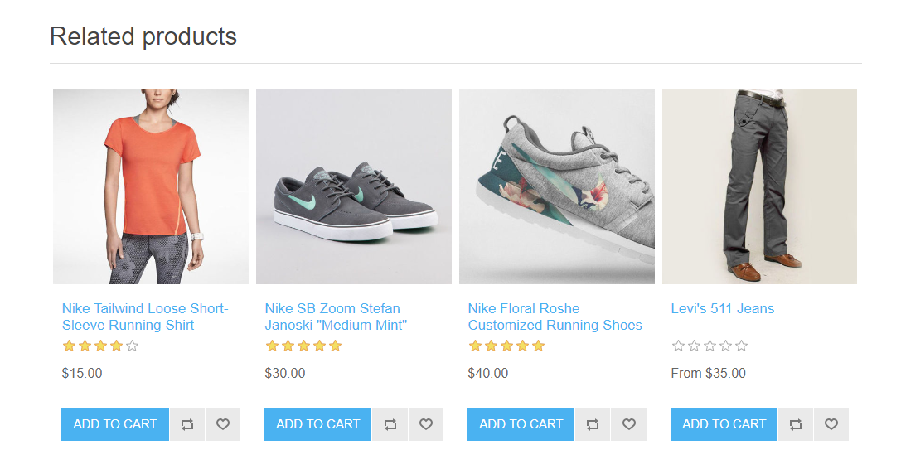

# 加購商品與相關商品

「加購商品 (Cross-sells)」與「相關商品 (Related products)」是 nopCommerce 中的行銷工具，可用於根據顧客的購物行為（瀏覽並將特定商品加入購物車）向其推薦可能感興趣的其他商品。這也是提升商品銷售（up-sell）的好機會。您可以同時使用這兩項工具。

您可以在建立或編輯商品的頁面中設定加購商品與相關商品。請前往 **目錄 → 商品**，選擇一個商品並點擊 **編輯**。找到「加購商品」與「相關商品」面板即可設定。

> [!NOTE]
>
> 在新增加購商品與相關商品之前，您必須先儲存該商品。

## 加購商品

「加購商品」選項提供了銷售與所選商品通常會一起購買之額外商品的機會；不過，您可以從目錄中加入任何商品，即使它們與購物車中的商品並無互補關係。加購商品會顯示在結帳頁面的底部。例如，當顧客正在購買 CPU 時，他們可能同時需要螢幕或其他商品。您可以為單一商品加入無限數量的加購商品。

### 新增加購商品

點擊 **新增加購商品** 並從目錄中選擇商品。您可以使用以下篩選條件來輕鬆尋找商品：**商品名稱**、**類別**、**供應商**、**商店**、**商品類型** 以及 **製造商**。

選擇並儲存加購商品後，您可以檢查加購商品在結帳頁面上的顯示方式：

## 相關商品

「相關商品」選項提供了向顧客宣傳並提升銷售其他與所選商品搭配之商品的機會。這些商品會顯示在商品詳細頁面中，位於所選商品的下方。您可以為單一商品加入無限數量的相關商品。

### 新增相關商品

點擊 **新增相關商品** 並從目錄中選擇商品。您可以使用以下篩選條件來輕鬆尋找商品：**商品名稱**、**類別**、**供應商**、**商店**、**商品類型** 以及 **製造商**。

選擇並儲存相關商品後，您可以檢查相關商品在商品詳細頁面上的顯示方式：

## 參閱

- [新增商品](xref:zh-Hant/running-your-store/catalog/products/add-products)
- [階梯價格](xref:zh-Hant/running-your-store/promotional-tools/tier-prices)

## 教學課程

- [瞭解 nopCommerce 中的加購商品](https://www.youtube.com/watch?v=J_6OlVarIFc)
- [管理相關商品](https://www.youtube.com/watch?v=FGuozvhyqYE&t=6s)