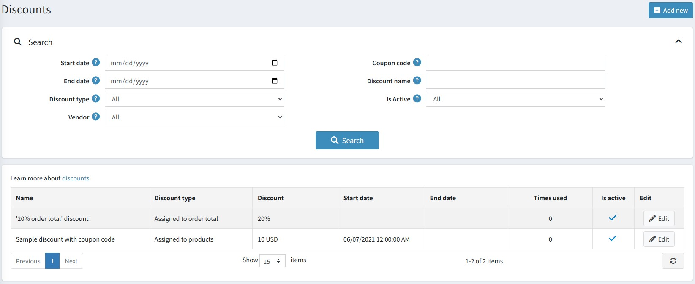
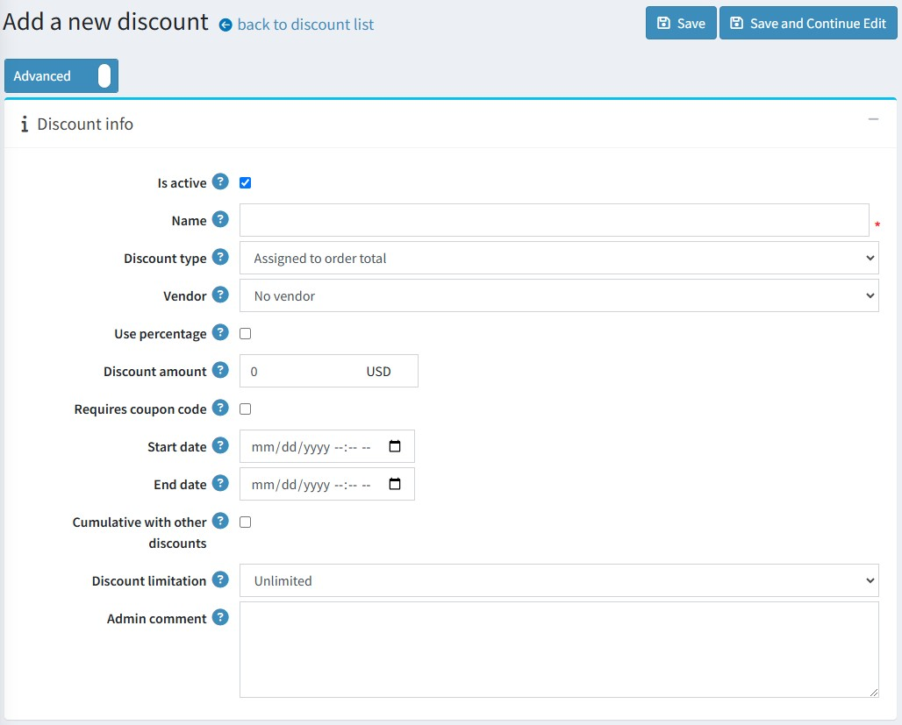
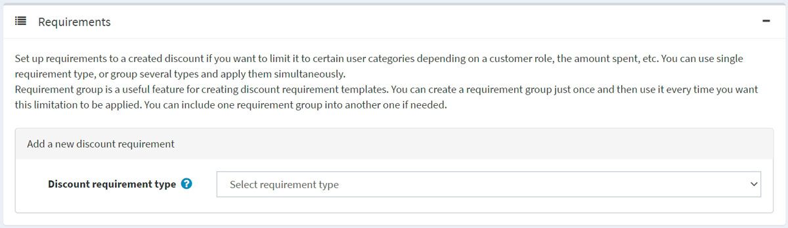
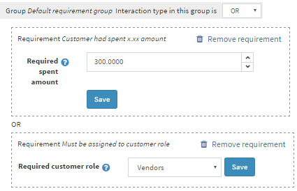
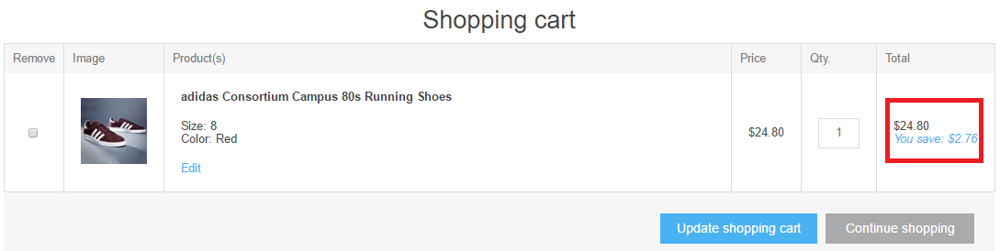
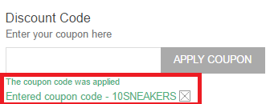
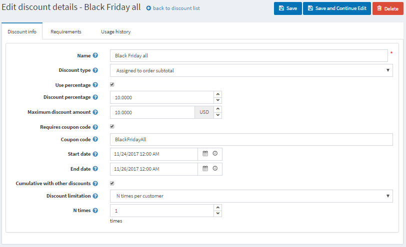
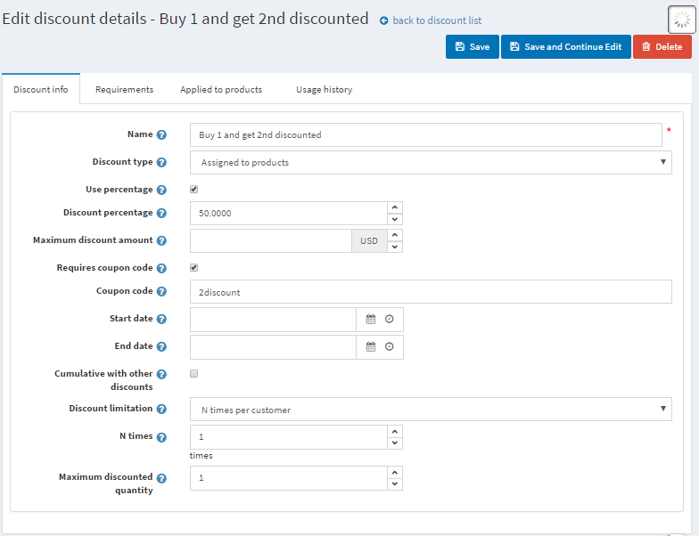
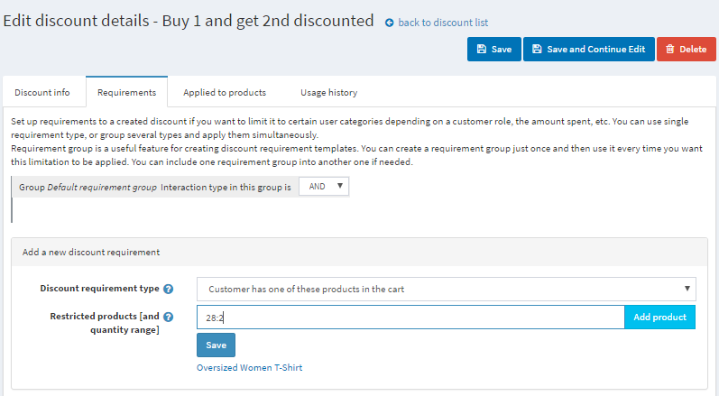

# 折扣

在 nopCommerce 中，您可以透過折扣功能來提供特殊優惠。折扣可套用於特定分類、商品、總金額等。您可以直接使用系統內建的各種條件需求，或是透過 [nopCommerce 市集](http://www.nopcommerce.com/marketplace) 中的外掛來擴充您的折扣功能。

nopCommerce 中的商品可以附加任意數量的折扣。當有多項折扣同時適用時，nopCommerce 會根據所有可用的折扣與群組成員資格，自動為顧客計算出最優惠的價格。

使用折扣最常見的方式是透過優惠碼。顧客可以在結帳前的購物車頁面中輸入優惠碼。

若要查看折扣列表，請前往 **行銷活動 → 折扣** 頁面：

頁面上方的區域可讓您透過各種搜尋條件來搜尋折扣：

- **開始日期** 與 **結束日期**：搜尋於這些日期之間建立的折扣。
- **折扣類型**。
- **供應商**：搜尋特定供應商的折扣。
- **優惠碼**。
- **折扣名稱**：折扣的完整名稱或其片段。
- **是否啟用**。

> [!NOTE]
>
> 預設情況下，nopCommerce 並未提供任何折扣，因此您可以從零開始建立折扣，並依照您的行銷策略進行規劃。

## 新增折扣

若要新增折扣，請前往 **促銷 → 折扣** 並點擊 **新增**。

此頁面有兩種模式：進階模式與基本模式。您可以維持在基本模式，該模式僅顯示主要欄位；或者切換至進階模式以顯示所有可用欄位。

- 若您想啟用此折扣，請勾選 **啟用 (Is active)** 核取方塊。
- 輸入折扣 **名稱 (Name)**。
- 從 **折扣類型 (Discount type)** 下拉式選單中，依照需求指派折扣類型：
  - *指派至訂單總額 (Assigned to order total)*：此折扣將應用於顧客的整筆訂單（訂單總額）。
  - *指派至商品 (Assigned to products)*：建立此折扣後，商店管理員可在商品詳細資料頁面將其指派給商品，或在儲存新折扣後，於下方顯示的 *套用至商品 (Applied to products)* 面板中新增商品。
  - *指派至類別 (Assigned to categories)*：建立此折扣後，商店管理員可在類別編輯頁面將其指派給類別，或在儲存新折扣後，於下方顯示的 *套用至類別 (Applied to categories)* 面板中新增類別。這能將折扣套用至該類別中的所有商品。
    - 若選擇此項，將會顯示 **套用至子類別 (Apply to subcategories)** 欄位，允許將此折扣套用至子類別。
  - *指派至製造商 (Assigned to manufacturers)*：建立此折扣後，商店管理員可在製造商編輯頁面將其指派給製造商，或在儲存新折扣後，於下方顯示的 *套用至製造商 (Applied to manufacturer)* 面板中新增製造商。這能將折扣套用至該製造商的所有商品。
  - *指派至運費 (Assigned to shipping)*：此折扣將應用於運費。
  - *指派至訂單小計 (Assigned to order subtotal)*：此折扣將應用於訂單小計金額。
- 選擇 **供應商 (Vendor)**。您可以在 **顧客 → 供應商** 中管理 [供應商](xref:zh-Hant/running-your-store/vendor-management)。
  供應商唯一支援的折扣類型為「指派至商品」。無法建立其他類型的折扣。屆時供應商僅能將自己的商品指派給此折扣（於「套用至商品」頁籤中）。
- 若您想套用百分比折扣，請勾選 **使用百分比 (Use percentage)** 核取方塊。
  - 若勾選上述核取方塊，將會顯示 **折扣百分比 (Discount percentage)** 欄位。
  - 您也可以設定 **最大折扣金額 (Maximum discount amount)**。將此欄位留空則代表不限制折扣金額。若您使用 *指派至商品* 的折扣類型，則該上限將分別應用於每個商品。

- 若未勾選 **使用百分比 (Use percentage)** 核取方塊，您可以針對訂單或 SKU 套用 **折扣金額 (Discount amount)**。
- 勾選 **需要優惠碼 (Requires coupon code)** 核取方塊，以允許顧客輸入優惠碼來獲取折扣。
  - 勾選此項後，會出現 **優惠碼 (Coupon code)** 選項。您可以在此欄位輸入所需的優惠碼。這能讓顧客在結帳時輸入優惠碼以套用折扣。
    > [!NOTE]
    >
    > 若符合條件，顧客可以在單筆訂單中使用多個優惠碼，次數不限。

- 若您想指定折扣的 **開始日期 (Start date)** 與 **結束日期 (End date)**，請從日曆欄位中選擇（時區為 Coordinated Universal Time (UTC)）。
- **可與其他折扣累加 (Cumulative with other discounts)** 選項允許顧客同時使用多個折扣。若勾選此項，此折扣可與其他折扣同時使用。
  > [!NOTE]
  >
  > 此功能僅適用於相同類型的折扣。目前，不同類型的折扣預設即為可累加的。

- 您也可以限制折扣的使用次數。從 **折扣限制 (Discount limitation)** 下拉式選單中，選擇所需的折扣限制：
  - *無限制 (Unlimited)*。
  - *僅 N 次 (N times only)*：選擇此選項並輸入此折扣可使用的總次數。
  - *每位顧客 N 次 (N times per customer)*：選擇此選項並輸入每位顧客可使用此折扣的次數。

- 在 **最大折扣數量 (Maximum discounted quantity)** 欄位中（僅當 **折扣類型** 設為 *指派至商品*、*類別* 或 *製造商* 時顯示），指定可享有折扣的最大商品數量。這可用於諸如「買 2 送 1」之類的行銷活動。
- 如有需要，請輸入 **管理員備註 (Admin comment)**。顧客將無法看到此內容。

點擊 **儲存** 以儲存變更，或點擊 **儲存並繼續編輯** 以繼續編輯其他面板。

## 新增折扣需求

建立折扣後，如果您希望折扣適用於某些特定規則，則可以新增折扣需求。
如果您想根據顧客角色、消費金額或其他條件將折扣限制在特定的顧客類別，請設定需求。您可以使用單一需求類型，或組合多種類型並同時套用。

若要新增折扣需求，請前往 *需求 (Requirements)* 面板：

若要新增需求，請從下拉式清單中選擇 **折扣需求類型 (Discount requirement type)**。

- nopCommerce 預設提供一種需求類型：*必須指派給顧客角色 (Must be assigned to a customer role)*。這讓您可以為特定的顧客群組（角色）設定折扣。其他需求類型可透過我們的 [市集](https://www.nopcommerce.com/en/extensions?searchterm=discount+requirement&category=discounts-promotions) 以購買外掛的形式取得。

- 此外，您還可以建立需求群組，以處理具有多重規則的複雜需求。需求群組是建立折扣需求範本的實用功能。您可以建立一次需求群組，並在需要套用此限制時重複使用。如有需要，您甚至可以將一個需求群組包含在另一個群組中。
  這些需求是使用布林邏輯來設定的。例如，如果您希望折扣僅適用於特定的顧客角色，或者顧客已消費了特定金額時。這類需求以及更多功能，皆可透過我們的 [市集](https://www.nopcommerce.com/en/extensions?searchterm=discount+requirement&category=discounts-promotions) 以購買外掛的形式取得。

您可以設定無限數量的巢狀需求群組（一個套入另一個）。例如，在更複雜的情況下，當您希望顧客同時滿足以下條件時獲得折扣：他們是供應商且消費了特定金額，或者他們是論壇管理員並同時將特定商品放入購物車。

當顧客在結帳過程中套用折扣時，顯示方式如下：

## 常見的折扣類型

### 黑色星期五促銷

黑色星期五總是落在感恩節後的隔天。這是一個非常普遍的折扣活動；幾乎每一家網路商店都會舉辦黑色星期五促銷。

- **名稱** — 您可以輸入任何名稱；這僅供內部使用。
- **折扣類型** — 此處我們採用「指定於小計」類型，即在加上所有費用（如運費和稅金）之前，將折扣應用於訂單總金額。在此情境下這很合適，因為我們希望購物車內的所有商品都能享有折扣。
- 我們可以按百分比 (%) 套用折扣，或直接輸入指定幣別的金額。此處我們設定為 10%。
- **最高折扣金額** 也可以設限，因此即便購物車內的商品總價為 300 美元，顧客最多也只能獲得 10 美元的折扣。
- 此折扣將需要 **優惠碼**。您可以不輸入優惠碼就套用折扣，但從行銷目的考量，並不建議這麼做。優惠碼能讓您追蹤活動成果。
- 折扣通常具有時效性。在此，我們在 **開始日期** 和 **結束日期** 欄位中輸入了黑色星期五週末的日期。
- **可與其他折扣累加** 選項允許顧客同時使用多項折扣。
- 最後一個設定是關於 **折扣限制** 的使用。例如，此折扣可以限制每位顧客僅能使用一次。

### 購買一件商品，第二件享 5 折優惠

通常，您會需要銷售更多特定商品。在這種情況下，為了鼓勵顧客購買多件商品，您可以提供折扣。讓我們來看看如何在您的 nopCommerce 商店中使用「購買一件商品，第二件享 5 折優惠」的折扣設定。

- **折扣類型 (Discount type)** 為 *指定給商品 (Assigned to products)*。在 *套用至商品 (Applied to products)* 面板中，您可以新增這些商品；在此範例中，將會是「加大碼 T 恤 (Oversized T-shirt)」。
- 我們希望顧客在購買第二件 T 恤時能獲得 50% 的折扣。
- 此折扣每位顧客僅限使用一次，因此 **最高折扣數量 (Maximum discounted quantity)** 設為 1。
- 您可以在 *需求 (Requirements)* 面板中設定商品數量的需求。新增一個需求類型 *顧客擁有所有這些商品 (Customer has all of these products)*，並新增一件數量為 2 的 T 恤。此需求類型可以透過外掛下載 [here](https://www.nopcommerce.com/en/has-all-products-discount-requirement-rule)。請參閱 [外掛 (Plugins)](xref:zh-Hant/getting-started/advanced-configuration/plugins-in-nopcommerce) 章節以了解如何安裝外掛。

您可以利用此情境來設定另一種熱門的折扣——「買一送一」，只需將折扣設定為 100% 即可。

## 參閱

- 關於折扣類型與折扣需求類型的更多外掛，請參閱 [nopCommerce 市集](http://www.nopcommerce.com/marketplace)
- 如何 [安裝外掛](xref:zh-Hant/getting-started/advanced-configuration/plugins-in-nopcommerce)

## 教學課程

- [在 nopCommerce 中使用折扣](https://www.youtube.com/watch?v=cAXxnV79dzw&index=7&list=PLnL_aDfmRHwsbhj621A-RFb1KnzeFxYz4)
- [使用布林邏輯設定折扣](https://www.youtube.com/watch?v=gBtZG3OcjnQ)