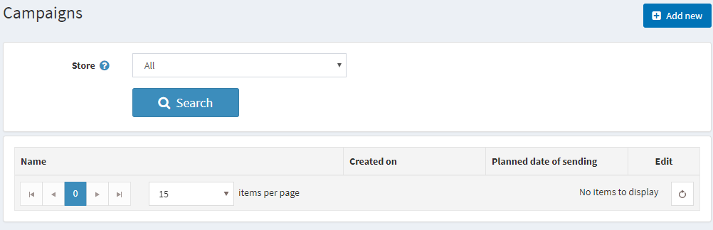
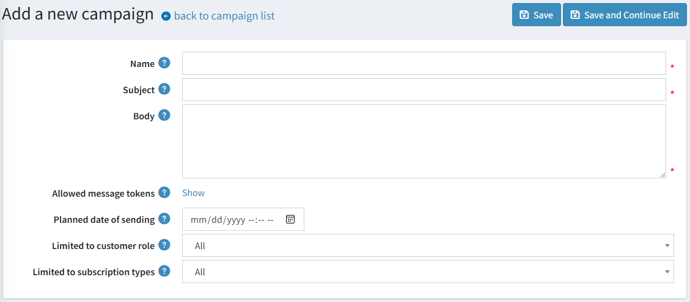
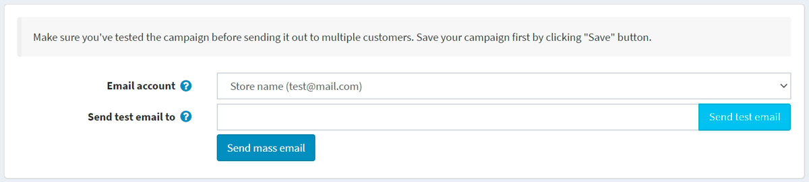
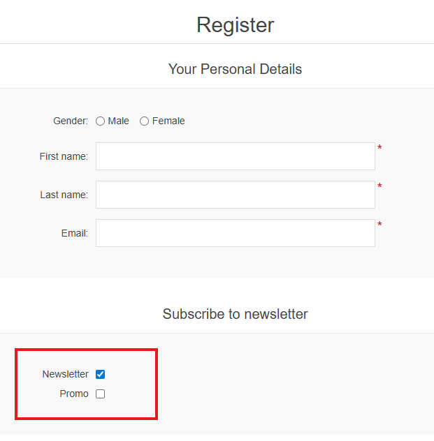
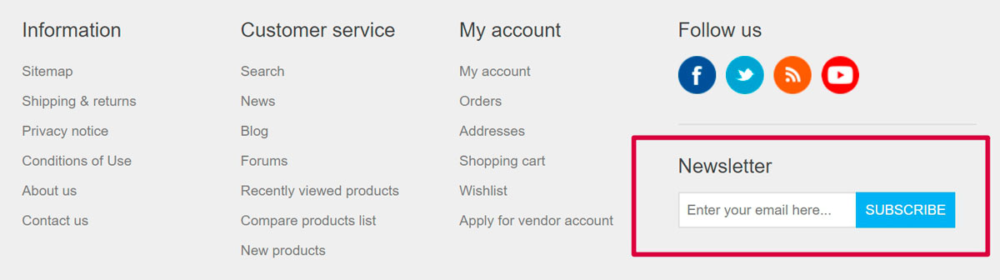
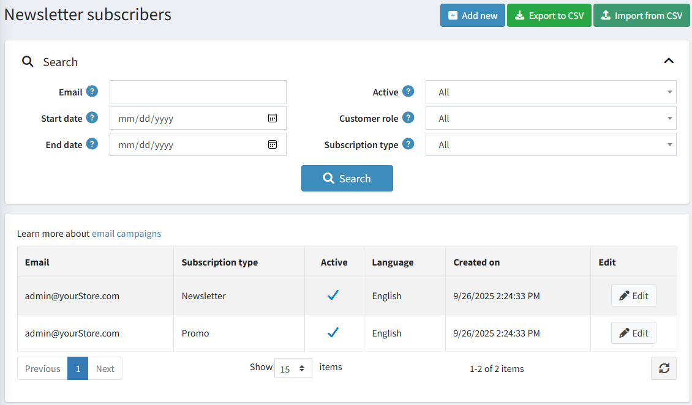
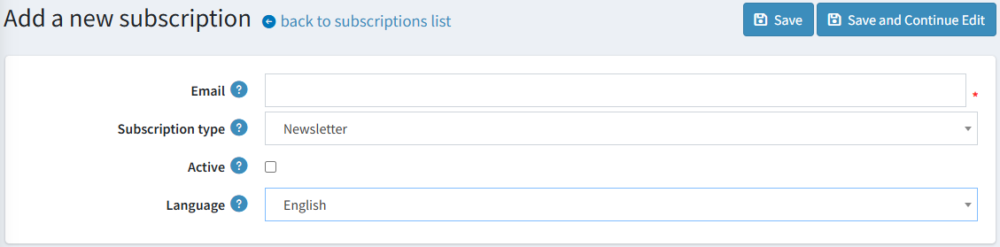
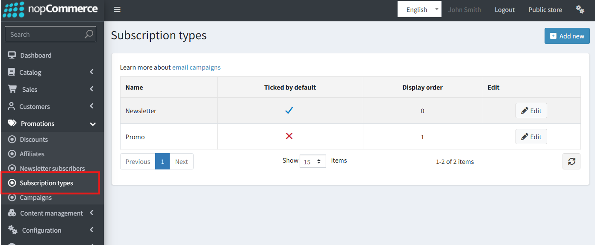
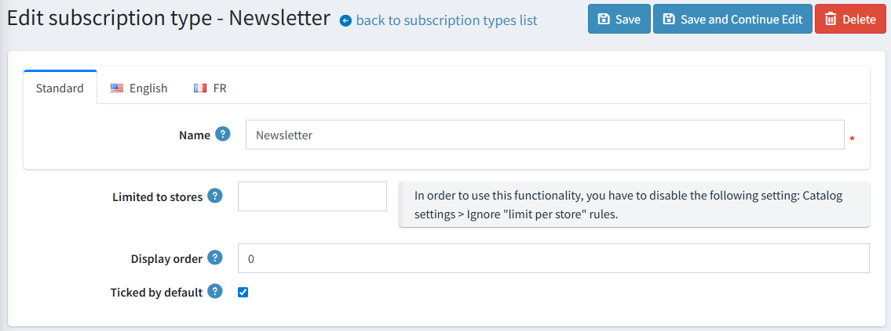

# 電子郵件行銷活動

在註冊過程中，顧客可以選擇「電子報」選項，以接收來自您商店的電子報。或者，也可以稍後透過頁尾的表單（以 Default Clean 佈景主題為例）訂閱電子報。另一種填入電子報訂閱者的方式是，從外部 CSV 檔案匯入訂閱者清單至 nopCommerce。您也可以將 nopCommerce 中的訂閱者清單匯出為外部 CSV 檔案。

請參閱下方 [電子報訂閱者](#multiple-newsletter-lists) 章節，了解如何管理電子報訂閱者。

您可以利用訂閱者清單來建立電子郵件行銷活動，無需額外的行銷活動即可輕鬆快速地觸及目標客群。行銷活動有助於提升顧客對公司的信任與忠誠度，同時促進銷售成長。

您可以在商店中運用多種電子郵件行銷活動範例：從感謝顧客訂閱的歡迎郵件開始，定期發送公告、公司相關新聞、供未來購物使用的優惠碼等等。

> [!NOTE]
>
> 系統預設沒有提供任何行銷活動，因此您可以從頭開始建立，以符合您自己的行銷策略。

若要管理行銷活動，請前往 **促銷 → 行銷活動**。

## 新增電子郵件行銷活動

若要建立新的行銷活動，請點擊 **新增 (Add new)**。

請定義下列行銷活動細節：

- 行銷活動 **名稱 (Name)**。
- 行銷活動的 **主旨 (Subject)**。
- 輸入您想要發送的電子郵件 **內文 (Body)**。
- 在 **允許的訊息 Token (Allowed message tokens)** 中，您可以查看可在電子郵件行銷活動中使用的訊息 Token 清單。點擊 **顯示 (Show)** 即可查看所有項目。
- 輸入 **預計發送日期 (Planned date of sending)** 與時間。
- 從 **限於商店 (Limited to store)** 下拉式選單中，選擇哪些商店的訂閱者將會收到此郵件。
- 從 **限於顧客角色 (Limited to customer role)** 下拉式選單中，選擇將會收到此郵件的訂閱者角色。
- 從 **限於訂閱類型 (Limited to subscription types)** 下拉式選單中，選擇此郵件將發送至的訂閱類型。

點擊 **儲存 (Save)** 或 **儲存並繼續編輯 (Save and continue editing)** 以繼續發送您的行銷活動。

## 發送活動

在活動儲存後，您可以將其發送給顧客。您會在頁面頂端看到新的面板：

> [!NOTE]
>
> 請確保在將活動發送給多位顧客之前，已經先進行過測試。

首先，請發送一封測試郵件，以確認所有設定都已正確完成。為此，請選擇用於發送活動的 **Email account**。請參閱 [Email accounts](xref:zh-Hant/getting-started/email-accounts) 章節，了解如何建立電子郵件帳戶。

接著，在 **Send test email to** 欄位中輸入您的電子郵件地址，並點擊 **Send test email**。

在確認一切運作正常後，請使用 **Send mass email** 按鈕將您的活動發送給顧客。

## 多重電子報清單

**多重電子報清單 (Multiple Newsletter Lists)** 功能允許商店擁有者為顧客建立並管理多種電子報訂閱選項。過去，系統僅提供單一的預設電子報。透過此功能，顧客現在可以選擇他們想要訂閱的電子報，這讓他們能夠更精確地控管自己所接收的通訊內容。

預設情況下，系統會提供一個名為 **"Newsletter"** 的電子報清單。商店擁有者可以從管理後台建立額外的清單，例如 **"Partner Newsletter"**、**"Special Offers"** 或 **"Promo Newsletter"**，並對其進行管理。

### 顧客體驗

當設定了多個電子報列表時，顧客將會在以下頁面看到所有可用的列表：

- **註冊頁面**
- **顧客資訊頁面**

顧客可以使用核取方塊來選擇他們希望訂閱的電子報。

或者，顧客稍後可以使用頁尾中的表單進行訂閱（在 Default Clean nopCommerce 佈景主題中）：

### 管理訂閱者

在 **促銷 → 電子報訂閱者** 頁面中，您可以使用以下欄位搜尋訂閱者：

- **Email** – 輸入訂閱者的電子郵件以進行搜尋，若留空則載入所有訂閱者。
- **開始日期 / 結束日期** – 依訂閱日期篩選。
- **啟用** – 選擇 *已啟用*、*未啟用* 或 *所有* 訂閱者。
- **商店** – 選擇商店。
- **顧客角色** – 選擇顧客角色。
- **訂閱類型** – 選擇訂閱類型。

點擊 **搜尋** 以套用篩選條件。

建立及編輯訂閱的功能可透過管理後台進行操作。

您也可以透過將外部 CSV 檔案匯入 nopCommerce 或將訂閱者匯出至 CSV 檔案來管理電子報訂閱者。

若要匯出或匯入電子報訂閱者：

- 點擊 **匯入 CSV** 以匯入 CSV 格式的訂閱者名單。
- 點擊 **匯出 CSV** 以匯出現有的訂閱者名單。

### 管理訂閱類型

除了管理訂閱者之外，商店擁有者還可以檢視及編輯 **訂閱類型**。
這讓您可以完全掌控哪些類型的電子報可供顧客選擇。

- 從管理後台，導覽至 **促銷 → 訂閱類型**。
- 您可以新增、編輯或刪除訂閱類型。
- 這些類型將在顧客訂閱時顯示為選項供其勾選。

**範例：**

管理現有的訂閱類型：

編輯或建立訂閱類型詳細資料：

### 行銷活動管理

建立電子郵件行銷活動時，商店經營者可以：

- 選擇**特定的電子報列表**作為目標
- 選擇**「所有電子報列表」**，將行銷活動發送給所有至少訂閱了一份電子報的顧客

此功能已與電子郵件外掛（例如 **Brevo**）完全整合，確保行銷活動能順暢遞送。

## 教學課程

- [在 nopCommerce 中管理行銷活動](https://youtu.be/iW2m8LQyyWM)