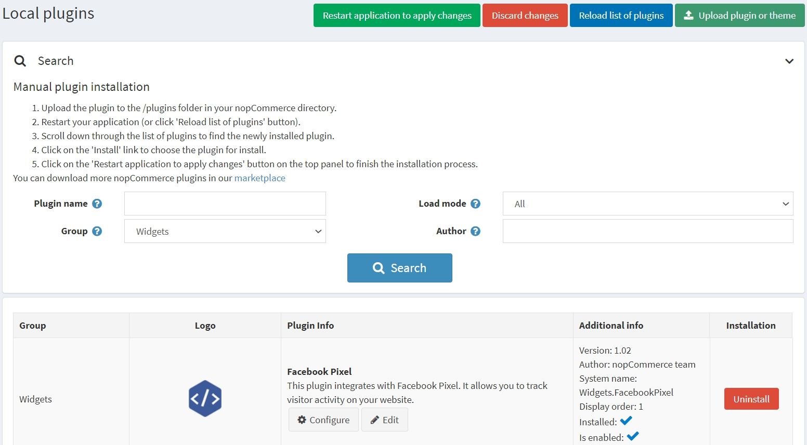
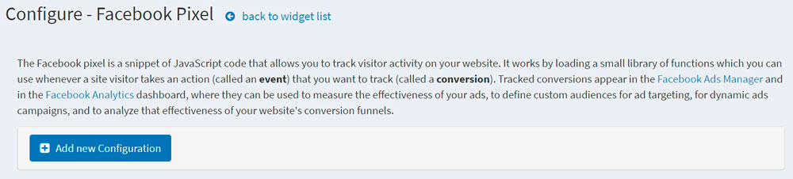
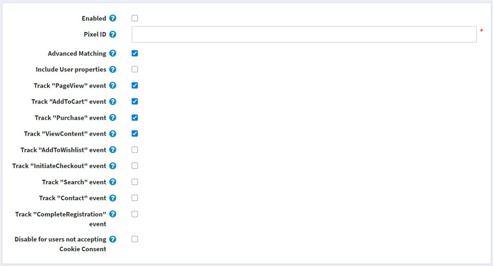
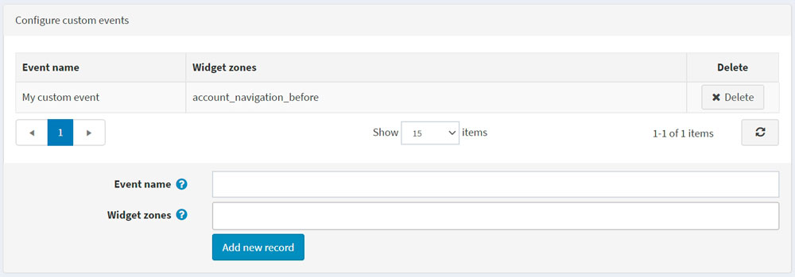

# Facebook Pixel 外掛

本章節說明如何將 Facebook Pixel 整合到您的商店中。

## 什麼是 Facebook Pixel

Facebook Pixel 允許您接收關於商店中採取之行為的資訊，藉此讓您的 Facebook 廣告與目標客群更具相關性。Facebook Pixel 可以協助您了解商店訪客的行為，以及哪種廣告策略最能達成您的業務目標。

追蹤到的轉換會顯示在 [Facebook Ads Manager](https://www.facebook.com/adsmanager) 和 [Facebook Analytics](https://business.facebook.com/analytics) 儀表板中，您可以在這些地方衡量廣告成效、定義用於廣告投放或動態廣告活動的自訂受眾，並分析網站轉換漏斗的有效性。

## Facebook Pixel 外掛的功能

nopCommerce 的 Facebook Pixel 外掛會貼上一段 JavaScript 程式碼片段，讓您可以追蹤訪客在您網站上的活動。它的運作方式是載入一小組函式庫，並在顧客執行任何動作時觸發。

## 安裝並啟用外掛

Facebook Pixel 外掛是 nopCommerce 內建的外掛。您可以在這裡找到它：**設定 → 本地外掛**。若要更快速地找到該外掛，請使用搜尋面板中的 **群組 (Group)** 欄位，將外掛篩選為 *Widgets* 類型：

若外掛尚未安裝，請使用 **安裝 (Install)** 按鈕進行安裝。接著，點擊 **編輯 (Edit)** 按鈕來啟用它。此時您會看到 *編輯外掛詳細資料 (Edit plugin details)* 視窗。勾選 **已啟用 (Is enabled)** 核取方塊，然後點擊 **儲存 (Save)** 按鈕。

## 如何設定此外掛

1. 點擊 **Configure** 按鈕。您將會看到 *Configure - Facebook Pixel* 頁面視窗：

1. 點擊 **Add new configuration** 按鈕。
1. 填寫以下表單以設定此外掛：

* 勾選 **Enabled** 核取方塊以啟用此 Facebook Pixel 設定。
* 輸入您的 **Pixel ID**，您可以從 [Ads Manager → Events Manager](https://business.facebook.com/events_manager) 中找到它。如果您尚未建立 Pixel，請[遵循這些說明](https://www.facebook.com/business/help/952192354843755)來建立一個 — 您只需要該 Pixel 的 ID 即可。
* **Advanced Matching**：如果勾選，部分訪客的資料（以雜湊格式）將會被 Facebook Pixel 收集。如果您已透過 Events Manager 自動實作進階比對，請取消勾選此設定。
* **Include User properties**：勾選以將 *User properties*（關於使用者的資料）包含在 Pixel 中。之後，您可以在 Facebook Analytics 儀表板中的 People → User Properties 下查看使用者屬性。

接下來，您將看到事件列表。標準事件是預先定義的訪客動作，對應於常見的轉換相關活動，例如搜尋商品、查看商品或購買商品。

* **Track "PageView" event**：勾選以啟用當使用者進入網站頁面時，追蹤此標準事件。
* **Track "AddToCart" event**：勾選以啟用當商品加入購物車時，追蹤此標準事件。
* **Track "Purchase" event**：勾選以啟用當訂單成立時，追蹤此標準事件。
* **Track "ViewContent" event**：勾選以啟用當使用者進入商品詳細頁面時，追蹤此標準事件。
* **Track "AddToWishlist" event**：勾選以啟用當商品加入願望清單時，追蹤此標準事件。
* **Track "InitiateCheckout" event**：勾選以啟用當使用者進入結帳流程前，追蹤此標準事件。
* **Track "Search" event**：勾選以啟用當進行搜尋時，追蹤此標準事件。
* **Track "Contact" event**：勾選以啟用當使用者透過「聯絡我們」表單提交問題時，追蹤此標準事件。
* **Track "CompleteRegistration" event**：勾選以啟用當註冊表單完成時，追蹤此標準事件。

> [!NOTE]
>
> 作為額外參數，某些事件會包含商品 SKU 或商品組合 SKU；請確保它們在您的商品目錄中已正確填寫。

* **Disable for users not accepting Cookie Consent**：勾選此項可針對未接受 Cookie 同意的使用者停用 Facebook Pixel。如果您在受《一般資料保護規則》（GDPR）規範的國家/地區經營業務，您可能會需要此功能。您同時需要在後台的 **Configuration → Settings → General settings** 頁面啟用 **DisplayEuCookieLawWarning** 設定，以便向使用者顯示 Cookie 同意提示。

> [!NOTE]
>
> 《一般資料保護規則》（GDPR）於 2018 年 5 月 25 日生效，為歐洲建立了統一的資料保護規則。與 Facebook 公司合作進行廣告業務的企業，可以繼續以目前的方式使用 Facebook 平台與解決方案。

## 設定自訂事件

> [!NOTE]
>
> 您必須先建立並儲存目前的設定後，才能看到此面板！

如果預先定義的標準事件不符合您的需求，您可以追蹤自訂事件，這些事件也可用於定義用於廣告最佳化的自訂受眾。
您可以在下方進行設定。指定名稱並選擇要追蹤自訂事件的小工具區域（widget zones）。如果您不知道該為自訂事件使用哪個區域，可以在我們的 [論壇](https://www.nopcommerce.com/boards) 中詢問。

## 參閱

[Facebook Pixel 收集哪些資料？](https://developers.facebook.com/docs/facebook-pixel/support#pixelcollect)