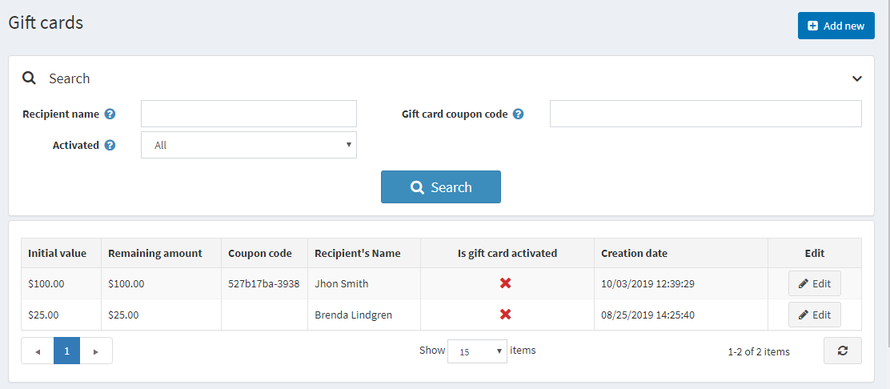
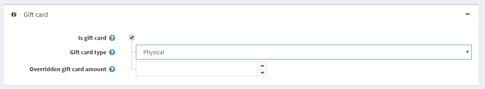
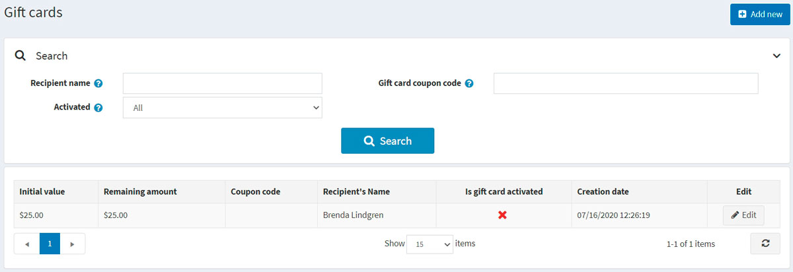
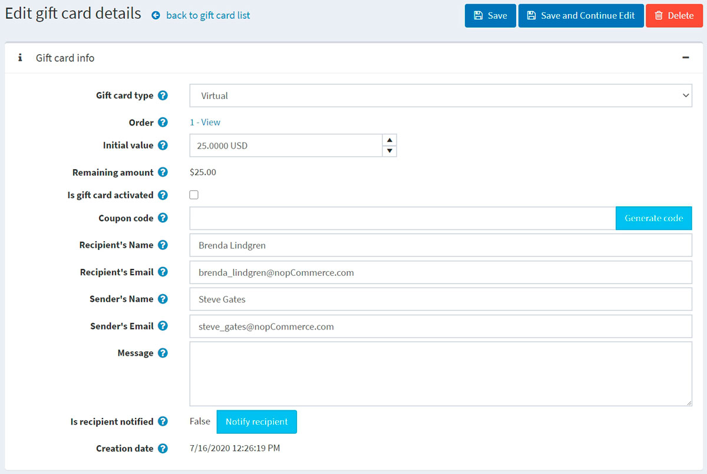
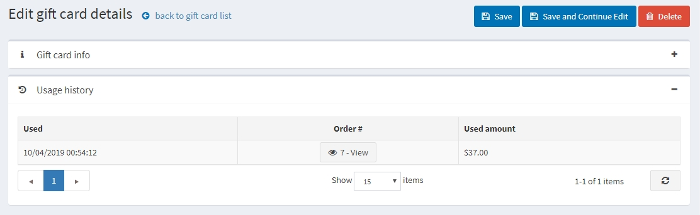
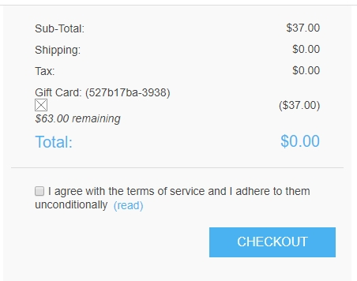

# 禮品卡

在 nopCommerce 中，您可以銷售禮品卡以及其他類型的商品。

禮品卡是良好的行銷工具，能讓您接觸更多顧客並刺激額外消費。禮品卡是一種目標明確的工具，因為收到禮品卡的顧客肯定會更有動機去使用它，這就像是專門為他們提供的個人化提案。

## 新增禮品卡

您可以建立禮品卡商品，並在 **目錄 → 商品 → 新增 → 禮品卡** 面板中，透過勾選 **Is gift card** 核取方塊將商品定義為禮品卡。

在此面板中，您還需要指定 **Gift card type**：*Virtual*（虛擬）或 *Physical*（實體）。

> [!WARNING]
>
> 不建議在「線上」運作中的商店變更禮品卡類型。

## 啟用禮品卡

當您的顧客完成禮品卡商品的購買後，您可以在 **銷售 → 禮品卡** 中搜尋並查看所有已購買禮品卡的列表。

若要查看禮品卡詳細資訊，請點選旁邊的 **Edit** 按鈕。系統將顯示 *Edit gift card details* 視窗：

您應該勾選 **Is gift card activated** 核取方塊來啟用禮品卡，接著產生 **Coupon code**。

> [!NOTE]
>
> 若要在訂單完成後自動啟用禮品卡，請前往 **設定 → 設定 → 訂單設定** 頁面。找到 *Gift cards* 面板並勾選 **Activate gift cards after completing of an order** 核取方塊。在此情況下，**Coupon code** 也會自動產生。
> 請注意，此頁面還有其他與禮品卡啟用相關的設定。

您也可以定義下列禮品卡資訊：

- 在 **Gift card type** 中，選擇它是 *Virtual* 還是 *Physical*。
- 在 **Order** 欄位旁邊，點選 **View** 以查看購買該禮品卡的訂單。
- 在 **Initial value** 欄位中，視需要編輯卡片的初始金額。
- **Remaining amount** 欄位可讓您查看該禮品卡的剩餘金額。
- **Is gift card activated** 欄位決定了此禮品卡是否已啟用並可供使用。
- **Coupon code** 欄位代表禮品卡的優惠碼（在結帳時使用）。
- 如有需要，在相關欄位中編輯 **Recipients name**、**Recipient's email**（若禮品卡類型為 *Virtual*）、**Sender's name** 以及 **Sender's email**（若禮品卡類型為 *Virtual*）。
- 在 **Message** 區域輸入選填訊息。
- 點選 **Notify recipient**。系統將會寄送一封包含禮品卡詳情的電子郵件給收件人。此按鈕僅適用於虛擬禮品卡，不適用於實體禮品卡。

## 使用紀錄

在 *Usage history* 面板中，您可以查看此禮品卡優惠碼所使用的訂單列表。在禮品卡啟用且寄件者收到優惠碼後，他們便可在結帳時使用該優惠碼。

## 使用禮品卡

顧客可以在前台網站的購物車頁面，將序號輸入到對應的方塊中來使用禮品卡。

> [!NOTE]
>
> 您可以透過取消勾選 **設定 → 設定 → 購物車設定** 頁面（*Common* 面板）上的 **Show gift card box** 核取方塊，來停用購物車頁面上的禮品卡輸入框。

您也可以允許顧客查詢禮品卡餘額。若要執行此操作，請在 **設定 → 設定 → 購物車設定** 頁面（*Common* 面板）上，勾選 **Allow customers to check gift card balance** 核取方塊。

> [!NOTE]
>
> 此功能需要啟用 CAPTCHA，因為它可能存在安全性風險，而 CAPTCHA 有助於防止及增加暴力破解的難度。若要啟用 CAPTCHA，請前往 **設定 → 設定 → 一般設定** 頁面，並勾選 *CAPTCHA* 面板中的 **CAPTCHA enabled** 核取方塊。若要了解如何設定 CAPTCHA，請參考 [安全設定 - CAPTCHA](xref:zh-Hant/getting-started/advanced-configuration/security-settings#captcha) 章節。

## 參閱

- [新增商品](xref:zh-Hant/running-your-store/catalog/products/add-products)
- [管理禮品卡的 YouTube 教學影片](https://www.youtube.com/watch?v=4SJ7uBZGas0&index=4&list=PLnL_aDfmRHwsbhj621A-RFb1KnzeFxYz4)