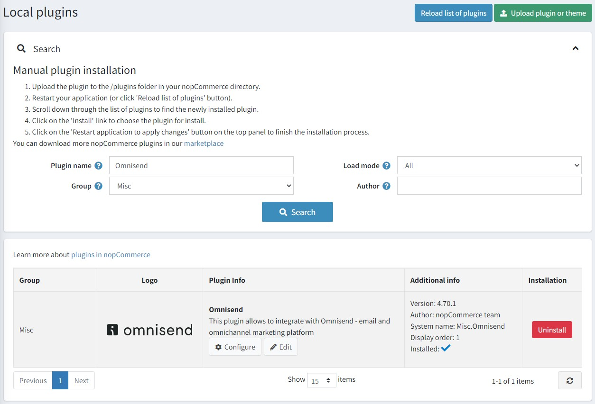
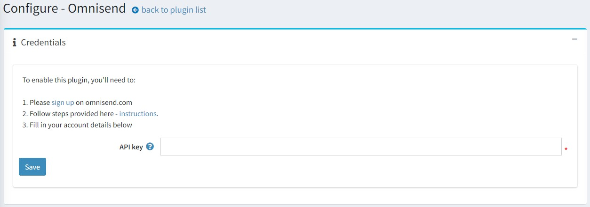
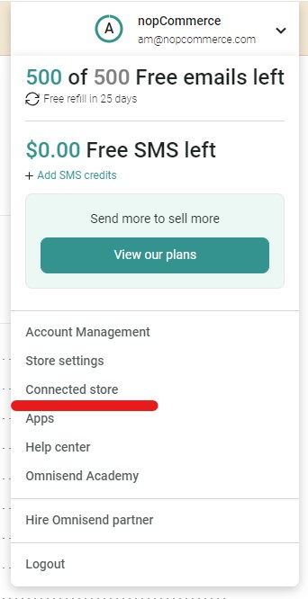
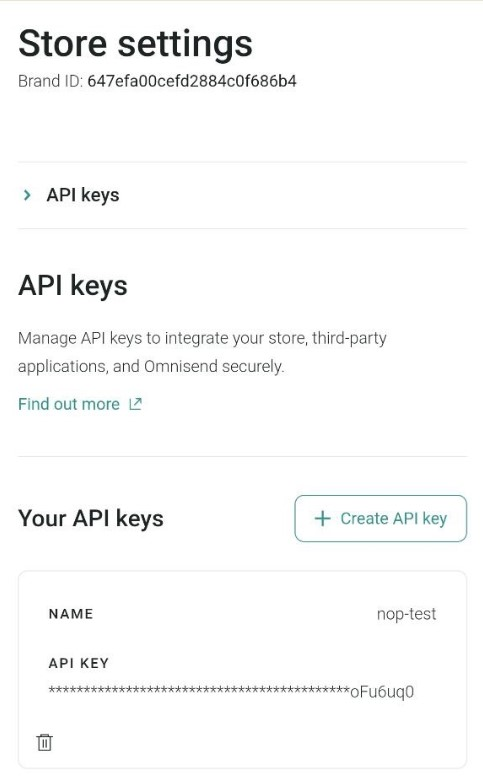
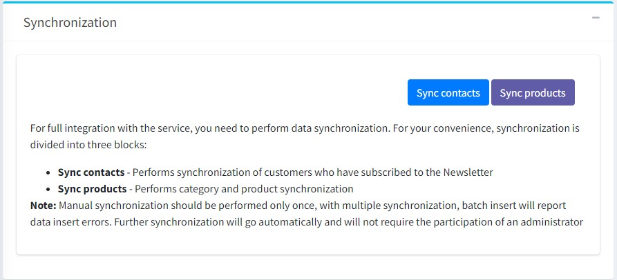

# Omnisend 整合

本章節說明如何將 Omnisend 外掛整合至您的商店中。該外掛支援所有 nopCommerce 版本，包含從 4.30 到 4.70 的次要版本。

## 什麼是 Omnisend

Omnisend 是一個電子郵件與簡訊行銷自動化平台，旨在協助電子商務商店與其顧客建立連結並進行互動。您可以建立彈出式視窗與註冊表單來收集新的訂閱者。透過電子郵件與簡訊等管道與他們互動。利用您的商店資料來劃分顧客群組，並透過個人化的自動化功能來提升銷售。

## Omnisend 外掛的功能

適用於 nopCommerce 的 Omnisend 外掛允許商店擁有者執行以下操作：

* 同步聯絡人 - 執行訂閱電子報之顧客的同步作業。
* 同步商品 - 同步商品類別與商品資訊。

## 安裝並啟用外掛

Omnisend 外掛是 nopCommerce 內建的外掛。您可以在這裡找到它：**設定 → 本地外掛**。若要更快速地找到此外掛，請使用搜尋面板中的 **群組** 欄位，將外掛篩選為 *Misc* 類型：

如果外掛尚未安裝，請點擊 **安裝** 按鈕進行安裝。接著，點擊 **編輯** 按鈕來啟用它。此時您會看到 *編輯外掛詳細資訊* 視窗。透過 **已啟用** 核取方塊將外掛標記為啟用，然後點擊 **儲存** 按鈕。

## 如何設定此外掛

1. 點擊 **Configure** 按鈕。您將會看到 *Configure - Omnisend* 視窗：

   若要在 nopCommerce 中使用 Omnisend，您需要 [建立一個帳號](https://your.omnisend.com/g1K9y2)。您可以從免費方案開始探索平台功能，無需信用卡。

   > [!NOTE]
   > 如果您已經在使用 Omnisend，且該帳號已連結到其他商店，請務必先 [建立一個新的空白商店](https://support.omnisend.com/en/articles/3022953-managing-multiple-stores?irclickid=VWt1B4VIXxyPTkbVXw2OtWsaUkHVGdTU12dV0g0&irpartnerid=5274744&irprogramid=21260&irgwc=1#register-a-new-store-under-the-owners-account)。

1. 若要將 Omnisend 連接到您的商店：請 [登入](https://app.omnisend.com/login?irclickid=VWt1B4VIXxyPTkbVXw2OtWsaUkHVGf2o12dV0g0&irpartnerid=5274744&irprogramid=21260&irgwc=1) 您的 Omnisend 帳號。

1. 點擊儀表板或帳號導覽選單中的 *Connect store*。

1. 產生一組 API key 並將其貼到外掛設定頁面中的對應欄位。

1. 點擊 **Save** 按鈕。

1. 前往 **Synchronization** 面板，將您的 nopCommerce 顧客與商品同步到您的 Omnisend 帳號。

### 支援哪些功能？

* [電子郵件](https://support.omnisend.com/en/articles/6070131-building-an-email-campaign?irclickid=VWt1B4VIXxyPTkbVXw2OtWsaUkHVGqRM12dV0g0&irpartnerid=5274744&irprogramid=21260&irgwc=1) 與 [簡訊行銷活動](https://support.omnisend.com/en/articles/1918472-sms-in-campaigns?irclickid=VWt1B4VIXxyPTkbVXw2OtWsaUkHVGqQs12dV0g0&irpartnerid=5274744&irprogramid=21260&irgwc=1)。
* [Omnisend 註冊表單](https://support.omnisend.com/en/articles/1061792-types-of-signup-forms?irclickid=VWt1B4VIXxyPTkbVXw2OtWsaUkHVJfyY12dV0g0&irpartnerid=5274744&irprogramid=21260&irgwc=1)。
* [其他第三方整合](https://support.omnisend.com/en/collections/35918-integrations-with-3rd-party-apps?irclickid=VWt1B4VIXxyPTkbVXw2OtWsaUkHVGM2w12dV0g0&irpartnerid=5274744&irprogramid=21260&irgwc=1)。
* 這些自動化工作流程：
  * [訂單確認](https://support.omnisend.com/en/articles/1421803-order-confirmation-automation?irclickid=VWt1B4VIXxyPTkbVXw2OtWsaUkHVGMw012dV0g0&irpartnerid=5274744&irprogramid=21260&irgwc=1)（適用於「訂單已付款」與「訂單已建立」事件），
  * [取消確認](https://support.omnisend.com/en/articles/1649441-cancellation-confirmation-automation?irclickid=VWt1B4VIXxyPTkbVXw2OtWsaUkHVGMyw12dV0g0&irpartnerid=5274744&irprogramid=21260&irgwc=1)（適用於「訂單已取消」事件），
  * [生日](https://support.omnisend.com/en/articles/1061790-birthday-email-automation?irclickid=VWt1B4VIXxyPTkbVXw2OtWsaUkHVGMRM12dV0g0&irpartnerid=5274744&irprogramid=21260&irgwc=1)，
  * [歡迎信](https://support.omnisend.com/en/articles/1061818-welcome-email-automation?irclickid=VWt1B4VIXxyPTkbVXw2OtWsaUkHVGMTk12dV0g0&irpartnerid=5274744&irprogramid=21260&irgwc=1)，
  * [顧客進入/離開區隔](https://support.omnisend.com/en/articles/2398171-contact-enters-exits-a-segment-automation?irclickid=VWt1B4VIXxyPTkbVXw2OtWsaUkHVGMQI12dV0g0&irpartnerid=5274744&irprogramid=21260&irgwc=1)，
  * [瀏覽放棄](https://support.omnisend.com/en/articles/1692754-browse-abandonment?irclickid=VWt1B4VIXxyPTkbVXw2OtWsaUkHVGMXU12dV0g0&irpartnerid=5274744&irprogramid=21260&irgwc=1)，
  * [商品放棄](https://support.omnisend.com/en/articles/1690227-product-abandonment?irclickid=VWt1B4VIXxyPTkbVXw2OtWsaUkHVGMSM12dV0g0&irpartnerid=5274744&irprogramid=21260&irgwc=1)，
  * [放棄結帳與放棄購物車](https://support.omnisend.com/en/articles/6659889-abandoned-cart-and-abandoned-checkout?irclickid=VWt1B4VIXxyPTkbVXw2OtWsaUkHVGJx812dV0g0&irpartnerid=5274744&irprogramid=21260&irgwc=1)。
* [區隔分析](https://support.omnisend.com/en/articles/5945163-using-omnisend-segmentation?irclickid=VWt1B4VIXxyPTkbVXw2OtWsaUkHVGJzE12dV0g0&irpartnerid=5274744&irprogramid=21260&irgwc=1)。區隔分析中的大多數篩選器皆可使用，除了以下訂單狀態事件：訂單已付款、訂單已取消、訂單已出貨、訂單已部分出貨、訂單已退款、訂單已部分退款。不過，您仍然可以使用「訂單已建立」篩選器。
* [即時活動](https://support.omnisend.com/en/articles/1689912-live-view-tracking-store-activity?irclickid=VWt1B4VIXxyPTkbVXw2OtWsaUkHVGJwY12dV0g0&irpartnerid=5274744&irprogramid=21260&irgwc=1)。
* 新增您的 [品牌資產](https://support.omnisend.com/en/articles/6099524-brand-assets-management?irclickid=VWt1B4VIXxyPTkbVXw2OtWsaUkHVGJ3w12dV0g0&irpartnerid=5274744&irprogramid=21260&irgwc=1)。

### 同步哪些資料？

下列商店資料現在將會同步至 Omnisend：

* 顧客詳細資料
* 商品與已瀏覽的分類
* 訂單相關事件
* 購物車放棄相關事件

> [!NOTE]
> 手動同步應僅執行一次，若進行多次同步，批次寫入（batch insert）將會回報資料寫入錯誤。後續的同步會自動執行，無需管理員參與。

## 聯絡人同步

此外掛實作了兩種型態的聯絡人同步：

* 初始匯入所有現有聯絡人。此動作在使用者剛安裝外掛，並希望將所有現有的商店聯絡人匯入至 Omnisend 帳號時執行。

* 訂閱或取消訂閱時的聯絡人同步。

## 顧客追蹤事件 (JS snippet)

為了追蹤商店中的使用者動作，會在網站的所有頁面上安裝一段 JS 腳本。預設情況下，該腳本會追蹤所有頁面的造訪紀錄，包含對商品頁面的造訪。此外，還會使用額外的腳本來通知使用者識別資訊。

## 購物車事件、訂單事件

在外掛中，需追蹤多項事件以通知 Omnisend 服務：

* 將商品加入購物車。
* 下訂單。
* 訂單付款。
* 訂單退款。
* 取消訂單。
* 完成訂單處理。
* 開始結帳流程。
* 變更購物車中的商品（增加數量、折扣等）。
* 從購物車中刪除最後一個商品。
* 變更訂單狀態。
* 還原購物車。顧客可以選擇從 Omnisend 的電子郵件（廢棄購物車提醒）中的連結回到商店。

## 商品同步

此外掛實作了類別與商品的匯入功能。
當您點擊 **Sync products** 按鈕時，同步處理程序就會執行。

> [!NOTE]
> 如果類別數量較多（>300 個），系統會向使用者顯示警告，說明匯入可能需要較長時間。

除了初始匯入外，此外掛亦實作了商品的即時同步，但僅追蹤 `StockQuantity` 參數的變更，以確保商品狀態（*inStock*、*outOfStock*、*notAvailable*）維持在最新狀態。