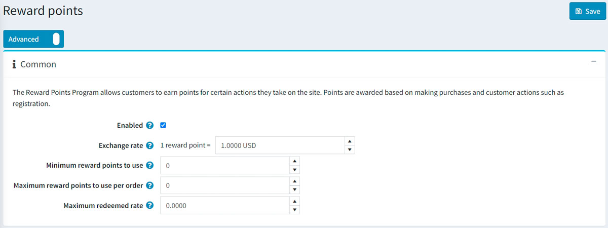
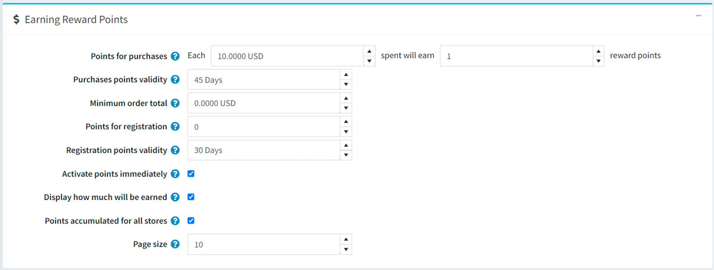
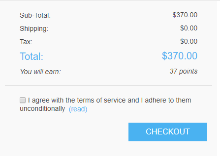
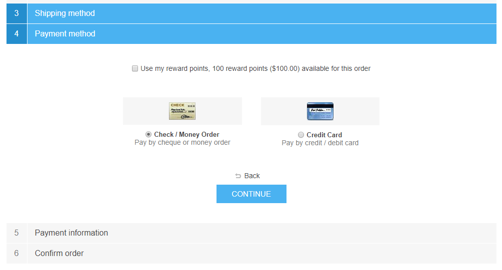

# 紅利點數

「紅利點數」功能讓您能建立並實作一套顧客忠誠度計畫，以提升顧客體驗並增加顧客忠誠度。紅利點數計畫允許顧客透過在網站上執行特定動作（如註冊及購物）來賺取點數。

紅利點數可用作付款方式之一，此選項會顯示在結帳頁面的付款方式區塊中。可兌換的紅利點數能與其他付款選項合併使用，例如信用卡、禮品卡等。

若顧客取消訂單或發送退貨請求，點數亦可被取消。

## 管理紅利點數

若要管理紅利點數計畫，請前往 **設定 → 設定 → 紅利點數**。此頁面提供兩種模式：*基礎*與*進階*。

此頁面支援多商店設定，這代表您可以為所有商店定義相同的設定，或為不同商店設定不同的數值。若您想管理特定商店的設定，請從多商店設定下拉式清單中選擇該商店名稱，並勾選左側對應的核取方塊，即可為其設定自訂數值。詳細資訊請參閱 [多商店設定](xref:zh-Hant/getting-started/advanced-configuration/multi-store)。

若要設定您的紅利點數計畫，請定義下列設定：

## 一般設定

- 勾選 **已啟用** 核取方塊以啟動紅利點數計畫。
- 在 **兌換率** 欄位中，指定紅利點數的兌換率（例如：1 點 = $1）。
- 在 **可使用的最低紅利點數** 欄位中，輸入顧客在可以使用點數前須累積的最低點數。若您不需要設定此項，請輸入 0。
- 若您指定了 **每筆訂單最高可使用紅利點數** 欄位，顧客在每筆訂單中將無法使用超過 X 點的紅利點數。若不想使用此設定，請設為 0。
- **最高折抵比例** 設定限制了可使用紅利點數支付的訂單總額上限（百分比）。例如，若設為 0.6，則訂單總額的 60% 可透過紅利點數支付，但不得超過 **每筆訂單最高可使用紅利點數** 的限制。若不想使用此設定，請設為 0。

## 賺取紅利點數

- 在 **購物贈送點數** 欄位中，指定購物可獲得的點數數量。
- 在 **購物點數有效期限** 欄位中，指定購物所獲點數的有效天數。預設值為 `45` 天。若您指定數值為 `0`，則紅利點數將永久有效。
- 在 **最低訂單總額** 欄位中，指定購物贈送點數的最低訂單金額（不含運費）。
- 在 **註冊贈送點數** 欄位中，指定顧客註冊可獲得的點數數量。
- 在 **註冊點數有效期限** 欄位中，指定註冊所獲點數的有效天數。
- 若您希望顧客在賺取點數後即可立即使用，請勾選 **立即啟用點數** 核取方塊。若取消勾選此項，將會出現另一個選項：
- 在 **紅利點數啟用時間** 核取方塊中，指定紅利點數啟用前的等待期間（天數/小時數）。
- 勾選 **顯示將可獲得的點數** 核取方塊，以向顧客顯示他們即將獲得多少點數。此資訊將顯示在結帳頁面上。
- 勾選 **所有商店累計點數** 核取方塊，以便將所有商店的紅利點數累計在同一個餘額中，使其能在任何商店使用。
- 在 **頁面大小** 欄位中，設定「我的帳戶」頁面中紅利點數歷史記錄的分頁大小。

點擊 **儲存**。

> [!NOTE]
>
> 紅利點數僅適用於已註冊的顧客。

當顧客在結帳時使用紅利點數，介面呈現如下：

## 參閱

- [管理紅利點數教學](https://www.youtube.com/watch?v=lE4-xDUKkd0&index=14&list=PLnL_aDfmRHwsbhj621A-RFb1KnzeFxYz4)