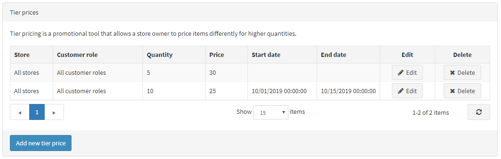
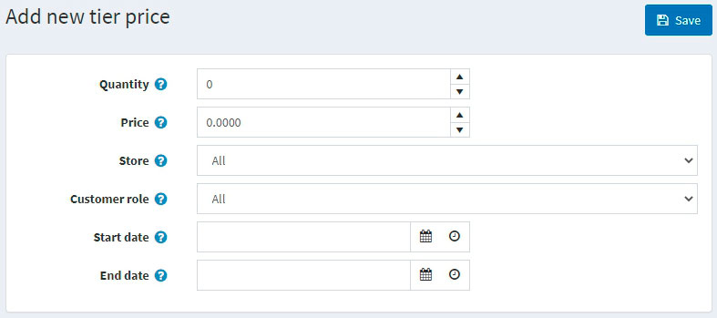
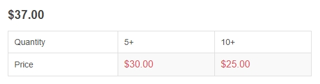

# 階梯價格

階梯價格是一種促銷工具，允許商店擁有者在顧客購買特定產品的較大數量時，提供優惠價格。此工具通常用於批發，但零售商也可以運用它來激勵買家並推動更多銷售。

階梯價格可以在產品編輯頁面中套用於產品。請前往 **目錄 → 產品**，選擇您想要新增階梯價格的產品，然後點擊 **編輯**。找到「階梯價格」面板即可新增階梯價格：

> [!NOTE]
>
> 在您可以為產品頁面新增階梯價格之前，必須先儲存該產品。

## 新增階梯價格

點擊 **新增階梯價格** 按鈕來新增階梯價格。接著會顯示「新增階梯價格」視窗：

- 在 **數量** 和 **價格** 欄位中，定義適用於特定產品數量的價格。
- 若您經營多家商店，請從 **商店** 下拉式選單中，選擇您打算套用階梯價格的商店。
- 從 **顧客角色** 下拉式選單中，選擇定義此階梯價格的顧客角色，例如：*所有* 顧客、*已註冊*、*訪客*。
- 在 **開始日期** 和 **結束日期** 欄位中，輸入階梯價格的有效期間。若不適用，請將這些欄位留空。

點擊 **儲存**。「階梯價格」表格將會更新為新的資料。

現在，您可以在前台網站檢視更新後的產品詳細資訊頁面：

當顧客將特定數量的產品加入購物車時，價格會自動變更以顯示折扣。

## 教學課程

- [管理階梯價格](https://www.youtube.com/watch?v=ERE08UEDU58&t=10s)