# 報表

報表對管理層來說非常重要；它們能夠監控商店的績效、追蹤關鍵指標，並為決策提供支援。nopCommerce 報表提供了存取銷售額與顧客資訊的功能。

## 儀表板

儀表板是您進入管理後台時看到的第一個頁面。它讓您能夠檢視商店統計資料，包含在特定期間（年度、月份、週次）內處理的訂單總數、註冊顧客數、低庫存商品，以及商店中最熱門的商品。

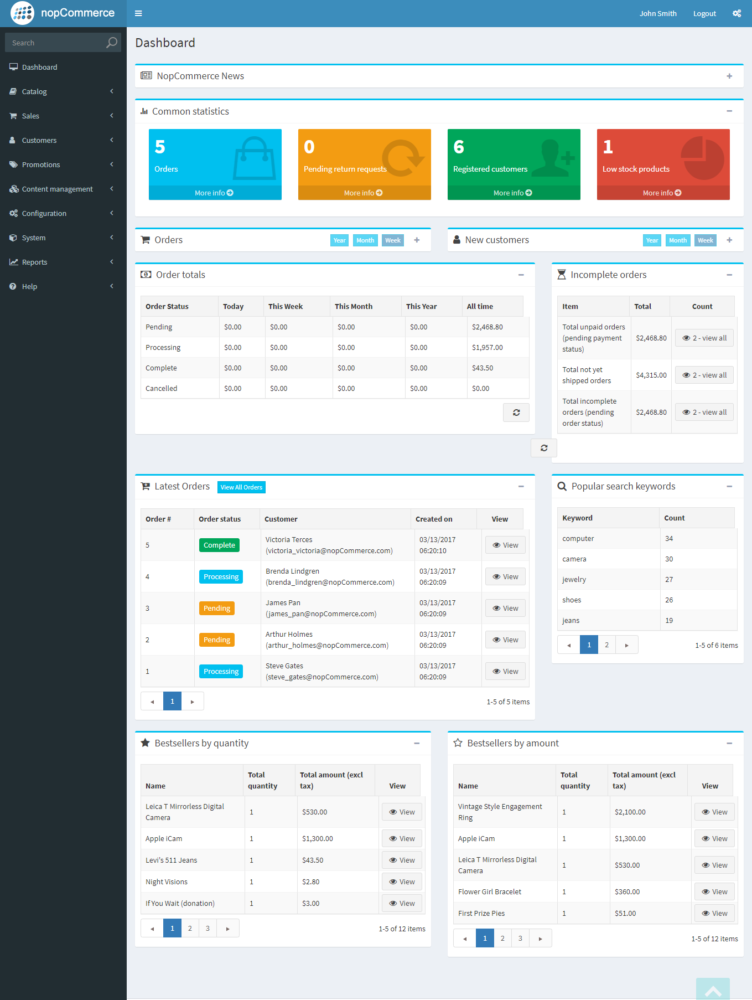

儀表板由多個區塊組成：

### nopCommerce 新聞

顯示一般性的 nopCommerce 新聞，例如新版本的發布資訊。
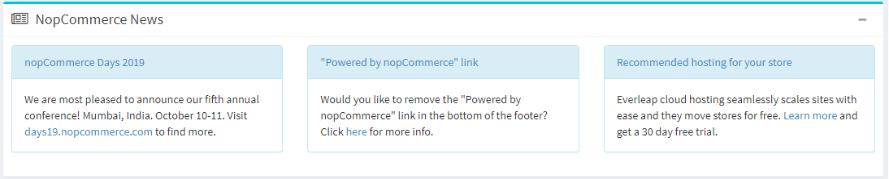

### 常見統計資料

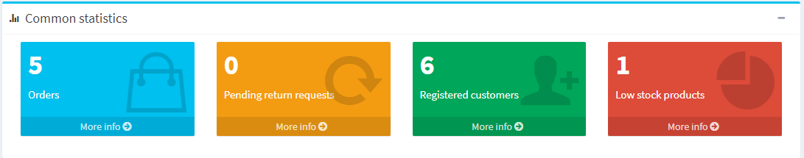

在這裡，您可以找到前往更詳細報表的連結：

- 銷售 → 訂單
- 銷售 → 退貨要求
- 顧客 → 已註冊顧客
- 報表 → 低庫存產品

### 訂單

此圖表顯示過去一週、一個月、一年所處理的訂單數量。
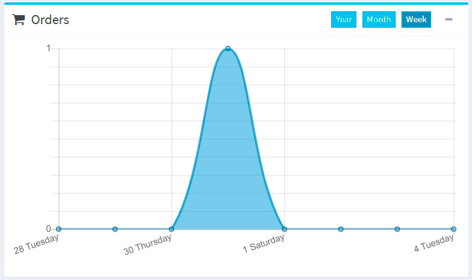

### 新顧客

此圖表顯示了過去一週、一個月、一年內註冊的顧客數量。
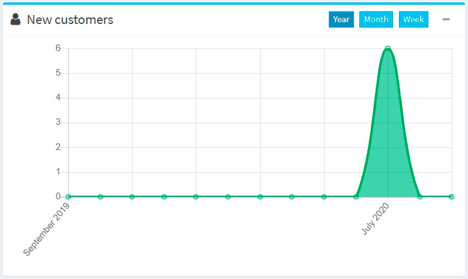

### 訂單總計

本區塊顯示過去一天、一週、一個月、一年內處理的訂單總計。訂單將會依據訂單狀態進行顯示。
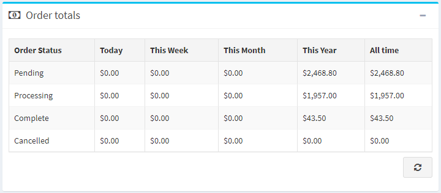

### 未完成的訂單

此區段顯示目前尚未完成的訂單數量。
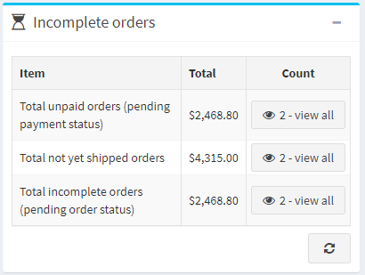

### 最新訂單

「最新訂單」區段會向您顯示最近下達的訂單。
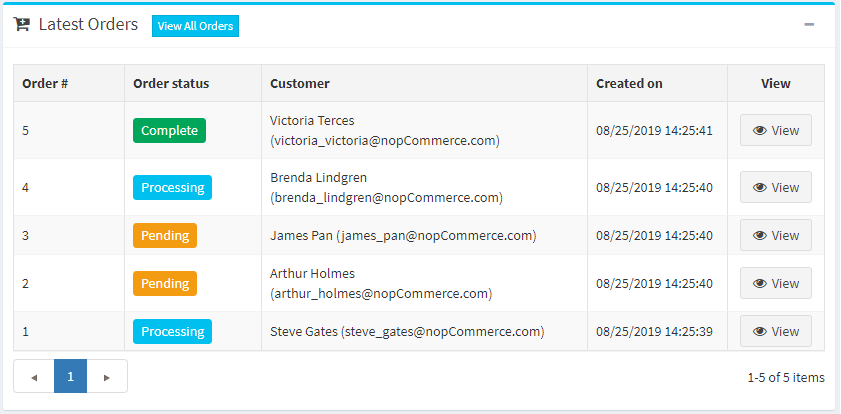

### 熱門搜尋關鍵字

此區塊會顯示最常被使用的關鍵字。

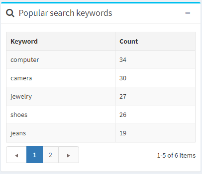

### 暢銷商品報表

此區段顯示按數量與按金額排序的暢銷商品。
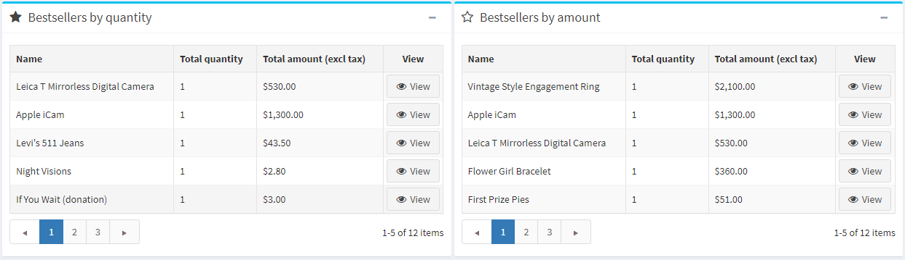

## 銷售摘要

此報表呈現了訂單的總體摘要。若要產生報表，您可以使用下列篩選條件：

- **開始日期**：搜尋的開始日期。
- **結束日期**：搜尋的結束日期。
- **訂單狀態**：依特定訂單狀態進行搜尋，例如「已完成」。
- **付款狀態**：依特定付款狀態進行搜尋，例如「已付款」。
- **類別**：在特定類別中進行搜尋。
- **製造商**：依特定製造商進行搜尋。
- **帳單國家**：依訂單的帳單國家進行篩選。
- **供應商**：依特定供應商進行搜尋。
- **商品**：依特定商品進行搜尋。
- **分組方式**：用於依時間週期進行分組。當此選項設為「日」時，它將顯示所選期間（開始/結束日期）的日期列表。例如：「2020年11月8日」、「2020年11月7日」等。當設為「週」時，它將顯示週的列表（例如：「2020年12月7日 - 2020年12月12日」等）。當設為「月」時，它將顯示月份的列表（例如：「2020年12月」、「2020年11月」等）。

接著點擊 **執行報表**。

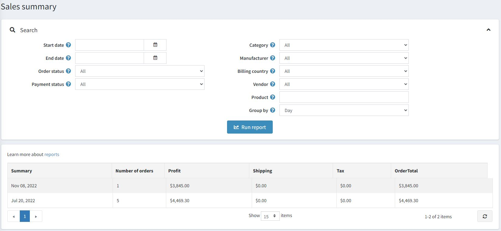

## 低庫存報告

低庫存報告包含目前庫存不足的商品清單。在下方所示範例中，最小庫存數量設為 20，而目前庫存數量為 0；因此系統會為此商品產生低庫存報告。您可以在新增商品時設定低庫存相關設定。

若要檢視低庫存報告，請前往 **報表 → 低庫存**。系統將顯示 *低庫存* 報告視窗，如下所示：
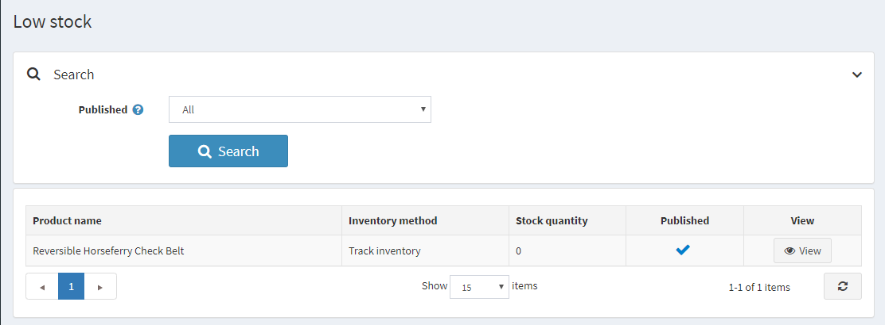

低庫存報告可以透過 **已發佈 (Published)** 屬性進行篩選，該屬性代表商品的 *已發佈* 狀態。

在顯示的表格中，點擊 **檢視 (View)** 即可進入商品詳細資料頁面，您可以在該頁面更新庫存數量。

## 熱銷與從未售出商品

了解熱銷商品與從未售出的商品對於任何商店經營者來說都至關重要。

首先，這有助於做出更正確的採購決策：您可以增加熱門商品的庫存，並將不熱銷的商品從產品列表中剔除。在分析時，請考慮例如某些顏色是否賣得更快，或者您的商品銷售是否具有季節性。

其次，定義最暢銷與最滯銷的商品可以幫助您*重新評估商品設計與行銷策略*。也許您賣得最好的商品只是因為它們在您的網站上擺放的位置較顯眼，或是擁有更好的商品描述。請提出各種選項並進行測試。為了更有效地做到這一點，請與您的顧客互動。*進行各種調查*以找出為什麼熱銷商品會受到青睞，以及是什麼因素讓它們在您的買家心中顯得特別。利用這些深入的見解來改進您的行銷並提升銷售業績。

### 暢銷商品

若要在 nopCommerce 中檢視暢銷商品，請前往 **報表 → 暢銷商品**。輸入以下一項或多項搜尋條件來執行報表：

- **開始日期** 和/或 **結束日期**。
- **商店**（如果您想要選取特定的商店）。
- **訂單狀態**，例如 *全部*、*待處理*、*處理中*、*已完成* 或 *已取消*。
- **付款狀態**，例如 *全部*、*待處理*、*已授權*、*已付款*、*已退款*、*部分退款* 或 *已作廢*。
- 選擇 **類別**。
- 選擇 **製造商**。
- 選擇 **帳單國家/地區**。
- 選擇 **供應商**。

接著點擊 **執行報表**。

此報表將根據銷售數量與營收來細分您的暢銷商品：

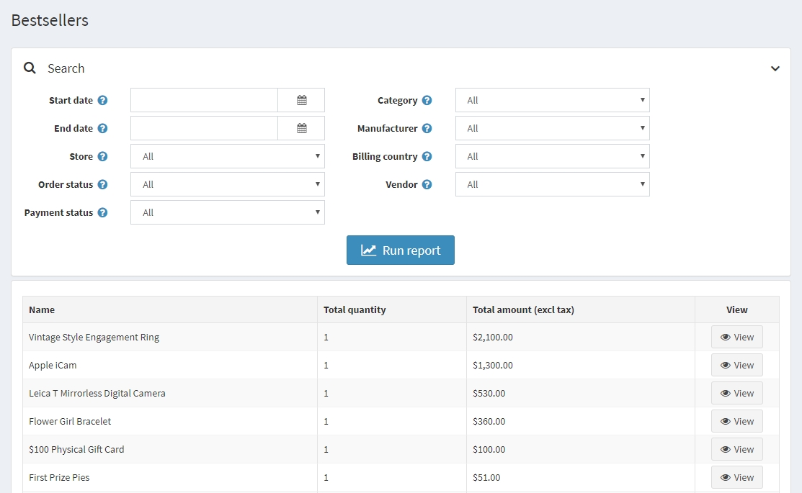

### 從未售出的商品

若要查看從未售出的商品，請前往 **報表 → 從未售出的商品**。輸入以下一項或多項搜尋條件來執行報表：

- 選擇 **類別 (Category)**。
- 選擇 **製造商 (Manufacturer)**。
- **商店 (Store)**：如果您想要選擇其中一家商店。
- 選擇 **供應商 (Vendor)**。
- **開始日期 (Start date)** 和/或 **結束日期 (End date)**。

然後點擊 **執行報表 (Run report)**。

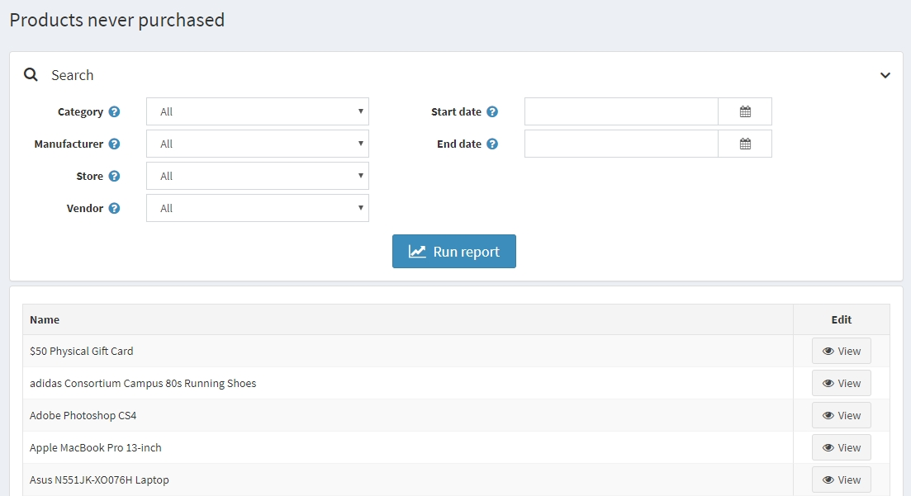

## 國家銷售額

國家銷售報告包含一份訂單清單，其中顯示每個國家的訂單數量與訂單總金額。這讓商店管理者能夠查看各個國家的訂單狀況。

若要查看國家銷售報告，請前往 **報表 → 國家銷售額**。

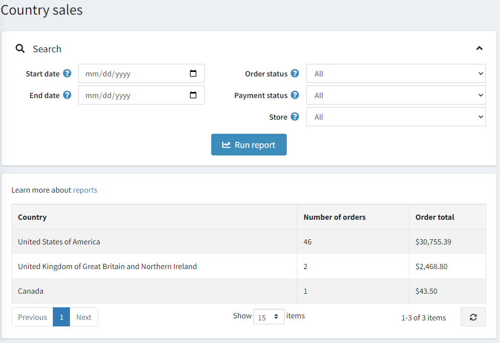

若要設定此報告，請輸入以下一項或多項搜尋條件：

- **開始日期**：搜尋的起始時間。
- **結束日期**：搜尋的結束時間。
- **訂單狀態**：例如 *全部 (All)*、*待處理 (Pending)*、*處理中 (Processing)*、*完成 (Complete)* 或 *已取消 (Cancelled)*。
- **付款狀態**：例如 *全部 (All)*、*待處理 (Pending)*、*已授權 (Authorized)*、*已付款 (Paid)*、*已退款 (Refunded)*、*部分退款 (Partially refunded)* 或 *已作廢 (Voided)*。
- **商店**：若您想選擇特定商店進行篩選。

設定完成後，點擊 **執行報表 (Run report)**。

## 顧客報表

顧客報表為商店負責人提供關於註冊顧客及其訂單的概括資訊。您可以在 **報表 → 顧客報表** 選單中找到各種報表。

### 已註冊顧客

若要執行此報表，請前往 **報表 → 顧客報表 → 已註冊顧客**。
此報表會顯示特定期間內已註冊的顧客數量。
您可以追蹤過去一天、一週、兩週、一個月與一年內註冊的使用者數量。

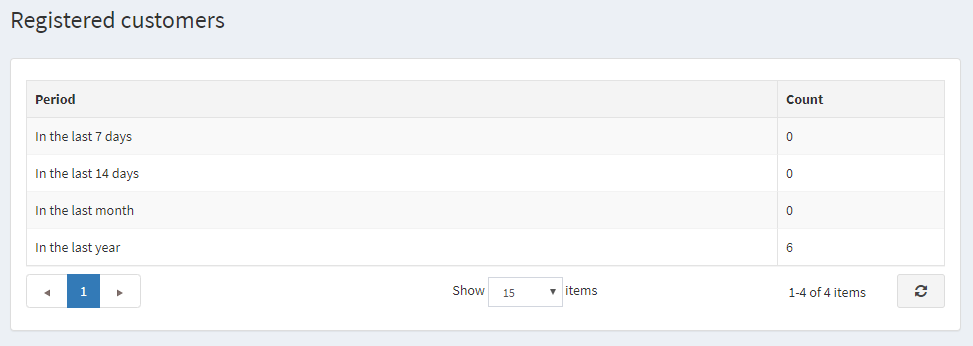

### 依訂單總金額查詢顧客

若要執行此報表，請前往 **報表 → 顧客報表 → 依訂單總金額查詢顧客**。
在此報表中，您可以查看顧客的訂單總金額以及他們所下的訂單數量。

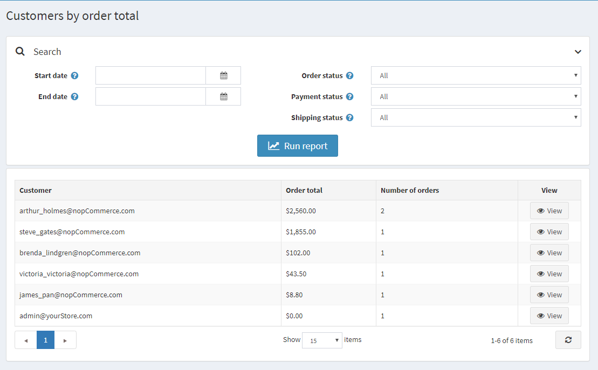

輸入一個或多個搜尋條件來彙編報表：

- 註冊 **開始日期**。
- 註冊 **結束日期**。
- **訂單狀態**，例如 *全部*、*待處理*、*處理中*、*已完成* 或 *已取消*。
- **付款狀態**，例如 *全部*、*待處理*、*已授權*、*已付款*、*已退款*、*部分退款* 或 *已作廢*。
- **貨運狀態**，例如 *全部*、*無需貨運*、*尚未出貨*、*部分出貨*、*已出貨*、*已送達*。

接著點擊 **執行報表**。

### 依訂單數排列的顧客

若要執行此報表，請前往 **報表 → 顧客報表 → 依訂單數排列的顧客**。
此報表會根據所發出的訂單總數，顯示前 20 名的顧客。

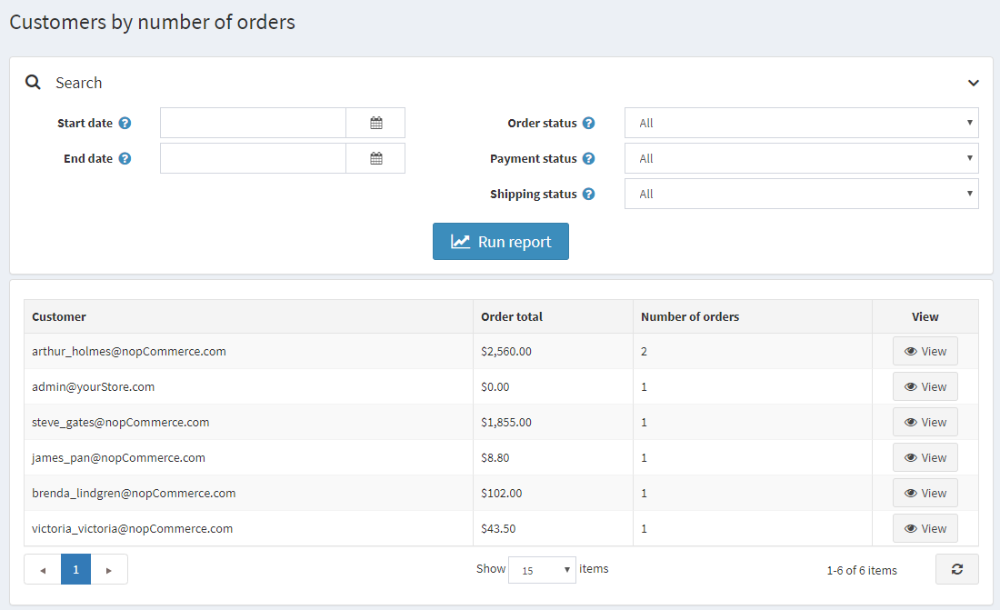

輸入一個或多個搜尋條件來編製報表：

- 註冊 **開始日期**。
- 註冊 **結束日期**。
- **訂單狀態**，例如 *全部 (All)*、*待處理 (Pending)*、*處理中 (Processing)*、*完成 (Complete)* 或 *已取消 (Cancelled)*。
- **付款狀態**，例如 *全部 (All)*、*待處理 (Pending)*、*已授權 (Authorized)*、*已付款 (Paid)*、*已退款 (Refunded)*、*部分退款 (Partially refunded)* 或 *作廢 (Voided)*。
- **出貨狀態**，例如 *全部 (All)*、*無需出貨 (Shipping not required)*、*尚未出貨 (Not yet shipped)*、*部分出貨 (Partially shipped)*、*已出貨 (Shipped)*、*已送達 (Delivered)*。

接著點擊 **執行報表 (Run report)**。

## 教學課程

- [在 nopCommerce 中執行報表](https://www.youtube.com/watch?v=IbfoppTG9tM)

## 參閱

- [Microsoft Power BI](xref:zh-Hant/running-your-store/reports/microsoft-power-bi)