# Microsoft Power BI

請取得 Power BI 的官方整合 [here](https://www.nopcommerce.com/microsoft-power-bi)。

## 簡介

Power BI 是一組軟體服務、應用程式與連接器的集合，它們共同運作將您不相關的資料來源，轉換為連貫、視覺化且具備互動性的洞察資訊。Power BI 讓您可以輕鬆連線至資料來源、視覺化並發掘重要資訊，並與您想分享的任何人分享這些內容。

這些內容並非靜態，因此您可以深入挖掘並尋找趨勢、洞察以及其他商業智慧。您可以對這些內容進行切割與分析，甚至能以您自己的語言向它提出問題。或者，您也可以坐享其成，讓資料自動發掘有趣的洞察、在資料變更時傳送通知給您，或依照您設定的排程以電子郵件傳送報表。您所有的內容隨時隨地都可取用，無論是在雲端或地端，且可透過任何裝置存取。這僅僅是 Power BI 強大功能的開端。

深入了解 [Power BI](https://learn.microsoft.com/en-us/power-bi/fundamentals/power-bi-overview)。

## 可用的報表

Power BI 報表是對資料集的多視角檢視，透過視覺化呈現該資料集中不同的發現與洞察。一份報表可以包含單一視覺化物件，也可以由充滿視覺化物件的頁面組成。

> [!TIP]
> 由於此外掛隨附原始碼，您可以新增報表或變更資料模型，針對您的特定需求自訂整合方式。您可以進一步了解如何建立報表 [here](https://learn.microsoft.com/en-us/power-bi/consumer/end-user-experience)。

基本的外掛套件包含了 13 份報表，涵蓋了現有資訊中不同的分析面向。以下呈現了各份報表的詳細說明。

### 銷售摘要

銷售摘要（Sales Summary）是一份常用報表，可顯示您所選日期範圍內的詳細銷售資料。

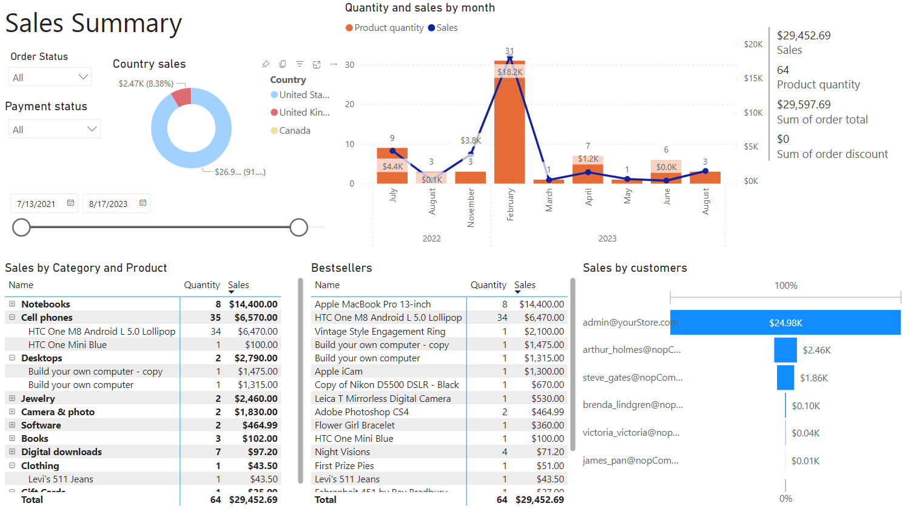

對於報表中的所有卡片，皆提供數個篩選欄位，以下我們將這些欄位統稱為通用篩選器。

> [!TIP]
> 報表中的每個元素，無論是表格、圖表還是統計圖，皆具互動性，並可作為整體資訊摘要的額外篩選條件。

銷售摘要報表包含數個區段（或稱為「卡片」），可針對您選定的日期範圍顯示不同的銷售資訊。

- **按類別與商品銷售** - 此表格顯示依類別銷售的商品數量資訊。該報表提供了銷售的整體概況。
- **暢銷商品** - 此表格顯示銷售額最高的商品。您也可以更改排序方式，依銷售數量顯示暢銷商品。
- **按顧客銷售** - 此報表可讓您了解哪些顧客的購買次數最多。
- **每月數量與銷售額** - 此圖表顯示銷售額隨時間的分佈情況。記錄不僅包含營收金額，還包含售出的商品單位數。

按星期幾銷售

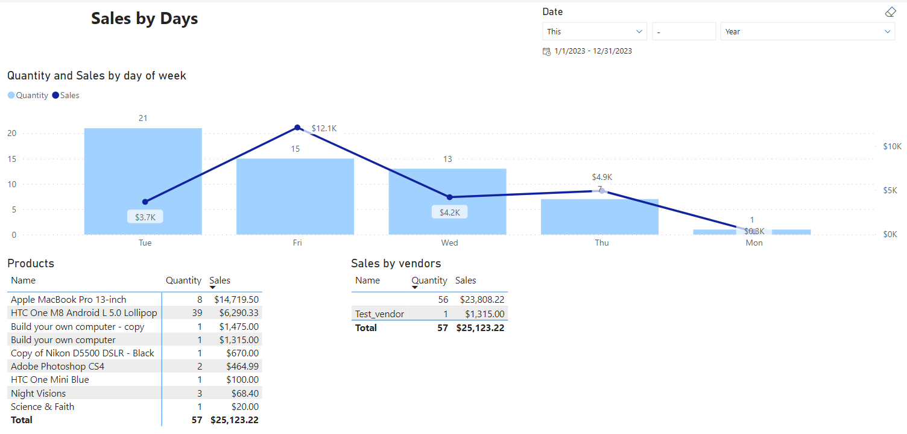

此報表顯示銷售額在星期幾的分佈情形。這在規劃促銷活動或一次性折扣時非常有用。

### 銷售歷史

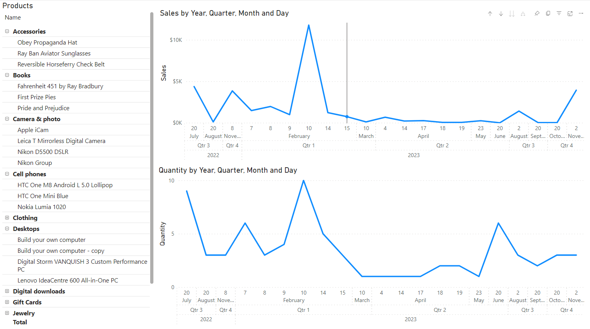

此報表允許您分析單一商品以及整個類別在商店經營歷程中的銷售歷史。這些資訊對於研究特定商品的市場需求非常有用，並且能顯示該商品是否呈現出過時或退流行的趨勢。

### 按運送地址的銷售統計

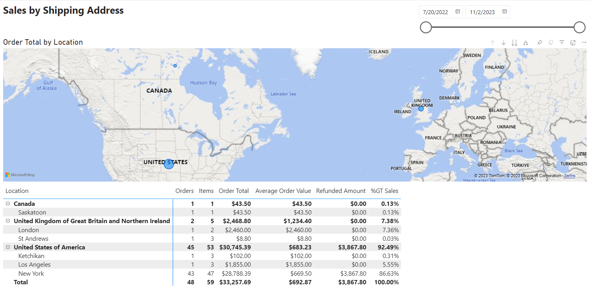

如果您對商品的寄送地理位置感興趣，此報表能為您提供相當詳細的說明，指出在所選的時間段內，有多少商品被寄送至特定的地點。

### 平均訂單金額

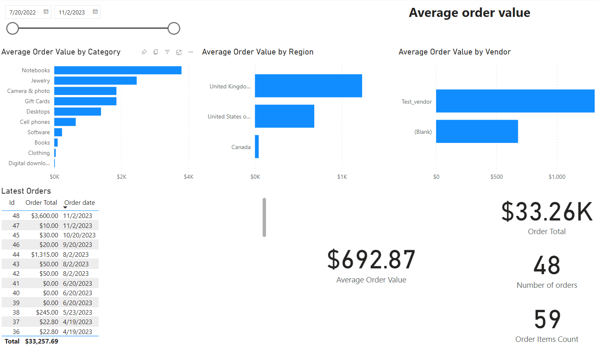

此報表有助於依據類別、地區及供應商來估算平均訂單價格。這些資訊對於評估來自不同地區顧客的購買力，以及了解哪些供應商會影響此指標非常有用。

### 訂單概覽

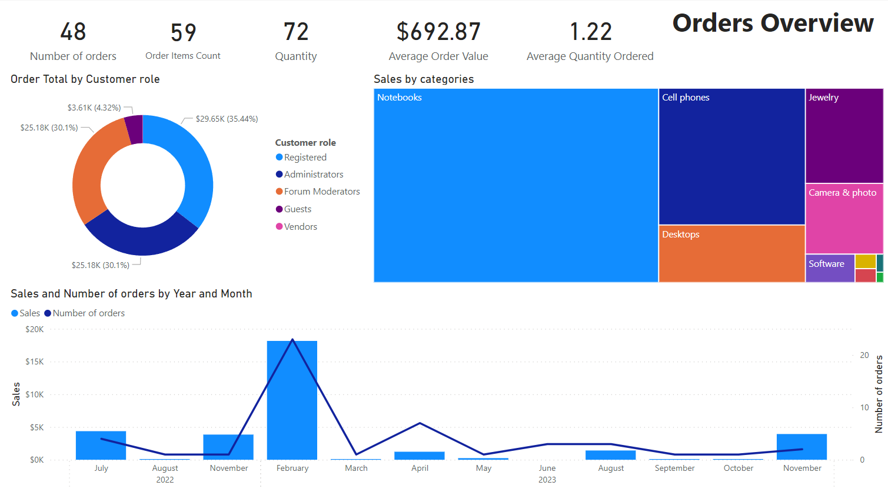

此報表包含幾個部分，讓我們逐一檢視：

- **依據顧客角色統計的訂單總額 (Order Total by Customer role)** - 此圖表顯示了訂單在不同使用者角色中的分佈。但請記住，一個使用者可以擁有數個角色，因此該使用者的訂單資訊將會分別顯示在該使用者的每個角色統計中。在上述範例中，管理員同時也是註冊使用者，因此他們的訂單會顯示在兩者的總計中。
- **依據類別銷售統計 (Sales by Categories)** - 此報表允許您評估商品類別的銷售佔比。
- **依據年與月的銷售額及訂單數量 (Sales and Number of orders by Year and Month)** - 此圖表為輔助性質，有助於了解銷售額在不同時間區段的成長動態。此資訊可用於分析特定商品類別的季節性銷售。

依據狀態統計訂單

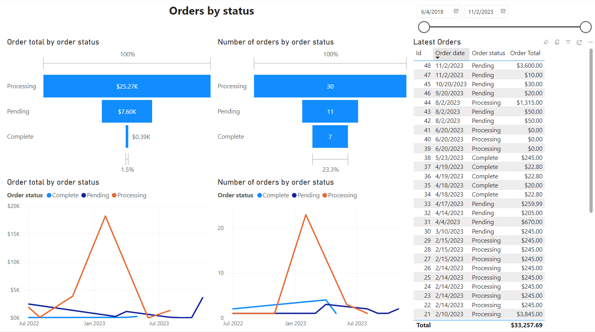

此報表旨在顯示訂單根據其狀態的分佈情形。這對於了解在選定時間區段內有多少訂單正在處理、其中有多少已經付款，以及有多少已經完成，相當重要。

### 每月績效

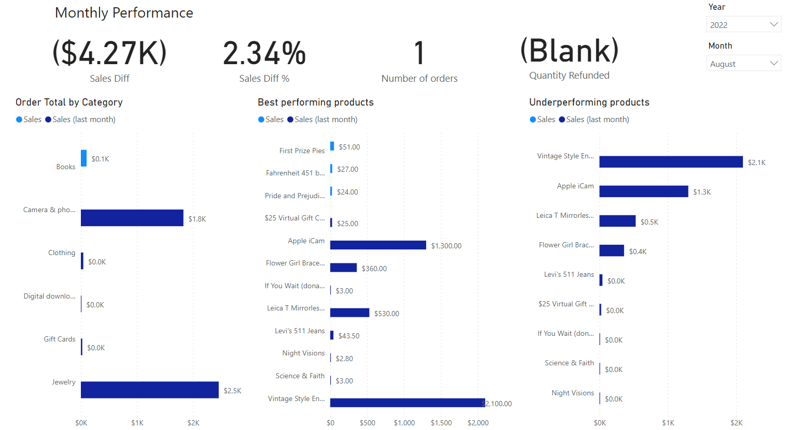

此報表會收集特定月份的銷售資訊，並與上個月進行比較。這讓商家能夠追蹤與上個月相比，表現最佳以及表現欠佳的商品。

- **按類別統計的訂單總額** - 此報表會收集特定月份中，各類別的所有商品銷售額，並與上個月進行比較。
- **表現最佳的商品** - 此報表僅包含那些當月銷售額超過上個月銷售額的商品。
- **表現欠佳的商品** - 此報表僅包含那些當月銷售額低於上個月銷售額的商品。

### 年度比較

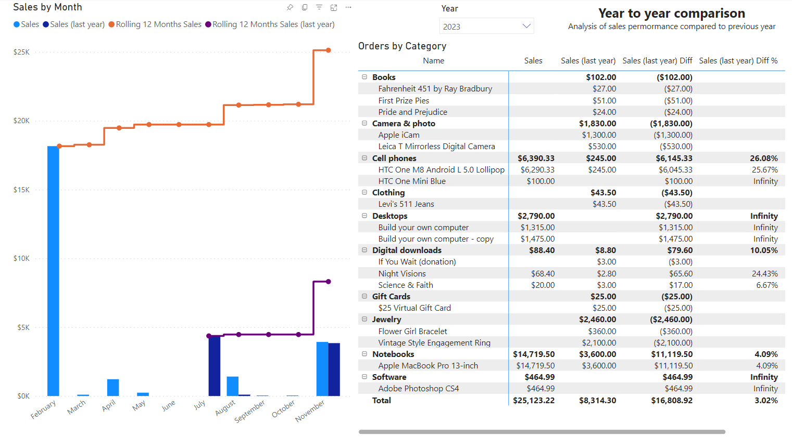

此報表要求您將特定年度的銷售額與前一年的銷售額進行比較。其中一項有趣的功能是累積銷售排程的實作。這將使您能夠分析獲利的動態變化，並預測未來的銷售成長。

### 熱銷商品

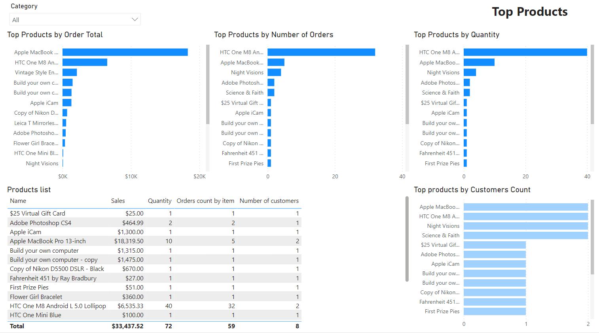

此報告可讓您識別指定類別中的銷售領先商品。系統會針對整個銷售歷史進行資料分析。
該報告包含多個區段，讓我們逐一檢視：

- **依訂單總額排名的熱銷商品** - 此圖表顯示基於訂單總金額的商品排名。
- **依訂單數量排名的熱銷商品** - 此圖表依照商品的訂單數量進行降序排列。這有助於您追蹤訂單頻率最高的商品。
- **依數量排名的熱銷商品** - 此圖表顯示購買數量最多的商品排名。
- **依顧客人數排名的熱銷商品** - 此圖表視覺化顯示購買特定商品的人數。商品排名計算時不考慮同一位買家的重複購買行為。透過這種方式，您可以接觸到對該商品感興趣的目標客群。
- **商品清單** - 此總體報告以表格形式呈現上述所有圖表的數據。

### 最新 20 筆訂單

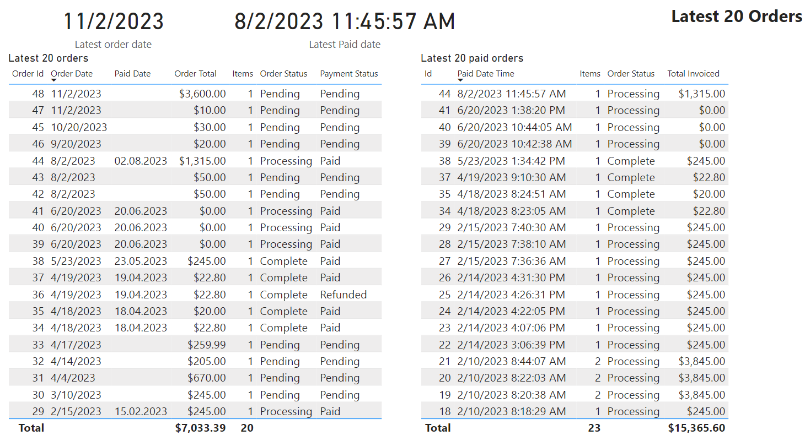

此報表讓您可以追蹤最新 20 筆訂單的相關資訊。對於管理員而言，這是一個監控商店當前工作負載的實用工具。

### 顧客

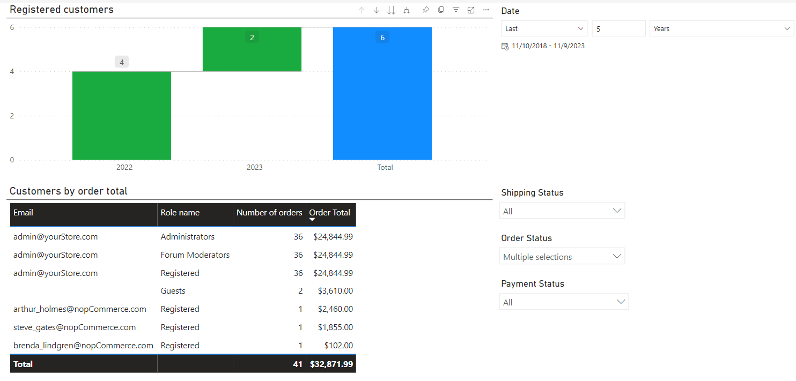

關於註冊使用者數量、訂單金額及訂單數量的資訊。此報表可根據訂單、貨運或付款狀態進行彙整，且所有內容皆可針對選定的時間範圍進行檢視。

### 進階商品搜尋

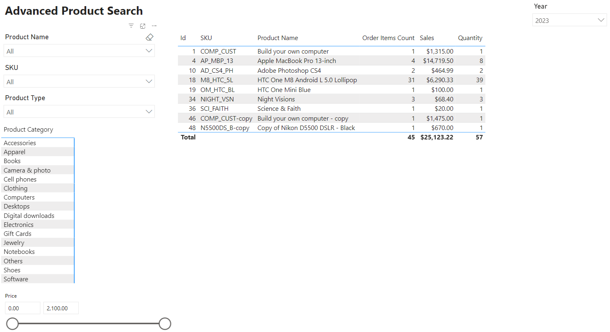

一份提供進階商品搜尋選項的報表。

## 外掛安裝

本章節說明如何將 Power BI 服務整合到您的商店中。

1. 前往 [here](https://www.nopcommerce.com/microsoft-power-bi) 購買此整合服務。
1. 下載外掛壓縮檔。
1. 前往 **後台 → 設定 → 本地外掛**。
1. 使用「上傳外掛或佈景主題」功能上傳外掛壓縮檔。
1. 向下捲動外掛清單以找到剛安裝的外掛，點擊「安裝」按鈕進行安裝。

## 前置設定

以下將說明將 Power BI 整合至 nopCommerce 的必要且充分的步驟。

1. [註冊](https://app.powerbi.com/singleSignOn) 或 [登入](https://app.powerbi.com/home) Power BI 服務。該帳號必須是您公司的帳號。

### Power BI Gateway

1. [安裝](https://powerbi.microsoft.com/en-us/gateway/) 標準的閘道器 **Power BI Gateway**。

   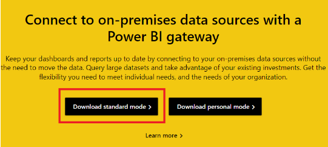

1. 啟動 **Gateway**，若要執行此操作，請開啟 **On-premises data gateway** 應用程式。
1. 輸入您在註冊 Power BI 服務時所使用的帳戶電子郵件地址。

   > [!NOTE]
   > 您的帳戶儲存在 **Azure AD** 租用戶中。

   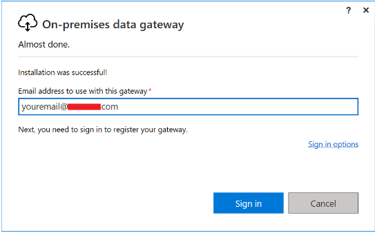

1. 選擇 **Register a new gateway on this computer**（在此電腦上註冊新的閘道器）。

   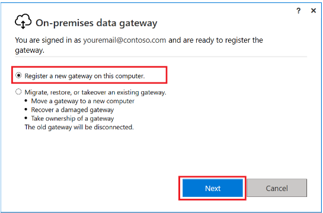

1. 輸入閘道器名稱。此名稱在該用戶端中必須是唯一的。同時輸入您的復原金鑰。您將需要此金鑰來還原或遷移閘道器。

   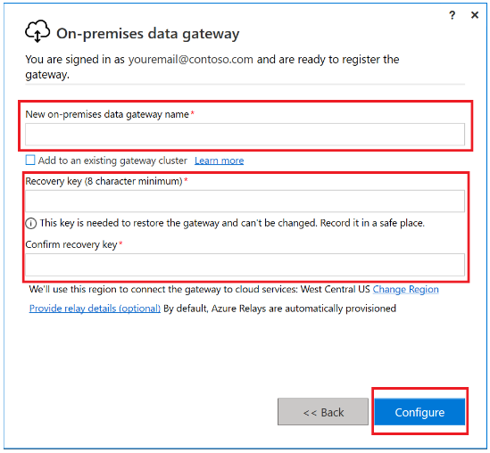

1. 確認您的閘道器已準備就緒可供使用。

   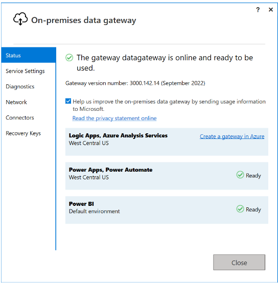

### 註冊您的應用程式

在 Microsoft Entra 中註冊您的應用程式，能在您的應用程式與 Microsoft 身分識別平台之間建立信任關係。

請依照下列步驟建立應用程式註冊：

1. 登入 [Microsoft Entra 管理中心](https://entra.microsoft.com/)。

1. 若您有權存取多個租用戶，請使用頂端選單中的 *設定* 圖示切換至您想要註冊應用程式的租用戶。

1. 瀏覽至 **識別 > 應用程式 > 應用程式註冊** 並選擇 *新增註冊*。

1. 為您的應用程式輸入一個有意義的 **名稱**。

1. 在 **支援的帳戶類型** 下，指定誰可以使用此應用程式。我們建議您為您的應用程式選擇 *僅限此組織目錄中的帳戶*。

1. 選擇 **註冊** 以完成應用程式註冊。

   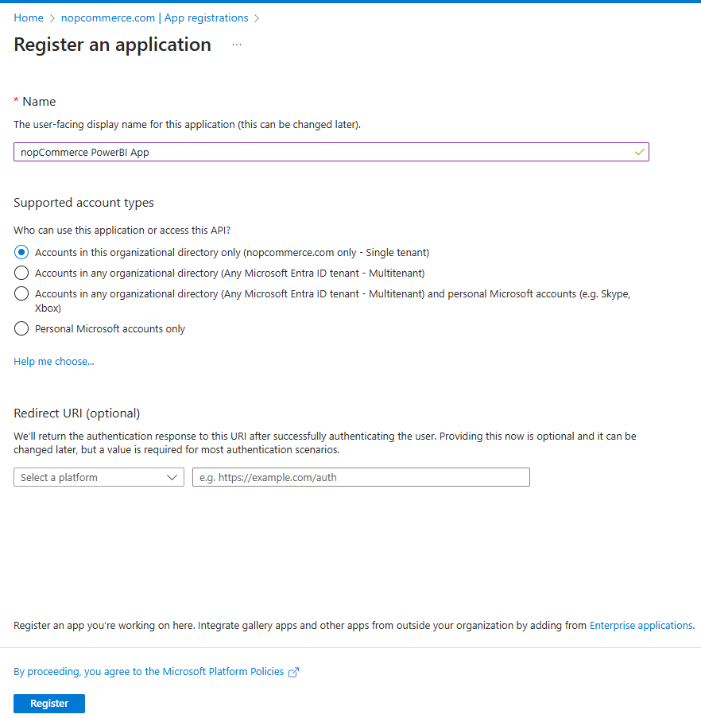

1. 顯示應用程式的 **概觀** 頁面。記錄 **應用程式 (用戶端) ID**，這會唯一識別您的應用程式，並在您的外掛設定中使用，作為驗證從 Microsoft 身分識別平台接收之安全性權杖的一部分。

   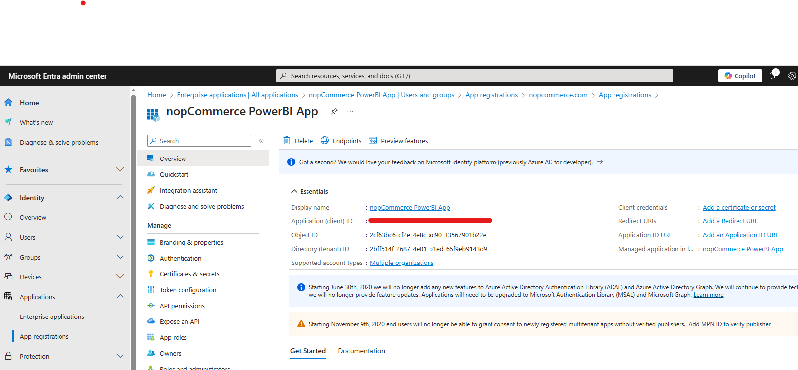

   > [!IMPORTANT]
   > 新的應用程式註冊預設對使用者隱藏。當您準備好讓使用者在他們的「我的應用程式」頁面上看到該應用程式時，您可以啟用它。若要啟用應用程式，請在 Microsoft Entra 管理中心導覽至 **識別 > 應用程式 > 企業應用程式** 並選擇該應用程式。接著在 **屬性** 頁面上，將 **對使用者顯示？** 設為 *是*。
   > 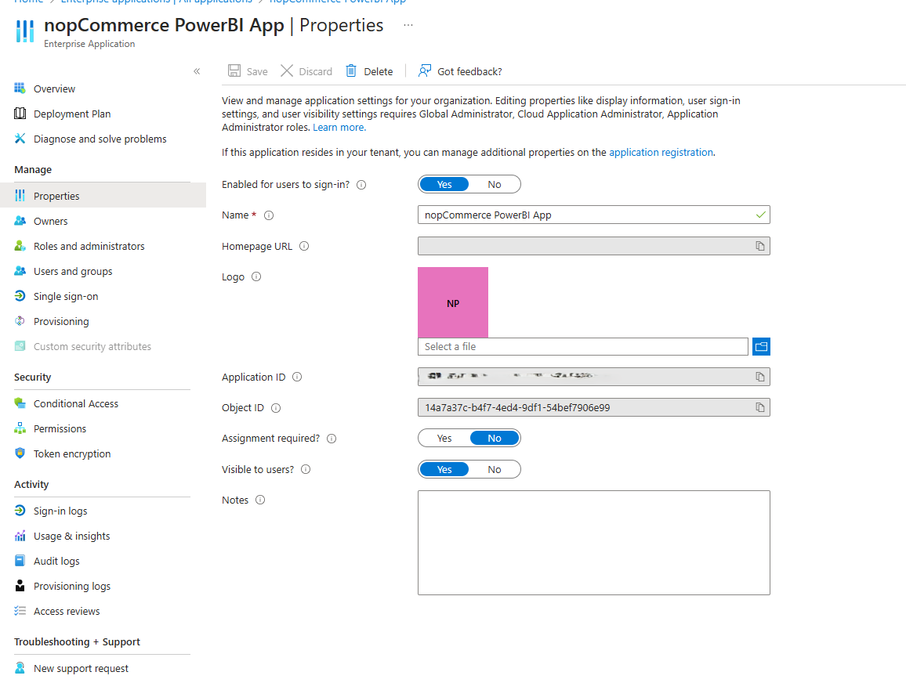

1. 授與管理員同意。若要新增權限至您的 Azure AD 應用程式，請依照下列步驟操作：

   - 從左側的 *管理* 下方，選擇 **API 權限**。
   - 選擇 **新增權限**。
      > 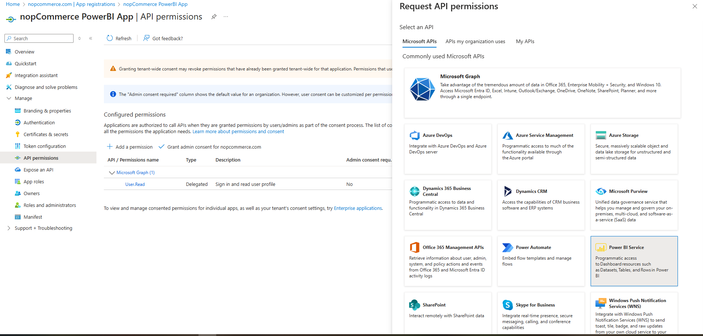
   - 在「要求 API 權限」視窗中，選擇 Power BI Service。
   - 選擇 **委派的權限**。此時會顯示 API 清單。
      > 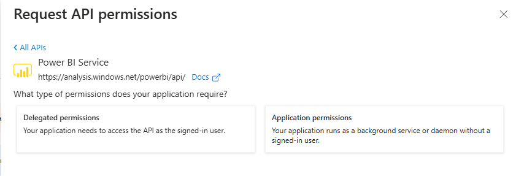

   - 展開您想要新增權限的 API，並勾選您想要新增的權限。
   - 選擇 **新增權限**。
      > 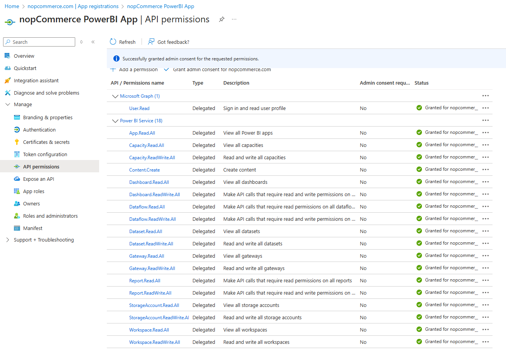

1. 從左側的「管理」下方，選擇 **驗證**。

1. 在 **進階設定** > **允許公用用戶端流程** > **啟用下列行動與桌面流程：** 中，選擇 **是**。
   > 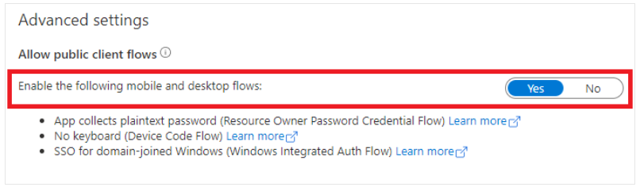

1. 前往外掛設定頁面並貼上產生的 **應用程式 ID**。
   > [!WARNING]
   > 只有在使用 MSSQL 資料庫時，才能發佈報表。目前不支援使用其他類型資料庫的連線設定。

## 發布報表

在本節中，我們將探討將報表發布到 Power BI 的流程。如果您不打算更改報表的內容或修改其資料模型，則此程序只需執行一次。執行完成後，您的商店與 Power BI 服務的整合將會永久生效。您只需要根據排程或在 Power BI 帳戶中手動更新資料即可。
完成後，本文中描述的所有報表都將提供給您使用。

1. 您必須指定報表上傳至 Power BI 服務時所使用的名稱。資料集 (Dataset) 也將以相同的名稱命名。

   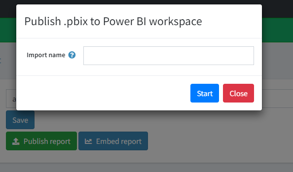

1. 接著，系統會產生一個驗證碼以通過使用者驗證。預設情況下，該驗證碼會複製到剪貼簿以便稍後貼上。點擊 **Verify user** 按鈕。

   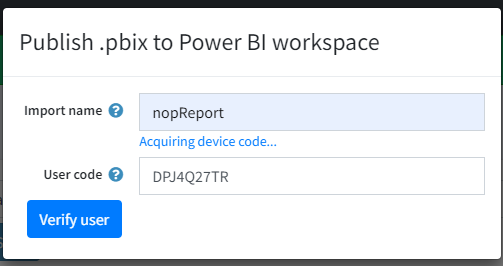

1. 在彈出視窗中貼上收到的驗證碼。

   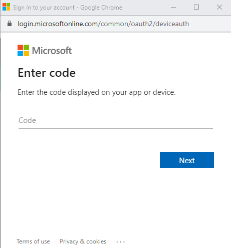

1. 接下來，在 Power BI 中選擇您的帳戶。

   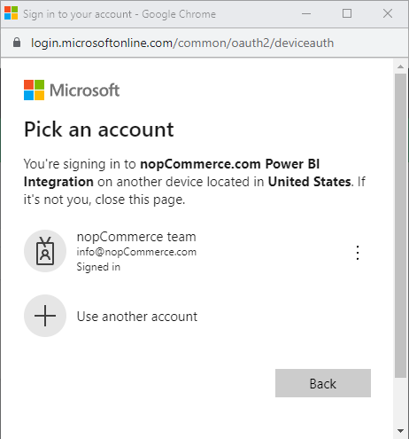

1. 接下來，確認您正在 Power BI 中連線至您的應用程式。點擊 **Continue**。

   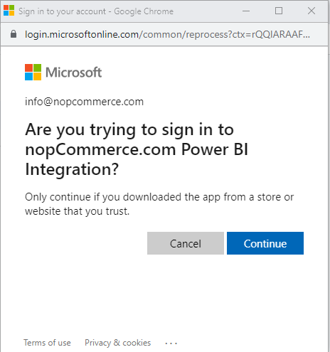

1. 如果您已成功登入應用程式，將會出現以下視窗。請稍候，直到它自動關閉。

   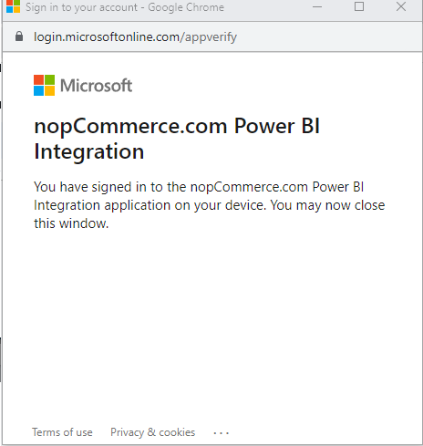

1. 在此步驟中，您可以選擇覆寫 Power BI 中名稱相同的現有報表。在此情況下，會出現以下訊息：

   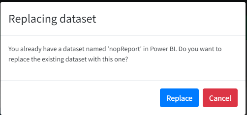

1. 接下來，您需要選擇要使用哪個閘道 (gateway) 來進行資料通訊。請選擇您稍早建立的那個。

   

1. 接著，報表檔案將會完成發布。

   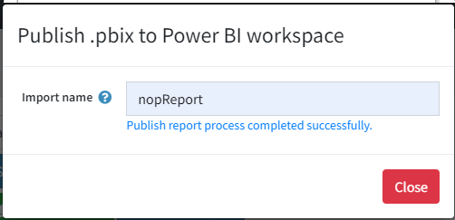

1. 現在，您可以在資料集設定面板中為您的報表設定資料重新整理排程。

   

## 疑難排解

### 問題 - 請求主體必須包含以下參數：'client_assertion' 或 'client_secret'

如果您在應用程式的授權過程中遇到此錯誤，請依照下列步驟解決問題：

1. 在 [Microsoft Entra 管理中心](https://entra.microsoft.com/) 中，於 **應用程式註冊** 選擇您的應用程式，然後選擇 **驗證**。
2. 在 **進階設定** > **允許公開用戶端流程** > **啟用下列行動與桌面流程：** 中，選擇 **是**。

### 檢查正確的連線與設定（若發生問題時）

- 若要確認閘道是否正確連線至您的資料來源，您可以在 **管理連線與閘道** (Manage connections and gateways) 區段中檢查連線狀態。

   

- 連線至閘道

   您需要確保閘道已連結至您的伺服器。機器名稱顯示在「裝置」(Device) 欄位中。
   

- 連線至資料庫

   

   您可以檢查您的連線，確認它是設定在哪些伺服器與資料庫上。
   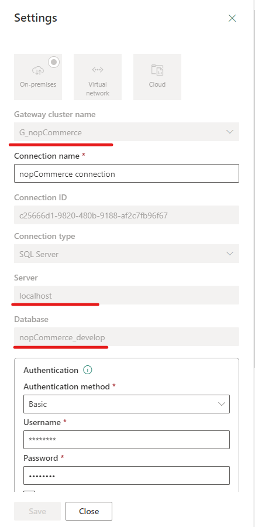

- （選用）若要驗證您對閘道設定的資料繫結是否正確，請登入您的 Power BI 帳號並開啟您的資料集設定。

   

- 從下拉式選單檢查與閘道的連線：

   如果狀態欄顯示「Running on [Your_Server_Name]」，則表示與閘道的連線已正確設定。您可以在「動作」(Actions) 欄位中查看詳細資訊。
   

## 檢視報表

已發佈的報表可以透過以下幾種方式檢視：

1. 直接在您的 Power BI 帳戶中，於 **My Workspace** [分頁](https://app.powerbi.com/groups/me/list?experience=power-bi) 檢視。
1. 使用 Power BI 內嵌分析（embedded analytics），直接在 Power BI 外掛設定頁面的 **View reports** 面板中檢視。

讓我們深入了解第二種情境，因為它是整合的一部分。

> [!TIP]
> 關於 Power BI 內嵌分析的更多資訊，請參閱 [here](https://learn.microsoft.com/en-us/power-bi/developer/embedded/embedded-analytics-power-bi)。

檢視報表的流程與發佈流程類似。在使用者驗證成功後，您工作區中的所有報表都會顯示在外掛的 **View reports** 面板中。

> [!WARNING]
> 每次檢視報表時，您都必須執行使用者授權程序，這是因為 Power BI 服務所核發的存取權杖（access token）有時間限制。
> 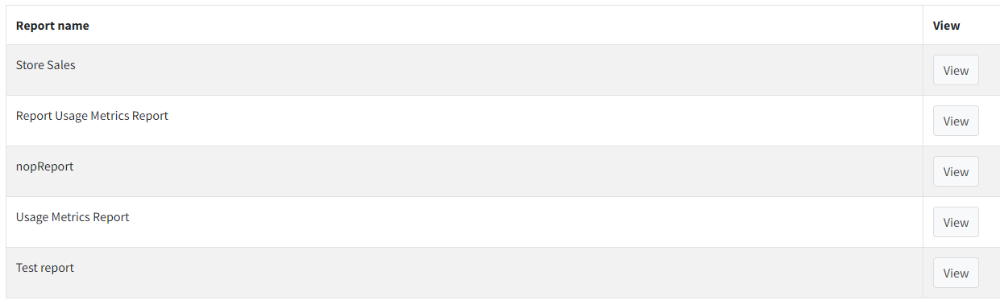

預設幣別為 *美元*（US dollar）。基於技術原因，此整合功能並未使用商店的主幣別；若需要在報表中更改，則必須手動處理。若要更改幣別，您需要編輯量值（measures）中所有數值指標的格式。

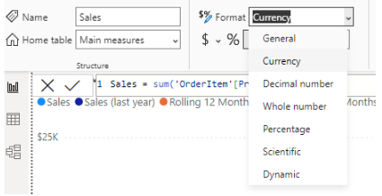

預設情況下，幣別格式設定為 "*Currency General*"，當報表的區域設定變更時，幣別應會自動重新格式化。

## 授權

Power BI 外掛採用下列 [條款](https://www.nopcommerce.com/microsoft-power-bi-license-terms) 進行授權。