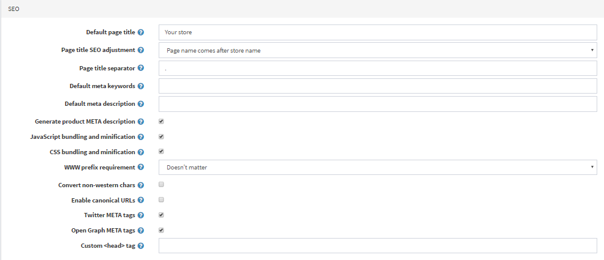
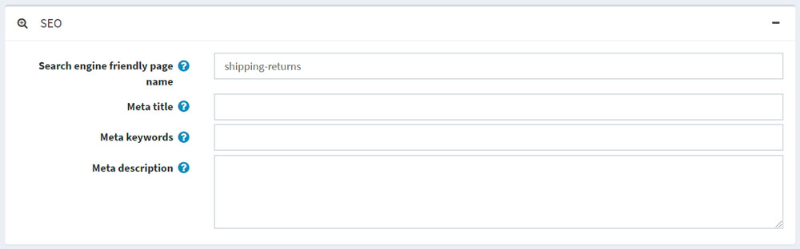
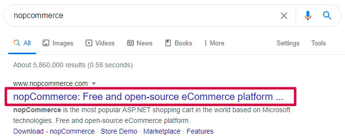
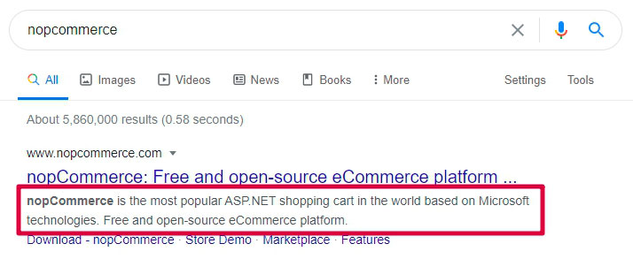
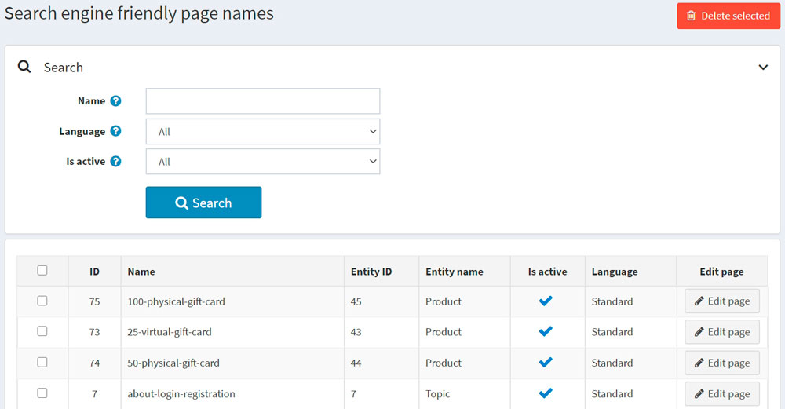

# 搜尋引擎最佳化

SEO 代表搜尋引擎最佳化（Search engine optimization）；這是從搜尋引擎的「免費」、「自然」、「編輯」或「原生」搜尋結果中獲取流量的過程。所有主要的搜尋引擎都有主要的搜尋結果，其中網頁和其他內容（例如影片或在地商家資訊）會根據搜尋引擎認為與使用者最相關的內容進行顯示與排名。

nopCommerce 支援商店中各類型頁面的 SEO 技術。您可以在 [參閱](#see-also) 章節中找到這些技術的清單。

## SEO 設定

nopCommerce 提供了一些通用的 SEO 設定，可套用到整間商店。

若要編輯 SEO 設定，請前往 **設定 → 設定 → 一般設定**，然後切換到 *SEO* 面板：

- 在 **預設頁面標題** 欄位中，輸入您商店頁面的預設標題。
- 在 **頁面標題 SEO 調整** 欄位中，選擇所需的頁面標題 SEO 調整方式如下：

  - 頁面名稱位於標題中的商店名稱之後：
  `YOURSTORE.COM` | PAGENAME

  - 商店名稱位於標題中的頁面名稱之後：
  PAGENAME | `YOURSTORE.COM`

- 指定 **頁面標題分隔符**。
- 輸入您商店頁面的 **預設 meta 關鍵字**。此設定可針對個別分類、製造商、商品及其他頁面進行覆寫。
- 輸入您商店頁面的 **預設 meta 描述**。此設定可針對個別分類、製造商、商品及其他頁面進行覆寫。
- 輸入您商店首頁的 **首頁標題**。
- 輸入您商店首頁的 **首頁 meta 描述**。
- 勾選 **產生商品 meta 描述**，以根據商品的簡短描述自動產生商品 META 描述（若未在商品詳細資料頁面中指定）。
- 選擇 **WWW 前綴要求**。例如，`http://yourStore.com/` 可以自動重新導向至 `http://www.yourStore.com/`。請選擇下列選項之一：
  - *無要求*
  - *頁面應具有 WWW 前綴*
  - *頁面不應具有 WWW 前綴*
- 勾選 **轉換非西方字元** 核取方塊，以移除 SEO 名稱中的變音符號。例如，將 é 轉換為 e。
- 勾選 **啟用標準化網址 (Canonical URLs)** 核取方塊，將網址轉換為標準化網址，以判定兩個語法不同的網址是否可能連向內容相同的頁面。
- 勾選 **Twitter META 標籤** 核取方塊，以在商品詳細資料頁面上產生 Twitter META 標籤。
- 勾選 **Open Graph META 標籤** 核取方塊，以在商品詳細資料頁面上產生 Open Graph META 標籤。
- 勾選 **Microdata 標籤** 核取方塊，以在商品詳細資料頁面上產生 Microdata 標籤。
- 輸入 **自訂 &#60;head&#62; 標籤**。例如，某些自訂的 &#60;meta&#62; 標籤。若要忽略此設定，請留空。

## SEO 面板

在 nopCommerce 中有幾種類型的頁面，您可以為其設定個別的 SEO 設定，包括 meta 關鍵字、meta 描述、meta 標題以及搜尋引擎友善的頁面名稱。這些設定可以在對應管理後台區塊的 SEO 面板中完成。

- 在 **搜尋引擎友善的頁面名稱 (Search engine friendly page name)** 欄位中，輸入搜尋引擎所使用的頁面名稱。如果您未輸入任何內容，則網頁 URL 將會使用該頁面名稱來組成。如果您輸入 *custom-seo-page-name*，則會使用以下自訂 URL：`http://www.yourStore.com/custom-seo-page-name`。

- 在 **Meta 標題 (Meta title)** 欄位中，輸入所需的標題。標題標籤 (title tag) 用於指定網頁的標題。它會被網頁瀏覽器抓取，並由 Google 等搜尋引擎用於在搜尋結果中顯示網頁：
  

- 輸入所需的 **Meta 關鍵字 (Meta keywords)**。它們能精簡地描述網頁內容，因此是向搜尋引擎呈現網站內容的重要指標。Meta 關鍵字有助於告訴搜尋引擎該頁面的主題。關鍵字通常使用小寫字母。

- 在 **Meta 描述 (Meta description)** 欄位中，輸入頁面的描述。Meta 描述提供了網頁的摘要。Google 等搜尋引擎通常會在搜尋結果中顯示 meta 描述，這可能會影響點擊率：
  
  Meta 描述的長度不限，但 Google 通常會將摘要截斷至約 155–160 個字元。最好讓 meta 描述足夠長以提供充分說明，因此建議將描述控制在 50–160 個字元之間。請注意，「最佳」長度會視情況而定，您的首要目標應該是提供價值並提升點擊率。

## 搜尋引擎友善頁面名稱

若要查看商店中使用的所有搜尋引擎友善頁面名稱，請前往 **系統 → 搜尋引擎友善頁面名稱**。

在此，您可以透過 **名稱**、**語言** 或 **是否啟用** 屬性來篩選搜尋引擎友善頁面名稱。您也可以使用 **刪除所選** 按鈕刪除單個或多個選定的搜尋引擎友善頁面名稱。在 **編輯頁面** 欄位中，您可以點擊按鈕導覽至對應的頁面。

## 參閱

- [新增商品](xref:zh-Hant/running-your-store/catalog/products/add-products)
- [商品分類](xref:zh-Hant/running-your-store/catalog/categories)
- [製造商](xref:zh-Hant/running-your-store/catalog/manufacturers)
- [供應商](xref:zh-Hant/running-your-store/vendor-management)
- [內容頁面 (Topics)](xref:zh-Hant/running-your-store/content-management/topics-pages)
- [新聞](xref:zh-Hant/running-your-store/content-management/news)
- [部落格](xref:zh-Hant/running-your-store/content-management/blog)

## 教學課程

- [了解 nopCommerce 中的 SEO 設定](https://youtu.be/UxqM_nJyv1Q)