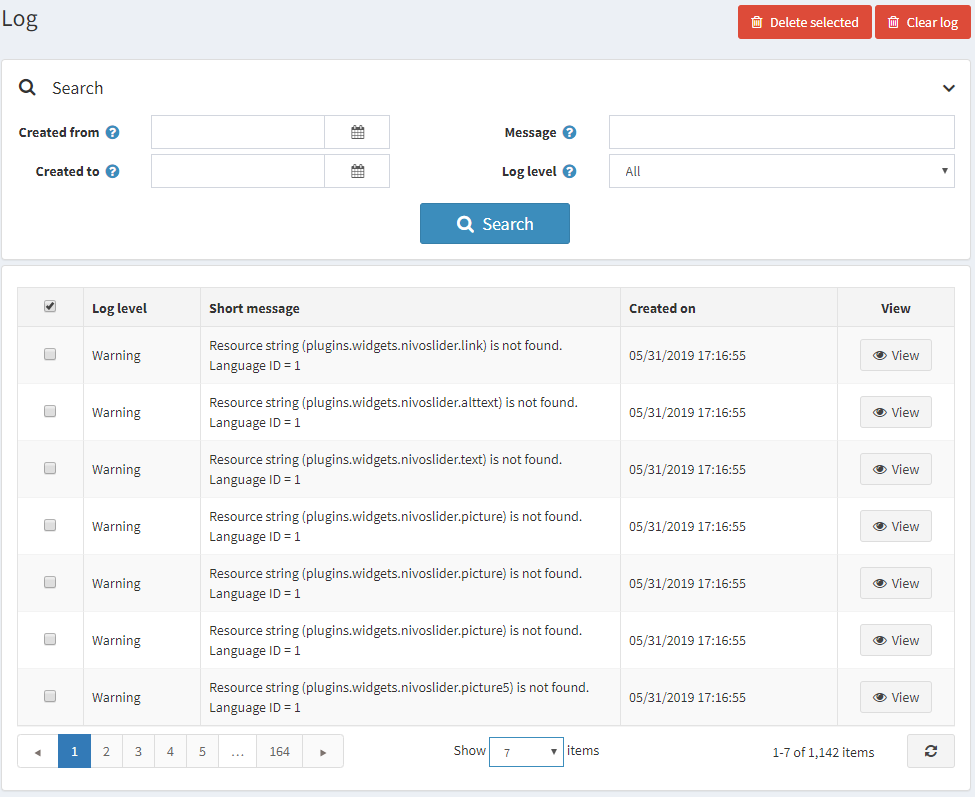
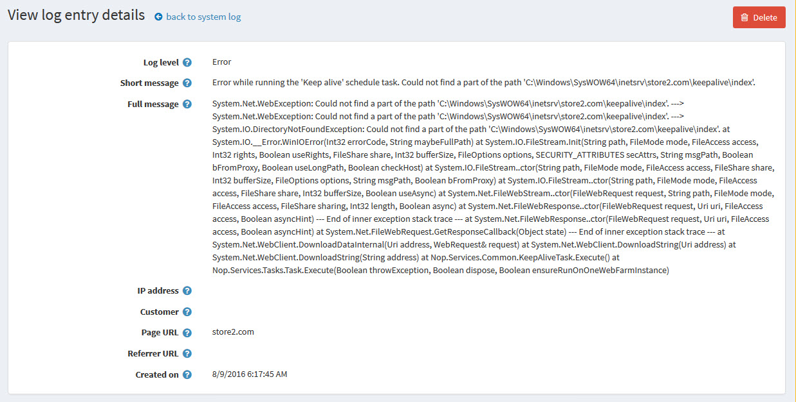

# 記錄

系統記錄報告會顯示系統中所建立的所有錯誤、警告與資訊訊息清單。若要檢視記錄，請前往 **系統 → 記錄**。*記錄* 視窗將顯示如下：

記錄項目包含記錄類型、錯誤說明與日期。您可以點擊 **刪除選取項目** 按鈕來移除所選的記錄項目，或是點擊 **清除記錄** 按鈕來清除整份記錄。

若要搜尋系統記錄，請輸入下列一項或多項資訊：

* 在 **建立自** 欄位中，選擇搜尋的開始日期。
* 在 **建立至** 欄位中，選擇搜尋的結束日期。
* 在 **訊息** 欄位中，輸入要搜尋的訊息或其片段。
* 從 **記錄層級** 下拉式清單中，選擇要顯示的記錄資訊類型，如下所示：
  * *全部*
  * *除錯*
  * *資訊*
  * *警告*
  * *錯誤*
  * *嚴重錯誤*

點擊 **搜尋**。系統記錄視窗將根據搜尋條件顯示結果。

## 檢視系統記錄詳細資料

點擊 **檢視** 可顯示發生錯誤的額外詳細資料，如下所示：

如有需要，您可以點擊 **刪除** 來從系統中移除記錄。