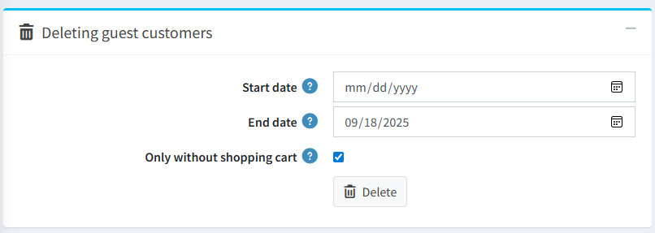
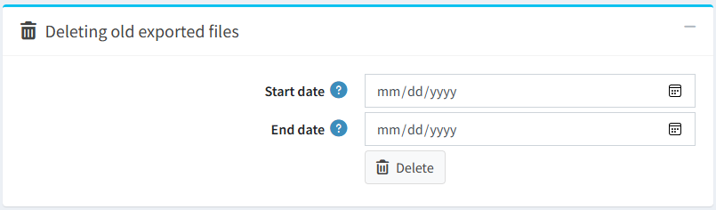
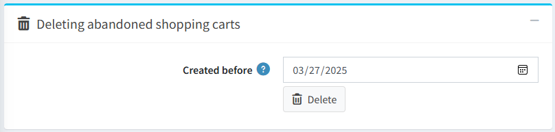
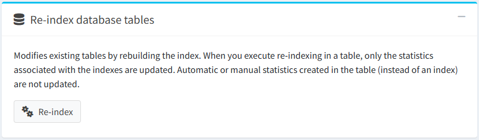
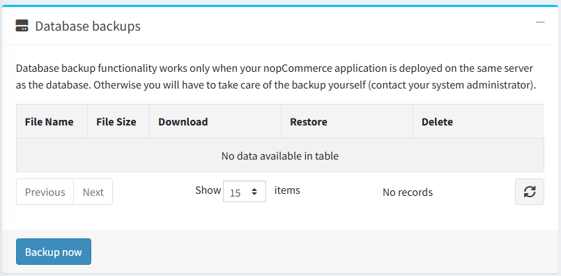
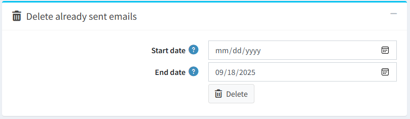
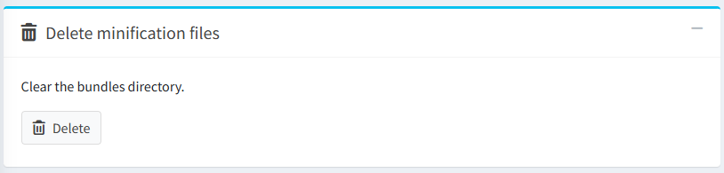
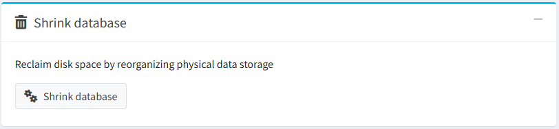
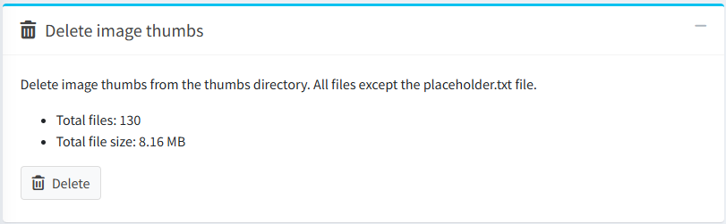

# 維護

在 **系統** 選單中，選擇 **維護**。

## 刪除訪客顧客記錄

在 *刪除訪客顧客* 面板中，點擊 **刪除** 按鈕。此選項可讓您刪除為訪客所建立的顧客記錄。

> [!NOTE]
>
> 僅有未包含訂單或未撰寫顧客內容（例如商品評論或新聞留言）的訪客記錄會被刪除。

## 刪除舊的匯出檔案

在 *刪除舊的匯出檔案* 面板中，點擊 **刪除** 按鈕。所有已匯出及產生的檔案（例如 PDF 和 Excel 檔案）都將被刪除並從資料庫中移除。

## 刪除廢棄的購物車與願望清單

在 *刪除廢棄的購物車* 面板中，點擊 **刪除** 按鈕。所有在指定日期之前建立的購物車與願望清單項目都將被刪除。

## 重新索引資料庫資料表

在 *重新索引資料庫資料表* 面板中，點擊 **重新索引** 按鈕。此程序會透過重建索引來修改現有的資料表。當您在資料表中執行重新索引時，僅會更新與索引相關聯的統計資料。在資料表中建立的自動或手動統計資料（而非索引）將不會被更新。

## 資料庫備份

在 *資料庫備份* 面板中，點擊 **立即備份** 按鈕以建立資料庫備份。

> [!NOTE]
>
> 資料庫備份功能僅在您的 nopCommerce 應用程式與資料庫部署於同一台伺服器時才能運作。否則，您必須自行處理備份（請聯繫您的系統管理員）。

## 刪除已寄出的電子郵件

## 刪除壓縮檔案

## 收縮資料庫

## 刪除圖片縮圖

## 教學課程

[系統維護選項總覽](https://www.youtube.com/watch?v=CNgTJZoWHTA)