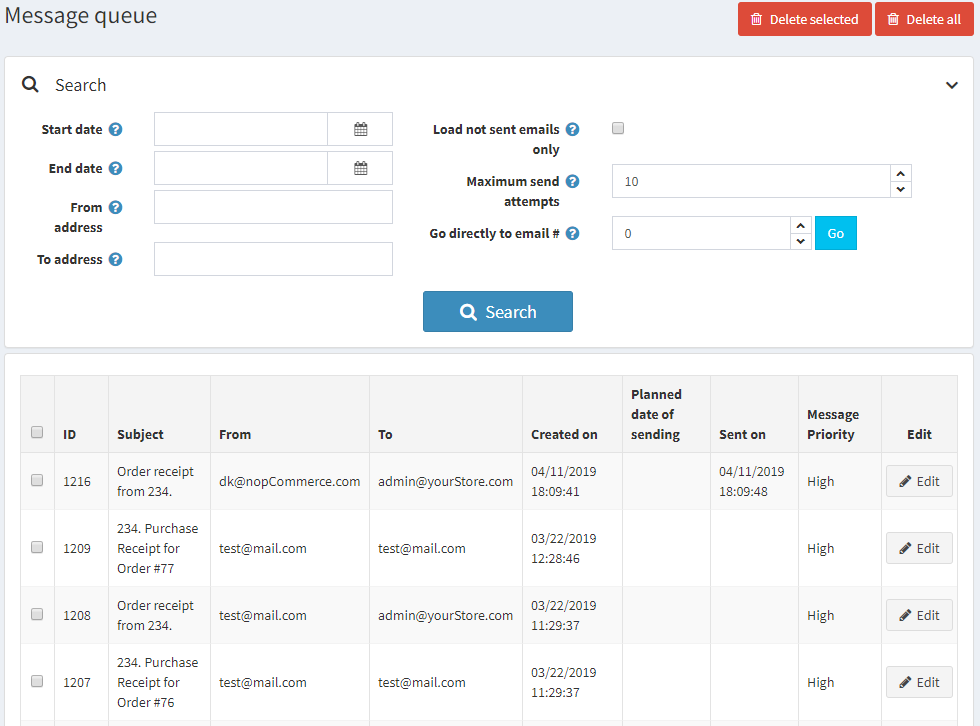
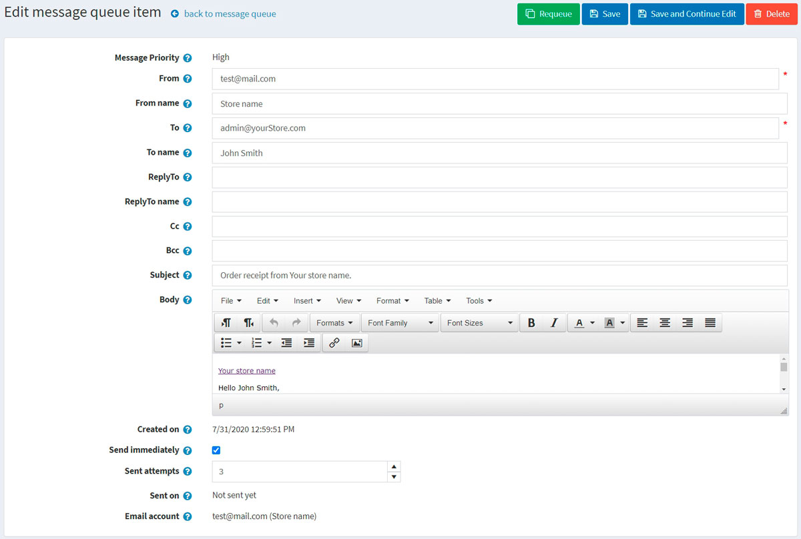

# 訊息佇列

在 nopCommerce 中，電子郵件不會立即發送，而是會進入佇列。訊息佇列包含了所有已發送或尚未發送的電子郵件。

若要載入訊息佇列，請在 **系統** 選單中，選擇 **訊息佇列**。*訊息佇列* 視窗將顯示如下：

輸入以下一項或多項條件來搜尋訊息：

* 在 **開始日期** 欄位中，選擇開始日期。
* 在 **結束日期** 欄位中，選擇結束日期。
* 在 **寄件者地址** 欄位中，輸入訊息的來源地址。
* 在 **收件者地址** 欄位中，輸入訊息的目標地址。
* 勾選 **僅載入未發送的電子郵件** 核取方塊，以僅載入尚未發送的電子郵件。
* 在 **最大發送嘗試次數** 欄位中，輸入發送訊息的最大嘗試次數。
* 在 **直接前往電子郵件編號 #** 欄位中，輸入電子郵件編號並點擊 **前往** 以顯示所需的電子郵件。

點擊 **搜尋** 以載入符合條件的訊息佇列。

在此頁面上，您可以點擊 **刪除所選** 按鈕，從網格中刪除選定的電子郵件。您也可以點擊 **刪除所有** 來移除所有電子郵件。

## 訊息佇列項目詳細資訊

若要檢視訊息佇列項目的詳細資訊，請點擊訊息旁的 **編輯** 按鈕。此時將顯示 *編輯訊息佇列項目* 視窗：

在此視窗中，您可以點擊 **刪除** 按鈕來刪除該訊息，或使用 **重新加入佇列** 按鈕將訊息重新加入發送佇列。

在此頁面上，您可以編輯以下訊息細節：

* **寄件者 (From)** 電子郵件地址。
* **寄件者名稱 (From name)**。
* **收件者 (To)** 電子郵件地址。
* **收件者名稱 (To name)**。
* **回信地址 (ReplyTo)** 電子郵件地址。
* **回信名稱 (ReplyTo name)**。
* **副本 (Cc)** 電子郵件地址。
* **密件副本 (Bcc)** 電子郵件地址。
* 電子郵件訊息 **主旨 (Subject)**。
* 電子郵件訊息 **內容 (Body)**。
* 勾選 **立即發送** 核取方塊，可立即發送此訊息。
* 輸入 **已發送嘗試次數**。這是發送此訊息的嘗試次數。

點擊 **儲存** 或 **儲存並繼續編輯** 以儲存訊息細節。