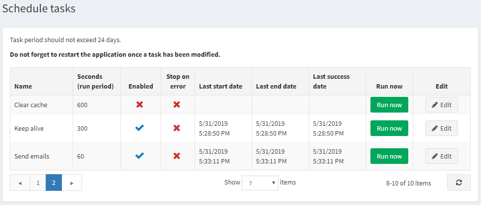
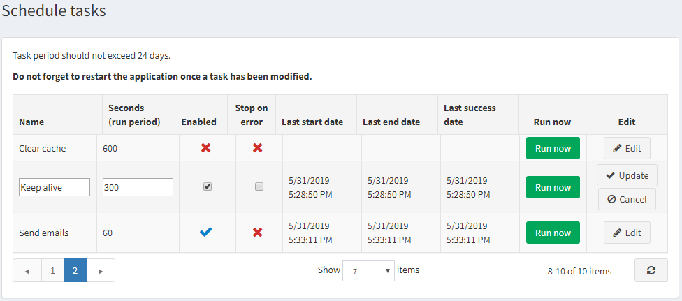

# 排程任務

*排程任務*視窗讓商店擁有者可以安排任務在特定週期於背景執行，並檢視關於任務是否有成功完成的相關實用資訊。例如，nopCommerce 會定期傳送佇列中的電子郵件。這些任務會在來自 ASP.NET 執行緒集區（thread pool）的獨立執行緒上執行。

若要檢視排程任務，請在 **系統** 選單中，選擇 **排程任務**。系統將會顯示如下的*排程任務*視窗：

若要編輯排程任務，請點擊任務旁邊的 **編輯** 按鈕。視窗將會展開如下：

您可以依照下列方式編輯排程任務：

* 編輯 **名稱**。
* 編輯 **秒數（執行週期）** 的數值。任務週期不應超過 24 天。
* 勾選 **已啟用** 核取方塊以啟用該任務。
* 勾選 **發生錯誤時停止** 核取方塊，以便在發生錯誤時停止該任務。

點擊 **更新** 以儲存您的變更。

> [!NOTE]
>
> 請別忘記在修改任務後重新啟動應用程式。

如有需要，您可以點擊 **立即執行** 來按需求執行排程任務。