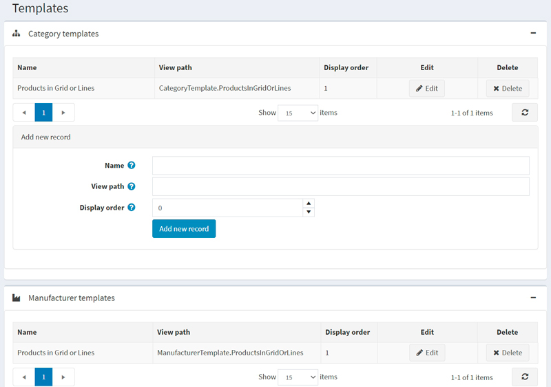
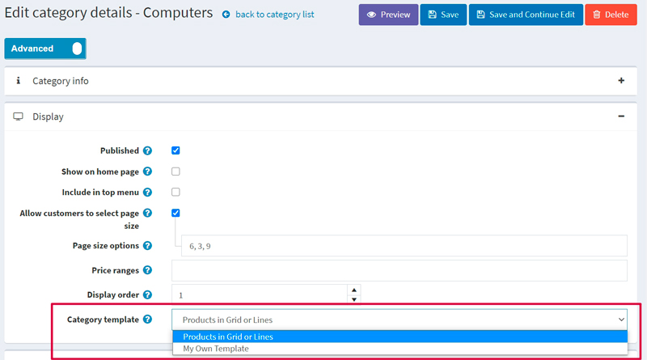
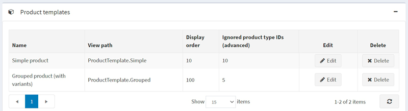
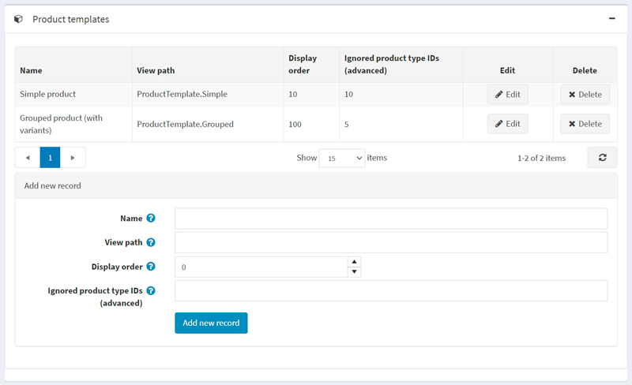
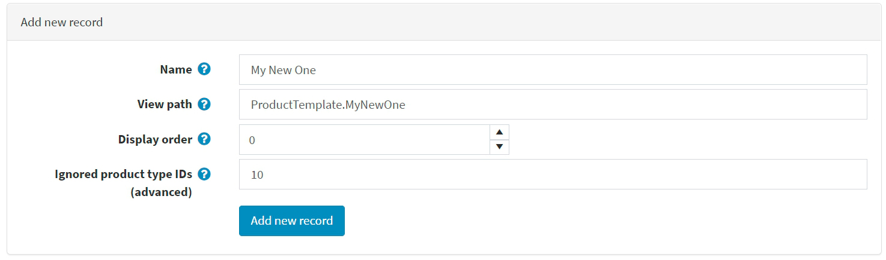
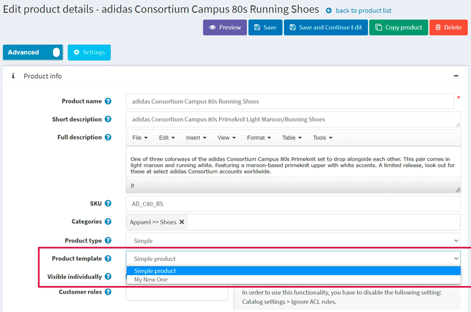

# 範本

在 nopCommerce 中，您可以為類別、製造商、商品以及內容頁面指定替代的佈局範本。您可以在 **系統 → 範本** 頁面上查看現有範本的清單：

系統預設包含一個類別範本、一個製造商範本、一個內容頁面範本以及兩個商品範本。

管理後台中的每個類別、製造商、商品以及內容頁面詳細資訊頁面，都允許您在編輯實體時選擇範本。例如：

> [!NOTE]
>
> 只有當您為類別、製造商或內容頁面建立多於一個範本時，才會看到範本的下拉式選單。
>
> [!NOTE]
>
> 由於我們有兩種商品類型：*簡單商品 (Simple)* 和 *分組商品 (Grouped (product with variants))*，因此系統預設會建立兩個相應的商品範本：
> 
>
> 因此，若要在商品詳細資訊頁面上看到範本下拉式選單，您需要建立兩個符合所選商品類型的商品範本。請參閱下方關於如何執行此操作的說明。

## 新增範本

讓我們以商品範本為例，看看如何建立一個範本。假設您要為「簡單 (Simple)」商品類型建立一個範本。

1. 首先，您需要建立一個合適的範本檔案。如果您已經將檔案放置在正確的資料夾中，請跳過此步驟。

   - 前往 `Views\Product` 資料夾。
   - 複製 `ProductTemplate.Simple.cshtml` 檔案並重新命名。例如，命名為 `ProductTemplate.MyNewOne.cshtml`。
   - 修改 `ProductTemplate.MyNewOne.cshtml` 檔案的程式碼以符合您的需求。

1. 前往 **系統 → 範本** 頁面並進入 *商品範本 (Product templates)* 面板：
  

1. 在 *新增記錄 (Add new record)* 區塊中，填寫以下表單：

   - 輸入範本的 **名稱 (Name)**。以本案例來說，名稱為 `My New One`。
   - 輸入 **檢視路徑 (View path)**。以本案例來說，路徑為 `ProductTemplate.MyNewOne`。
   - 輸入此範本的 **顯示順序 (Display order)**。1 代表列表的最上方。
   - *僅適用於商品範本。其他範本不適用：* 輸入 **忽略的商品類型 ID (進階) (Ignored product type IDs (advanced))**。系統預設有兩種商品類型及其對應的 ID：*簡單 (Simple)* (ID 5) 和 *分組 (Grouped)* (ID 10)。由於我們正在為「簡單」商品類型建立範本，我們應該忽略 ID 為 10 的「分組」商品類型。

   表單看起來會像這樣：
  

1. 點擊 **新增記錄 (Add new record)** 按鈕以儲存新範本。

   儲存新範本後，您將會在商品詳細資訊頁面上看到它，現在您可以從兩個商品範本中進行選擇：
   

> [!NOTE]
>
> 使用 **忽略的商品類型 ID (進階) (Ignored product type IDs (advanced))** 欄位來限制商品範本並非必要。如果您將此欄位留空，該商品範本將可用於所有類型的商品。