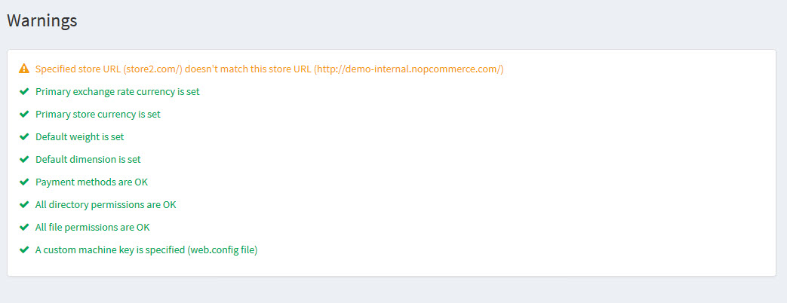

# 警告

以下程序說明如何檢視商店中目前存在的所有警告。

若要檢視商店警告，請前往 **系統 → 警告**。系統將顯示如下的「警告」視窗：

我們建議您修正所有現有的警告。否則，這些警告將會影響您商店的效率與效能。

請參閱下列文章以修正現有的警告：

* [您的商店資訊](xref:zh-Hant/getting-started/advanced-configuration/your-store-information)
* [貨幣](xref:zh-Hant/getting-started/configure-payments/advanced-configuration/currencies)
* [度量衡](xref:zh-Hant/getting-started/configure-shipping/advanced-configuration/measures)
* [付款方式](xref:zh-Hant/getting-started/configure-payments/payment-methods/index)
* [nopCommerce 中的外掛](xref:zh-Hant/getting-started/advanced-configuration/plugins-in-nopcommerce)